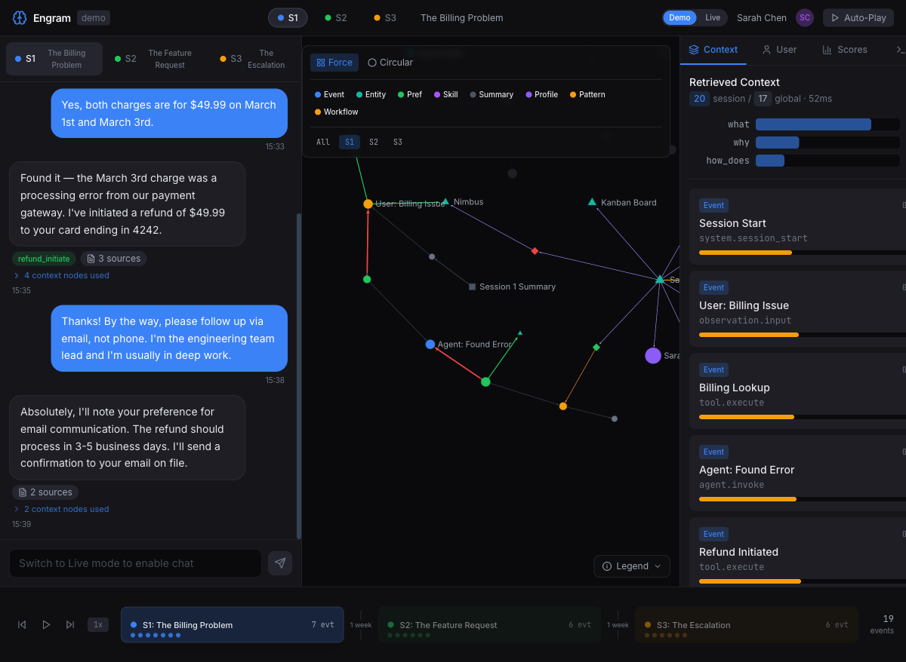
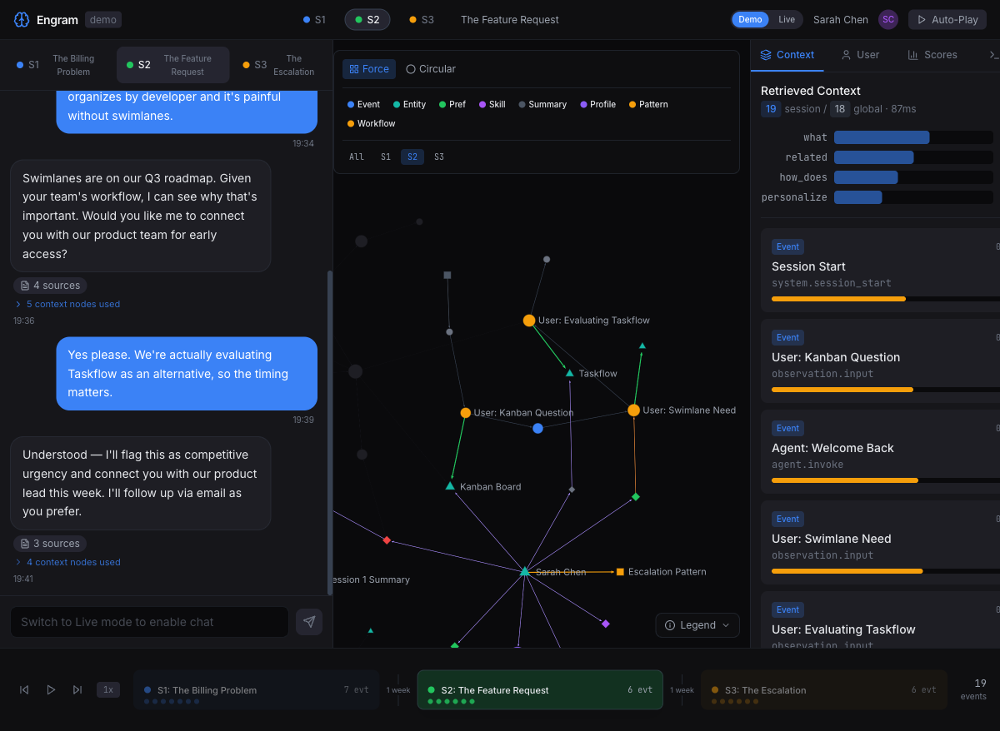
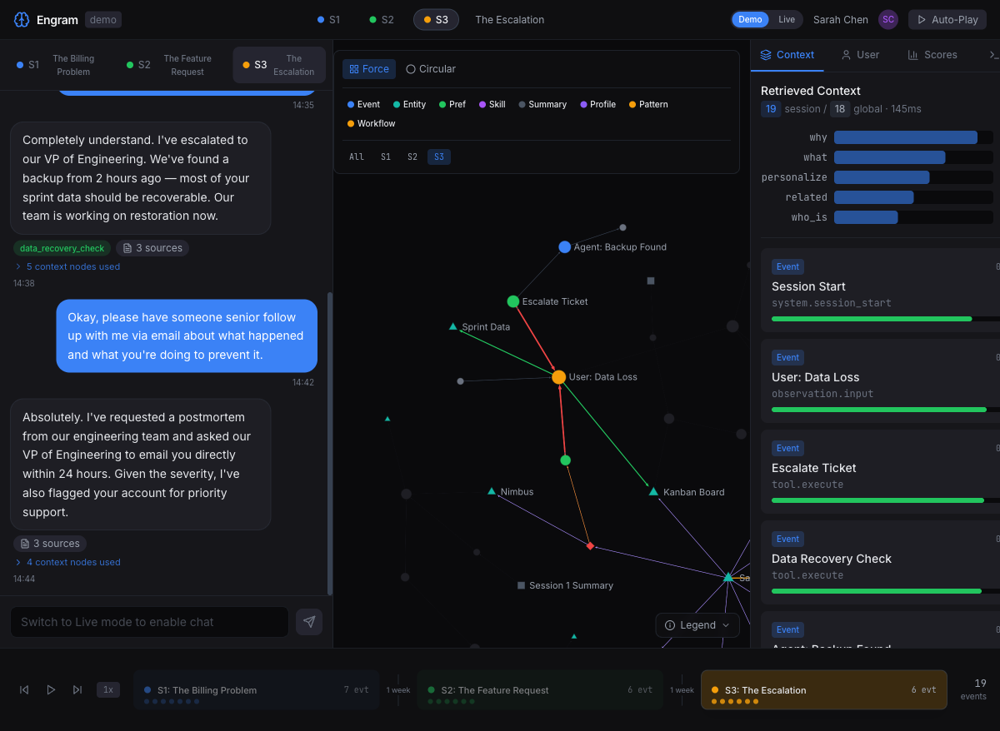
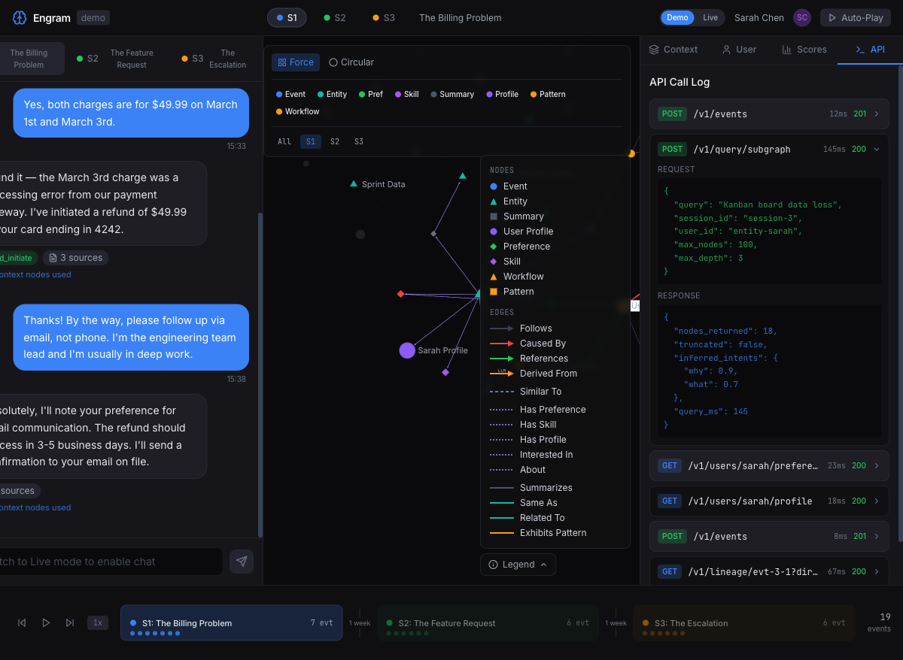
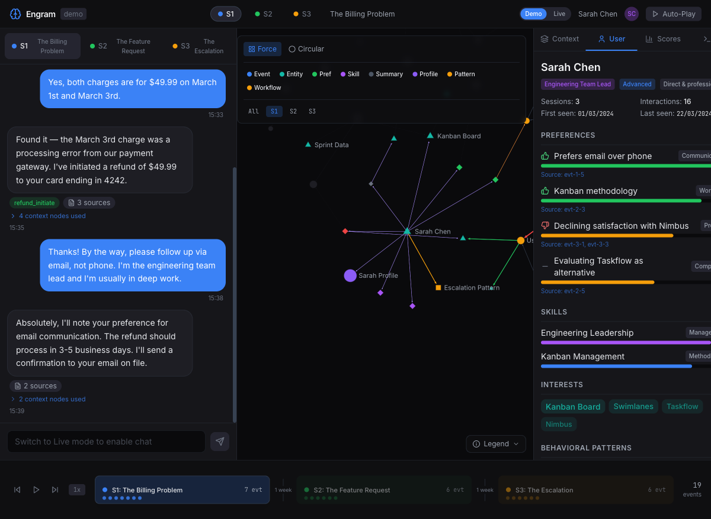
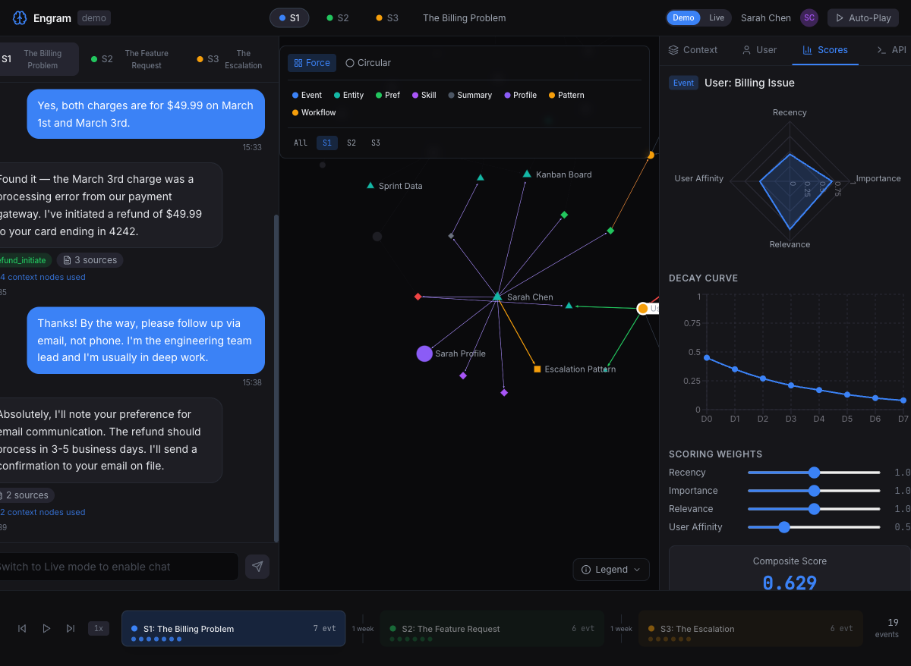
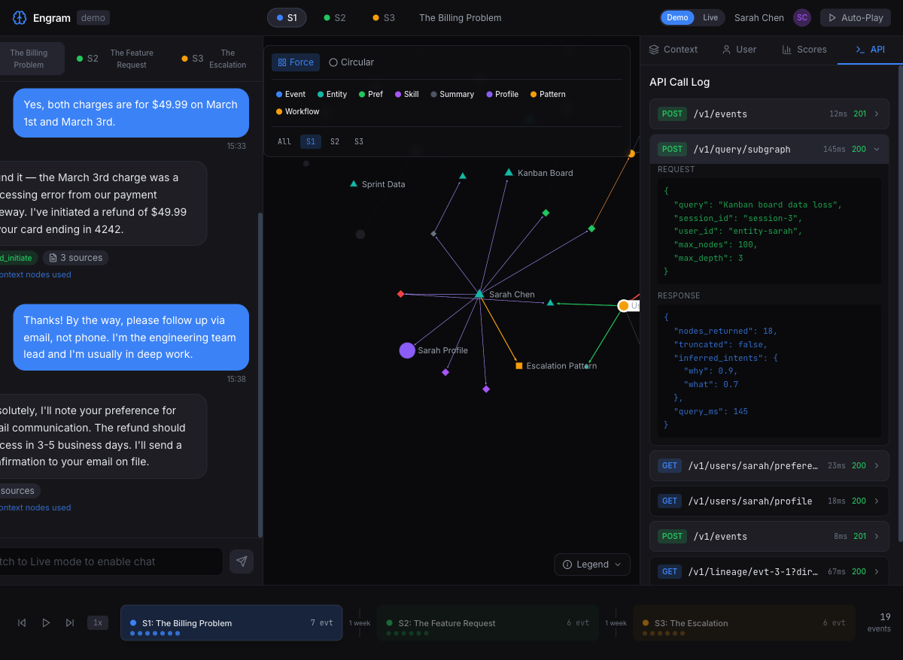
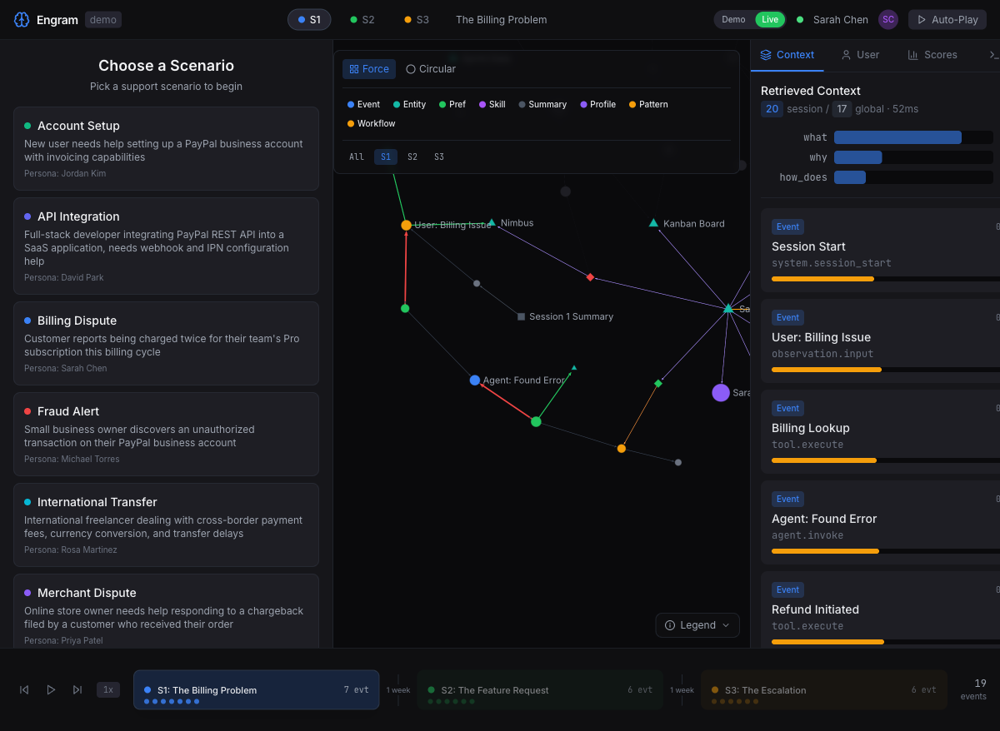

# Engram Context Graph — Frontend Shell Feature Showcase

## Table of Contents

1. [Overview](#overview)
2. [Architecture & Layout](#architecture--layout)
3. [Session Navigation](#session-navigation)
4. [Chat Panel](#chat-panel)
5. [Knowledge Graph Visualization](#knowledge-graph-visualization)
   - [Graph Rendering Engine](#graph-rendering-engine)
   - [Node Types & Visual Encoding](#node-types--visual-encoding)
   - [Edge Types & Visual Encoding](#edge-types--visual-encoding)
   - [Graph Layouts](#graph-layouts)
   - [Node Type Filtering](#node-type-filtering)
   - [Session Filtering](#session-filtering)
   - [Node Selection & Highlighting](#node-selection--highlighting)
   - [Hover Tooltip](#hover-tooltip)
   - [Camera Animation](#camera-animation)
   - [Legend Panel](#legend-panel)
6. [Insight Panel](#insight-panel)
   - [Context Tab](#context-tab)
   - [User Tab](#user-tab)
   - [Scores Tab](#scores-tab)
   - [API Tab](#api-tab)
7. [Session Timeline & Playback](#session-timeline--playback)
8. [Demo vs Live Mode](#demo-vs-live-mode)
9. [State Management](#state-management)
10. [Data Model](#data-model)
11. [Accessibility & UX Details](#accessibility--ux-details)
12. [Tech Stack](#tech-stack)

---

## Overview

The Engram Frontend Shell is an interactive demonstration of the Engram Context Graph — a traceability-first memory system for AI agents. It visualizes how an AI support agent builds and uses a knowledge graph across multiple customer interactions, showing how context, preferences, skills, and behavioral patterns are captured, connected, and used for intelligent retrieval.

The demo follows **Sarah Chen**, an engineering team lead, across three support sessions where the AI agent progressively learns about her preferences, detects behavioral patterns, and uses cross-session context to provide increasingly personalized support.



---

## Architecture & Layout

The application uses a **4-zone layout** that fills the full viewport:

| Zone | Position | Width | Component |
|------|----------|-------|-----------|
| Chat Panel | Left | 400px fixed | Conversation history with tool badges and provenance links |
| Graph Panel | Center | Flexible (fills remaining) | WebGL knowledge graph visualization |
| Insight Panel | Right | 350px fixed | Tabbed analysis: Context, User, Scores, API |
| Session Timeline | Bottom | 100px fixed, full width | Playback controls and event timeline |

The header bar spans the full width and contains:
- **Engram logo** and `demo` badge
- **Session selector** (S1/S2/S3) with color-coded indicators and title
- **Mode toggle** (Demo/Live)
- **User avatar** (Sarah Chen initials)
- **Auto-Play** button

---

## Session Navigation

The demo contains **3 sessions** that tell a cohesive customer story:

| Session | Title | Theme | Color | Events | Key Actions |
|---------|-------|-------|-------|--------|-------------|
| S1 | The Billing Problem | Billing dispute resolution | Blue | 7 | `billing_lookup`, `refund_initiate` |
| S2 | The Feature Request | Product feedback & competitive intel | Green | 6 | Cross-session context recall |
| S3 | The Escalation | Critical data loss incident | Amber | 6 | `escalate_ticket`, `data_recovery_check` |



Switching sessions (via header buttons or chat tabs) updates **all panels simultaneously**:
- Chat panel shows that session's conversation
- Graph highlights that session's events (dimming others)
- Context tab shows session-specific intent scores and retrieved nodes
- Timeline highlights the active session band



Each session demonstrates progressively deeper context graph capabilities:
- **S1**: Basic event capture (billing lookup, refund) + preference extraction (email preference)
- **S2**: Cross-session memory (agent recalls refund from S1), entity linking (Kanban Board, Swimlanes, Taskflow)
- **S3**: Behavioral pattern detection (escalation tendency), provenance tracing (agent references competitive pressure from S2)

---

## Chat Panel

### Message Types

Messages are visually differentiated:

| Type | Alignment | Style | Features |
|------|-----------|-------|----------|
| User messages | Right-aligned | Blue (#3b82f6) rounded bubble | Timestamp |
| Agent messages | Left-aligned | Dark card with border | Tool badges, provenance badges, context nodes, timestamp |

### Tool Badges

Agent messages display green tool badges when the agent invoked tools:
- `billing_lookup` — S1 account lookup
- `refund_initiate` — S1 refund processing
- `escalate_ticket` — S3 priority escalation
- `data_recovery_check` — S3 backup verification

### Provenance Badges

Each agent message includes clickable provenance indicators:
- **"N sources"** badge — shows how many graph nodes informed the response. Clicking highlights those nodes in the graph with an orange glow.
- **"N context nodes used"** — expandable section showing which graph nodes were retrieved for that specific response.

### Message Animation

Messages use Framer Motion slide-up animations when they appear, creating a natural chat feel during playback.

### Chat Input

In Demo mode, the chat input is disabled with the message "Switch to Live mode to enable chat." In Live mode, it becomes an active text input with a send button.

---

## Knowledge Graph Visualization

The graph visualization is the centerpiece of the application. It renders all 69 nodes and 45 edges as an interactive WebGL graph.

### Graph Rendering Engine

The visualization uses **Sigma.js 3.0** with **Graphology** as the graph data structure:

- **Renderer**: Sigma.js with WebGL for hardware-accelerated rendering
- **Graph library**: Graphology (in-memory graph with O(1) node/edge lookups)
- **Edge rendering**: `EdgeArrowProgram` for directed edges with arrowheads
- **Custom node programs**: 4 custom WebGL shader programs for distinct shapes

The graph is rebuilt from scratch whenever the nodes or edges data changes. Node and edge attributes are set via Graphology's attribute API, and Sigma's **reducer pattern** dynamically controls visual appearance without modifying the underlying graph data.

### Node Types & Visual Encoding

Each of the 8 node types has a unique **shape + color** combination:

| Node Type | Shape | Color | Size Range | Description |
|-----------|-------|-------|------------|-------------|
| Event | Circle | Varies by event_type | 4-8 | Individual agent/user actions |
| Entity | Triangle | Cyan (#14b8a6) | 5-9 | Extracted entities (people, products, features) |
| Summary | Square | Gray (#4b5563) | 6 | Session or topic summaries |
| UserProfile | Circle | Purple (#8b5cf6) | 10 | Persistent user profile node |
| Preference | Diamond | Green/Red/Gray by polarity | 4-5 | User preferences (positive/negative/neutral) |
| Skill | Diamond | Purple (#a855f7) | 5 | User competencies |
| Workflow | Triangle | Orange (#f59e0b) | — | Detected workflow patterns |
| BehavioralPattern | Square | Orange (#f59e0b) | 6 | Cross-session behavioral patterns |

**Event sub-colors** (by `event_type`):
- `agent.invoke` → Blue (#3b82f6)
- `tool.execute` → Green (#22c55e)
- `observation.input` → Amber (#f59e0b)
- `system.session_start` / `system.session_end` → Gray (#6b7280)

**Node size** is determined by `importance` score (1-10 scale) — high-importance nodes like "User: Data Loss" (importance=10) appear visibly larger than low-importance nodes like "Session End" (importance=2).

### Edge Types & Visual Encoding

The graph uses **16 edge types** grouped into categories:

**Temporal edges** (directed):
| Edge Type | Color | Style | Meaning |
|-----------|-------|-------|---------|
| FOLLOWS | Gray (#374151) | Solid arrow | Temporal sequence within a session |
| CAUSED_BY | Red (#ef4444) | Solid arrow | Causal relationship (e.g., billing lookup caused by user complaint) |

**Semantic edges**:
| Edge Type | Color | Style | Meaning |
|-----------|-------|-------|---------|
| SIMILAR_TO | Blue (#60a5fa) | Dashed | Semantic similarity (e.g., "Evaluating Taskflow" ~ "Data Loss" at 0.72) |
| REFERENCES | Green (#22c55e) | Solid arrow | Event references an entity |

**Hierarchical edges**:
| Edge Type | Color | Style | Meaning |
|-----------|-------|-------|---------|
| SUMMARIZES | Gray (#4b5563) | Solid arrow | Summary covers a set of events |
| DERIVED_FROM | Orange (#fb923c) | Solid arrow, "LLM" label | Preference/skill extracted from an event via LLM |

**User-model edges** (dotted):
| Edge Type | Color | Style | Meaning |
|-----------|-------|-------|---------|
| HAS_PROFILE | Purple (#a78bfa) | Dotted | Entity → UserProfile link |
| HAS_PREFERENCE | Purple (#a78bfa) | Dotted | Entity → Preference link |
| HAS_SKILL | Purple (#a78bfa) | Dotted | Entity → Skill link |
| INTERESTED_IN | Purple (#a78bfa) | Dotted | Entity → Entity interest link |
| ABOUT | Purple (#a78bfa) | Dotted | Preference → Entity subject link |
| EXHIBITS_PATTERN | Orange (#f59e0b) | Solid arrow | Entity → BehavioralPattern |

**Resolution edges**:
| Edge Type | Color | Style | Meaning |
|-----------|-------|-------|---------|
| SAME_AS | Teal (#14b8a6) | Solid | Entity co-reference |
| RELATED_TO | Teal (#14b8a6) | Solid | General entity relationship |

**Directionality**: 13 edge types are directed (rendered with arrowheads), 3 are undirected (SIMILAR_TO, SAME_AS, RELATED_TO).

### Graph Layouts

Two layout algorithms are available, toggled via the control bar:

#### Force-Directed Layout (ForceAtlas2)

The default layout uses the **ForceAtlas2** physics simulation:

| Parameter | Value | Effect |
|-----------|-------|--------|
| `iterations` | 100 | Number of simulation steps |
| `gravity` | 1 | Pulls disconnected components toward center |
| `scalingRatio` | 10 | Controls repulsion strength between nodes |
| `barnesHutOptimize` | true | O(n log n) approximation for large graphs |
| `strongGravityMode` | false | Linear gravity (not quadratic) |

This produces an organic layout where:
- Densely connected clusters (e.g., session event chains) group together
- The central entity node (Sarah Chen) naturally appears as a hub
- Cross-session edges (SIMILAR_TO, shared entity references) create visual bridges

#### Circular Layout


The circular layout distributes all nodes evenly around a circle:
- **Radius**: `max(100, nodeCount * 8)` — scales with graph size
- **Angle**: `(2 * PI * index) / nodeCount` — equal spacing
- Useful for seeing all nodes at once and identifying edge patterns

### Node Type Filtering

The control bar contains **8 filter buttons**, one per node type. Each button shows the node type name with its associated color. Clicking a button toggles visibility of that node type.

When a node type is filtered out:
- Those nodes become invisible (hidden via the node reducer)
- Edges connected to hidden nodes are also hidden
- The filter state is reflected in the button appearance (dimmed when disabled)

This allows focused exploration — e.g., hiding Events to see only the user model (Profile, Preferences, Skills, Patterns) or hiding Entities to focus on temporal event flow.

### Session Filtering

The session filter buttons (All / S1 / S2 / S3) control which session's events are visually emphasized:

- **All**: All nodes fully visible
- **S1/S2/S3**: Events belonging to the selected session appear at full opacity; events from other sessions are dimmed to a dark gray (#1e1e24) with reduced opacity. Entities, Preferences, and other non-session nodes remain visible.

When a session filter is applied:
- Edges between sessions are dimmed
- The camera **automatically pans and zooms** to frame the filtered session's nodes (see Camera Animation)

### Node Selection & Highlighting

Clicking a node (either in the graph or on a context card in the right panel) triggers selection:

- **Selected node**: Highlighted with increased `zIndex` (10), bringing it to the front
- **Connected nodes**: Neighbors of the selected node remain fully visible
- **Unconnected nodes**: Dimmed slightly
- **Insight panel**: Automatically switches to the Scores tab when a node is selected
- **Screen reader**: Announces "Selected: {node label}" via the announce store

Clicking empty space (stage click) clears the selection.

### Hover Tooltip

Hovering over a node displays a tooltip with:
- **Node label** (name)
- **Node type** badge
- **Decay score** (0.00 - 1.00)
- **Key attributes** (event_type, entity_type, tool_name, etc.)

The tooltip is positioned relative to the viewport using Sigma's `viewportToFramedGraph` coordinate conversion, ensuring it stays visible near the cursor.

Hover events are tracked with analytics (duration in milliseconds).

### Camera Animation

When switching session filters, the camera smoothly animates to frame the relevant nodes:

1. Compute the **bounding box** of all nodes in the filtered session
2. Calculate center point and required zoom level
3. Use Sigma's `camera.animate()` for a smooth pan + zoom transition
4. Duration: ~300ms ease-in-out

This ensures users never "lose" the graph when switching sessions — the view always reframes to show the relevant subgraph.

### Legend Panel



The expandable legend panel (bottom-right of graph area) provides a complete visual reference:

**Nodes section**: All 8 node types listed with their shape icon and color swatch:
- Circle (blue) = Event
- Triangle (cyan) = Entity
- Square (gray) = Summary
- Circle (purple) = User Profile
- Diamond (green) = Preference
- Diamond (pink) = Skill
- Triangle (orange) = Workflow
- Square (dark pink) = Pattern

**Edges section**: All displayed edge types grouped by category with line style indicators:
- Solid arrows: Follows, Caused By, References, Derived From
- Dashed: Similar To
- Dotted: Has Preference, Has Skill, Has Profile, Interested In, About
- Solid colored: Summarizes, Same As, Related To, Exhibits Pattern

The legend uses Framer Motion for smooth expand/collapse animation.

---

## Insight Panel

The right panel provides 4 tabs of analysis for the current session and selected node.

### Context Tab


The Context tab shows what the retrieval system returned for the current session:

**Header metrics**:
- **Session node count** (e.g., "20 session") — nodes belonging to this session
- **Global node count** (e.g., "17 global") — cross-session nodes retrieved
- **Query latency** (e.g., "52ms") — simulated retrieval time

**Intent classification bars**:
Horizontal bar charts showing the system's inferred intents for the current query. Each bar displays:
- Intent name (e.g., `what`, `why`, `how_does`, `related`, `personalize`, `who_is`)
- Score (0.0 to 1.0)
- Proportional bar width

The intents change per session:
- S1: `what=0.8, why=0.3, how_does=0.2` (informational billing query)
- S2: `what=0.6, related=0.5, how_does=0.4, personalize=0.3` (feature exploration)
- S3: `why=0.9, what=0.7, personalize=0.6, related=0.5, who_is=0.4` (urgent causal investigation)

**Node cards**: Scrollable list of all retrieved nodes, each showing:
- Node type badge with color
- Decay score (colored indicator bar)
- Node label
- Event type (for Event nodes)

Clicking a node card selects it in the graph and switches to the Scores tab.

### User Tab



The User tab displays the complete user model for Sarah Chen:

**Profile card**:
- Name: Sarah Chen
- Role tags: "Engineering Team Lead", "Advanced", "Direct & professional"
- Statistics: Sessions (3), Interactions (16), First seen (01/03/2024), Last seen (22/03/2024)

**Preferences** (4 items):
Each preference shows:
- Polarity icon (thumbs up for positive, thumbs down for negative, neutral dash)
- Description text
- Category badge (Communication, Workflow, Product, Competitor)
- Provenance source event ID (e.g., "Source: evt-1-5")
- Confidence bar

| Preference | Polarity | Category | Source |
|-----------|----------|----------|--------|
| Prefers email over phone | Positive | Communication | evt-1-5 |
| Kanban methodology | Positive | Workflow | evt-2-3 |
| Declining satisfaction with Nimbus | Negative | Product | evt-3-1, evt-3-3 |
| Evaluating Taskflow as alternative | Neutral | Competitor | evt-2-5 |

**Skills** (2 items):
- Engineering Leadership (Management) — with proficiency bar
- Kanban Management (Methodology) — with proficiency bar

**Interests** (4 items):
Displayed as colored tag chips: Kanban Board, Swimlanes, Taskflow, Nimbus

**Behavioral Patterns** (3 items):
Each pattern includes:
- Pattern name and status badge (active/emerging)
- Description
- **Confidence trend chart** (Recharts line chart showing confidence evolution across sessions)
- **Pattern timeline**: Dated observations showing which session contributed evidence:
  - Session ID, confidence delta (e.g., "+25%"), and observation text
- **Recommendations**: Priority-ranked action items with severity badges (high/medium/low)

Example — **Escalation Tendency** (active):
> "References competitor products when escalating issues, indicating churn risk"
- Mar 8 (session-2): "Mentioned evaluating Taskflow as alternative" (+25%)
- Mar 22 (session-3): "Referenced switching due to data loss" (+15%)
- Recommendation (high): "Assign dedicated account manager — Proactive outreach reduces churn risk"

### Scores Tab



The Scores tab requires a selected node. When a node is selected, it shows:

**Node identifier**: Type badge + label (e.g., "Event · User: Billing Issue")

**Radar Chart** (Recharts RadarChart):
4-axis spider chart showing the node's scoring factors:
- **Recency** — how recently the node was accessed
- **Importance** — base importance score (1-10, normalized to 0-1)
- **Relevance** — semantic relevance to the current query
- **User Affinity** — personalization weight

**Decay Curve** (Recharts LineChart):
A 7-day projected decay curve (D0 through D7) showing how the node's score will decrease over time based on the **Ebbinghaus forgetting model**:
- Exponential decay formula: `e^(-t/stability)`
- Stability increases with access count (sublinear growth)
- The curve helps visualize which nodes will fade fastest

**Scoring Weight Sliders**:
4 interactive sliders (range 0.0 to 2.0, step 0.1) that control how much each factor contributes to the composite score:
- Recency: default 1.0
- Importance: default 1.0
- Relevance: default 1.0
- User Affinity: default 0.5

Adjusting sliders immediately recalculates the composite score.

**Composite Score**:
Large display showing the weighted score (e.g., "0.629"), computed as:
`(recency * w_recency + importance * w_importance + relevance * w_relevance + affinity * w_affinity) / sum(weights)`

**Factor Breakdown Table**:
| Factor | Raw | Weight | Weighted |
|--------|-----|--------|----------|
| Recency | 0.45 | 1.0 | 0.450 |
| Importance | 0.70 | 1.0 | 0.700 |
| Relevance | 0.80 | 1.0 | 0.800 |
| User Affinity | 0.50 | 0.5 | 0.250 |

### API Tab



The API tab shows a log of all API calls that the demo simulates, providing transparency into what the backend would process:

Each entry shows:
- **Method badge**: Color-coded (POST=green, GET=blue)
- **Endpoint path** (e.g., `/v1/query/subgraph`, `/v1/events`)
- **Latency** (e.g., "145ms")
- **Status code** (color-coded: 200=green, 201=yellow)

Clicking an entry expands it to show:

**Request JSON**:
```json
{
  "query": "Kanban board data loss",
  "session_id": "session-3",
  "user_id": "entity-sarah",
  "max_nodes": 100,
  "max_depth": 3
}
```

**Response JSON**:
```json
{
  "nodes_returned": 18,
  "truncated": false,
  "inferred_intents": {
    "why": 0.9,
    "what": 0.7
  },
  "query_ms": 145
}
```

The 7 logged API calls demonstrate the full API surface:
1. `POST /v1/events` (12ms, 201) — Event ingest
2. `POST /v1/query/subgraph` (145ms, 200) — Context retrieval with intent
3. `GET /v1/users/sarah/preferences` (23ms, 200) — User preferences
4. `GET /v1/users/sarah/profile` (18ms, 200) — User profile
5. `POST /v1/events` (8ms, 201) — Another event ingest
6. `GET /v1/lineage/evt-3-1?direction=backward&max_depth=3` (67ms, 200) — Lineage traversal
7. `POST /v1/query/subgraph` (198ms, 200) — Another subgraph query

---

## Session Timeline & Playback

The bottom timeline provides a visual overview of all sessions and playback controls.

### Timeline Bands

Each session is rendered as a horizontal band containing:
- **Session label**: "S1: The Billing Problem" with event count ("7 evt")
- **Event dots**: Small colored circles representing individual events within the session
- **Gap labels**: Between sessions, a time gap indicator (e.g., "1 week")

### Playback Controls

| Button | Function |
|--------|----------|
| Skip to start | Resets to the first event of the first session |
| Play / Pause | Toggles auto-play. When playing, events reveal one at a time with a timed interval |
| Skip forward | Advances to the next event |
| Speed (1x/2x/5x) | Cycles through playback speeds (interval = 2000ms / speed) |

During playback:
- Chat messages appear one by one (controlled by `visibleMessagesPerSession` map)
- The timeline highlights the current event dot
- Session switches automatically when all events in a session are revealed

### Event Counter

The bottom-right shows the total event count ("19 events") across all sessions.

### URL State Persistence

The playback state is persisted in the URL hash for shareability:
```
#session=session-1&speed=1&layout=force
```

Parameters encoded: `session`, `step` (current event index), `speed` (1/2/5), `layout` (force/circular). Updates are debounced at 300ms to avoid URL thrashing.

---

## Demo vs Live Mode

The application supports two operating modes, toggled via the header:

### Demo Mode (Default)

- Uses **mock data** — 69 nodes, 45 edges, 32 chat messages
- All data is static and deterministic (seeded PRNG for positions)
- Chat input is disabled
- Session switching shows pre-built conversations
- Graph shows the complete pre-built knowledge graph
- No backend required

### Live Mode



- Connects to a **real Engram backend** via REST API
- Shows **7 scenario cards** to start a live conversation:
  - Account Setup (Persona: Jordan Kim)
  - API Integration (Persona: David Park)
  - Billing Dispute (Persona: Sarah Chen)
  - Fraud Alert (Persona: Michael Torres)
  - International Transfer (Persona: Rosa Martinez)
  - Merchant Dispute (Persona: Priya Patel)
  - Payment Failure (Persona: Alex Rivera)
- Selecting a scenario creates a new session and starts a live chat
- Chat input is enabled; messages are sent to the backend
- Graph updates in real-time as the backend processes events
- Backend health indicator shows "Backend healthy" (green dot) or connection status

Mode selection persists in `localStorage` across page reloads.

---

## State Management

The application uses **8 Zustand stores** for state management (no Redux, no Context API boilerplate):

| Store | Responsibility | Key State |
|-------|---------------|-----------|
| `graphStore` | Graph data + visualization state | `nodes`, `edges`, `selectedNodeId`, `visibleNodeTypes`, `visibleEdgeTypes`, `sessionFilter`, `layoutType` |
| `sessionStore` | Session data + playback | `sessions`, `messages`, `currentSessionId`, `isPlaying`, `playbackSpeed`, `currentStepIndex`, `visibleMessagesPerSession` |
| `chatStore` | Live chat state | `scenarios`, `activeScenario`, `messages`, `isStreaming` |
| `insightStore` | Insight panel state | `activeTab`, `debugEnabled` |
| `userStore` | User profile data | `profile`, `preferences`, `skills`, `interests`, `patterns` |
| `animationStore` | Traversal animation | `isAnimating`, `currentStep`, `mode`, `retrievalResults` |
| `apiLogStore` | API call logging | `calls[]`, `addCall()` — with interceptors for automatic logging |
| `announceStore` | Screen reader | `message` — set text to trigger `aria-live` announcements |

Each store uses Zustand's selector pattern for minimal re-renders: `useGraphStore((s) => s.nodes)` only re-renders when `nodes` changes.

---

## Data Model

### Mock Data Statistics

| Category | Count | Details |
|----------|-------|---------|
| Total nodes | 69 | 19 events, 8 entities, 2 summaries, 1 profile, 4 preferences, 2 skills, 1 pattern + session variants |
| Total edges | 45 | 18 FOLLOWS, 4 CAUSED_BY, 8 REFERENCES, 2 SUMMARIZES, 1 HAS_PROFILE, 4 HAS_PREFERENCE, 2 HAS_SKILL, 3 DERIVED_FROM, 1 EXHIBITS_PATTERN, 1 INTERESTED_IN, 2 ABOUT, 1 SIMILAR_TO |
| Sessions | 3 | S1 (7 events), S2 (6 events), S3 (6 events) |
| Chat messages | 32+ | Across all 3 sessions |
| API calls | 7 | Mock API call log entries |
| Scenarios | 7 | Live mode scenario cards |

### Atlas Response Pattern

The frontend data model mirrors the backend Atlas response:
```typescript
interface GraphNode {
  id: string;
  label: string;
  node_type: NodeType;    // 8 types
  session_id?: string;
  event_type?: string;
  color: string;
  size: number;
  x: number; y: number;
  attributes: Record<string, unknown>;
  decay_score: number;     // 0.0 - 1.0
  importance: number;      // 1 - 10
}

interface GraphEdge {
  id: string;
  source: string;
  target: string;
  edge_type: EdgeType;     // 16 types
  color: string;
  size: number;
  label?: string;
  properties: Record<string, unknown>;
}
```

---

## Accessibility & UX Details

- **Semantic HTML**: All panels use `role="region"` with `aria-label` (e.g., "Chat conversation", "Knowledge graph visualization", "Context insights", "Session timeline")
- **Screen reader announcements**: Node selection triggers `aria-live` updates via the `announceStore`
- **Keyboard navigation**: `Ctrl+Shift+D` toggles debug mode (shows additional Debug tab in insights)
- **Graph aria label**: "Interactive knowledge graph. Use mouse to pan and zoom."
- **Color contrast**: Dark theme (#0a0a0f background) with high-contrast text and colored elements
- **Responsive tooltips**: Graph tooltips stay within viewport bounds

---

## Tech Stack

| Technology | Version | Purpose |
|------------|---------|---------|
| React | 18 | UI framework |
| TypeScript | strict mode | Type safety |
| Vite | 5.3.5 | Build tool + dev server with HMR |
| Sigma.js | 3.0 | WebGL graph rendering |
| Graphology | — | Graph data structure |
| graphology-layout-forceatlas2 | — | Force-directed layout |
| Zustand | — | State management (8 stores) |
| Recharts | — | Charts (RadarChart, LineChart) |
| Framer Motion | — | Animations (messages, legend, tabs) |
| Tailwind CSS | — | Utility-first styling (dark theme) |
| Lucide React | — | Icon library |

### Custom WebGL Node Programs

The graph uses 4 custom node rendering programs (each a WebGL vertex + fragment shader):

| Program | Shape | Used By |
|---------|-------|---------|
| `NodeCircleProgram` | Circle | Event, UserProfile |
| `NodeTriangleProgram` | Triangle | Entity, Workflow |
| `NodeDiamondProgram` | Diamond | Preference, Skill |
| `NodeSquareProgram` | Square | Summary, BehavioralPattern |

These are located in `src/components/graph/programs/` and extend Sigma's node program interface.

### Analytics Tracking

The app tracks 4 event types via the `tracker` module:
- `node.click` — node ID, node type
- `node.hover` — node ID, duration in ms
- `filter.toggle` — filter type, new value
- `graph.layout_change` — old layout, new layout

Events are logged to the console in development (visible in API tab / browser console).
