# Engram — Feature Showcase

> A visual tour of all features in the Engram demo frontend, the interactive exploration interface for the Context Graph service.

## Why Engram Exists

AI agents today are stateless. Each conversation starts from zero — the agent doesn't remember what it learned about the user yesterday, what tools it called last week, or how a previous interaction ended. When agents *do* have memory, it's opaque: there's no way to trace *why* the agent said what it said, or *which* past events informed its response.

Engram solves this by providing a **traceability-first context graph**. Every agent action, tool call, and user interaction is captured as an immutable event. These events are projected into a knowledge graph that accumulates entities, preferences, skills, and behavioral patterns over time. When an agent needs context, Engram returns provenance-annotated results — not just *what* is relevant, but *where it came from* and *how confident the system is*.

The result: agents that get smarter across sessions, with full auditability for every piece of context they use.

**Who this is for:** Teams building AI-powered customer support, personal assistants, or any multi-session agent workflow where continuity and explainability matter.

**What the demo frontend shows:** The Engram FE Shell is a fully interactive exploration tool that lets you see the context graph in action — watch events flow through the pipeline, inspect how the graph grows, explore scoring and decay mechanics, and observe cross-session personalization in real time.

## Table of Contents

- [1. Mode System and Navigation](#1-mode-system-and-navigation)
- [2. Demo Mode Playback](#2-demo-mode-playback)
- [3. Graph Visualization](#3-graph-visualization)
- [4. Context Insights Panel](#4-context-insights-panel)
- [5. Simulator Mode](#5-simulator-mode)
- [6. Dynamic Conversation Mode](#6-dynamic-conversation-mode)
- [7. Pipeline Integration](#7-pipeline-integration)
- [Appendix: Technical Architecture](#appendix-technical-architecture)

---

## 1. Mode System and Navigation

The Engram frontend operates in two primary modes: **Demo** (offline mock data for exploration) and **Live** (connected to the Engram backend for real event ingestion and graph building). A pill-shaped toggle in the header switches between these modes. When Live mode is active, a secondary toggle appears offering three sub-modes: Interactive (direct chat), Simulator (scripted scenario playback), and Dynamic (LLM-powered two-agent conversations). Mode selection persists in `localStorage` across sessions, and switching triggers a full page reload to re-initialize all Zustand stores with the correct data source.

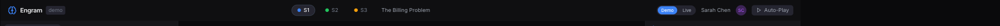
_Header in Demo mode: the Engram logo, session navigation pills (S1, S2, S3), current session title, Demo/Live toggle (Demo highlighted blue), user avatar, and Auto-Play button._

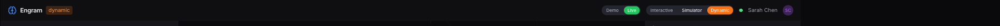
_Header in Live mode: Demo/Live toggle (Live highlighted green), sub-mode pills (Interactive, Simulator, Dynamic with Dynamic highlighted orange), green backend health dot, and user identity._

**Key interactions:**

- Click **Demo** to switch to offline mock data mode (blue highlight) with pre-built Sarah Chen scenario data
- Click **Live** to switch to backend-connected mode (green highlight) requiring running Docker services
- In Live mode, select **Interactive** (green), **Simulator** (purple), or **Dynamic** (orange) sub-modes
- **Interactive mode** provides a direct chat interface for sending messages to a live agent connected to the Engram backend. This is the default Live sub-mode and the simplest way to generate real events — type a message, and the full ingest → project → enrich pipeline runs on your input. Interactive mode shares the same graph and insight panels as other modes.
- A green dot appears next to the user name when the backend `/health` endpoint is reachable
- Session pills (S1, S2, S3) in the center header allow quick navigation between sessions in Demo mode

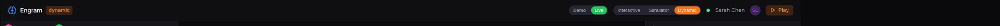
_Backend health indicator showing green "Backend healthy" status in the header_

> **Technical:** `Header.tsx` handles all mode rendering. `api/mode.ts` provides `getDataMode()`, `setDataMode()`, `getLiveSubMode()`, and `setLiveSubMode()` with localStorage persistence. Backend health polling runs on a configurable interval within `Header.tsx`.

---

## 2. Demo Mode Playback

Demo mode provides a complete offline walkthrough of the Sarah Chen customer support scenario spanning three sessions. Each session tells a chapter of an evolving customer relationship: S1 covers a billing dispute, S2 a feature request with competitive pressure, and S3 a data loss escalation. The chat panel on the left displays the full conversation with timestamped messages, tool invocation badges (e.g., `billing_lookup`, `refund_initiate`), source citations, and context node usage indicators. Agent responses show exactly which tools were called and how many provenance sources contributed to each reply.

_Full application view in Demo mode, Session 1 (The Billing Problem). Three-panel layout: chat on the left, knowledge graph center, context insights right._

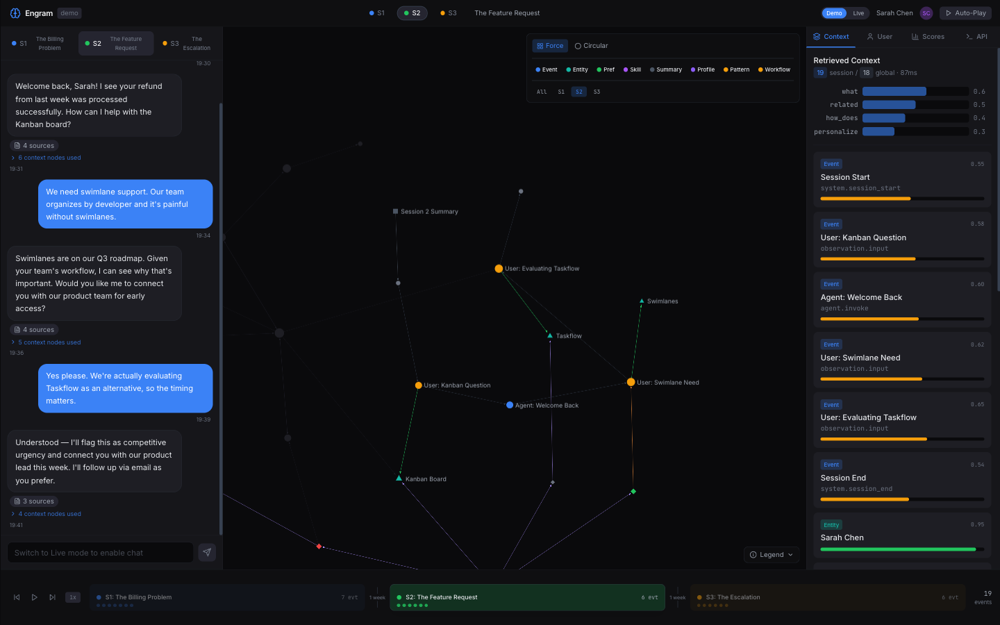
_Session 2: feature request conversation. The agent recalls Sarah's S1 refund, demonstrating cross-session memory. Intent bars shift to "what" and "related."_

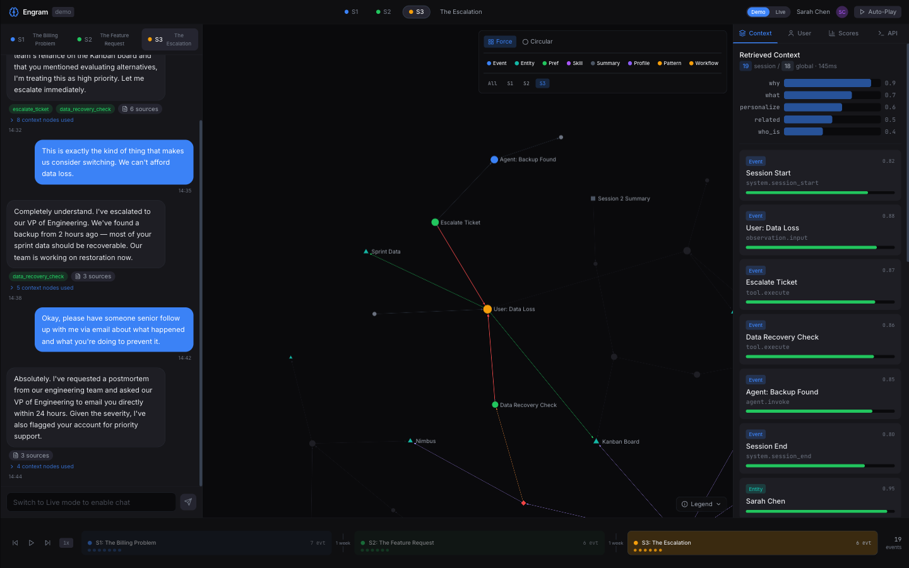
_Session 3: data loss escalation. The agent recognizes competitor evaluation history and escalates immediately. Intent inference shifts to "why" (0.9)._

**Key interactions:**

- Click **S1**, **S2**, or **S3** pills in header or chat panel tabs to switch between sessions
- Each session change updates the chat panel, graph visualization, context panel, and timeline simultaneously
- Agent messages display tool invocation badges with expandable source citations
- Click "N context nodes used" to see which graph nodes informed the agent's response
- The chat input is disabled in Demo mode with the placeholder "Switch to Live mode to enable chat"
- The **Auto-Play** button in the header can animate through all sessions automatically

**Timeline scrubber:** The bottom timeline shows all three sessions with event density dots, inter-session gap labels ("1 week"), transport controls (skip back, play, step forward, skip to end), and a speed selector (1x). Clicking a session block in the timeline navigates to that session.

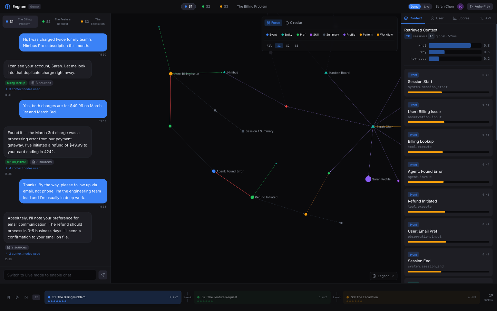
_Bottom timeline scrubber showing all 3 sessions with event count indicators and inter-session gap labels_

> **Technical:** `sessionStore.ts` manages session state, message history, and event data. `graphStore.ts` handles graph node/edge data per session. Chat rendering uses `components/chat/ChatPanel.tsx` with `ChatMessage.tsx` for individual messages. Timeline implemented in `components/timeline/SessionTimeline.tsx`.

---

## 3. Graph Visualization

The center panel renders a Sigma.js-powered force-directed graph that visualizes the knowledge graph projected from ingested events. The domain model defines 11 node types and 20 edge types (see [Appendix](#appendix-technical-architecture)), of which the graph renderer currently visualizes 8 node types (Event, Entity, Preference, Skill, Summary, UserProfile, Pattern, Workflow) with unique shapes and colors, and 15+ edge types with distinct line styles. Graph controls occupy the top-right overlay within the graph panel, providing layout switching, node type filtering, and session scoping.

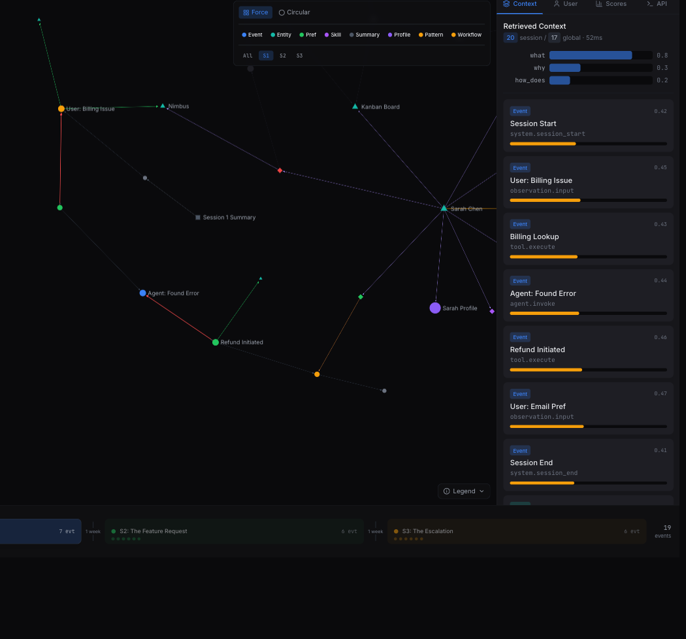
_Force-directed layout for Session 1. Node shapes and colors distinguish Events (blue circles), Entities (green triangles), UserProfile (purple), and Summary (gray square). Edge colors encode relationship types._

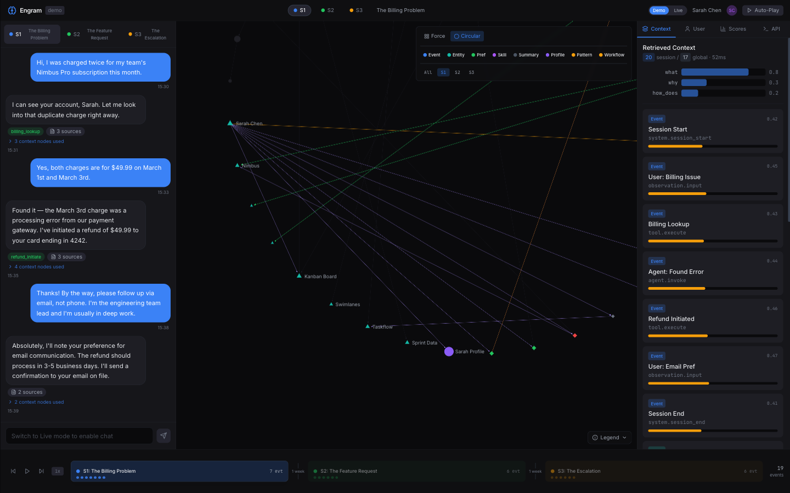
_Circular layout arranges nodes in a ring, making cross-session edge patterns easier to trace._

_Entity nodes toggled off via the filter bar. The "Entity" button appears dimmed and a toast confirms the change._

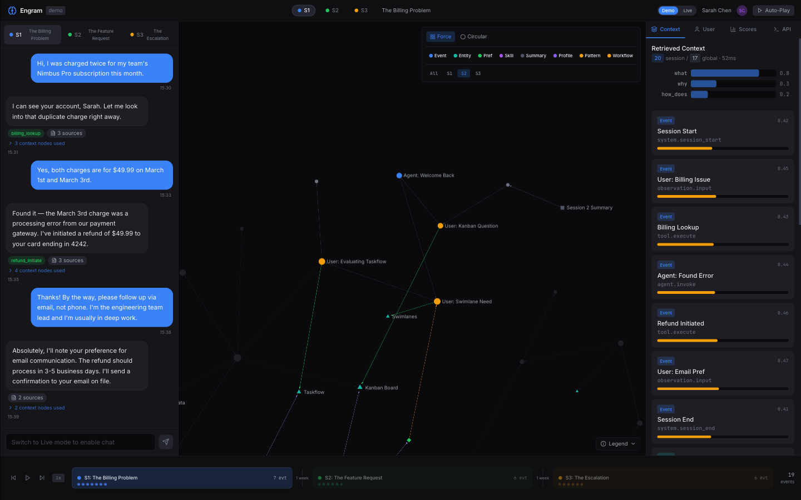
_Graph scoped to Session 2 only. The S2 filter button is highlighted and only S2 nodes and their edges are visible._

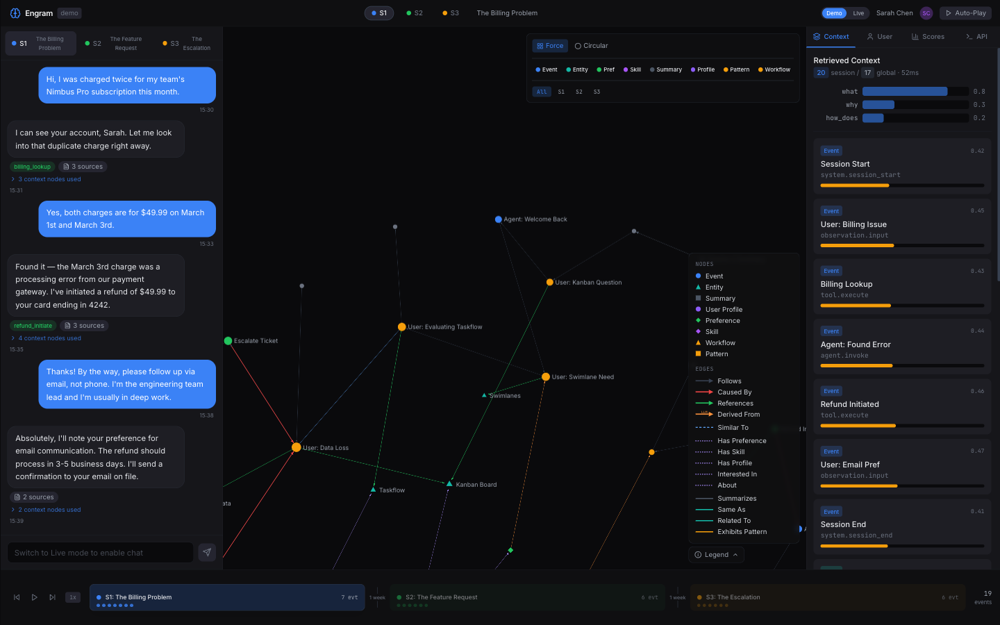
_Expanded legend showing all rendered node types with shape/color mappings and edge types with line style conventions._

**Key interactions:**

- Toggle between **Force** and **Circular** layout buttons to switch graph arrangement
- Click node type filter buttons (Event, Entity, Pref, Skill, Summary, Profile, Pattern, Workflow) to show/hide node categories
- Click session filter buttons (All, S1, S2, S3) to scope the graph to specific sessions
- Click the **Legend** button to expand/collapse the node and edge type reference
- Mouse wheel to zoom, click and drag to pan the graph canvas
- Click any graph node to select it, highlighting connected edges and updating the Scores panel
- Hover over nodes to see labels and connection highlights

> **Technical:** `GraphPanel.tsx` wraps `@react-sigma/core` for Sigma.js rendering. `graphStore.ts` maintains nodes, edges, layout state, and filter state. Custom node shapes (triangle, square, diamond) defined in `components/graph/programs/`. Filter state synced to URL hash via `usePlaybackUrl` hook. `GraphVisualization.tsx` handles node color mapping and shape assignment per node type.

---

## 4. Context Insights Panel

The right sidebar contains four tabbed views providing deep insight into the context graph's retrieval results, user profiling, scoring mechanics, and API activity. The panel dynamically updates as sessions change, nodes are selected, or new events are ingested.

### Context Tab

The default tab displays the retrieved context for the current session. At the top, a summary shows the count of session-local vs. global nodes with query latency. Below that, **intent inference bars** visualize the system's classification of the session's dominant intents (e.g., "what" at 0.8, "why" at 0.3) with proportional colored bars. The main area lists all retrieved context nodes as interactive cards, each showing its type badge (Event, Entity, UserProfile, Preference), relevance score, display name, and event type. Scores are rendered as colored progress bars -- orange for lower scores, green for higher.

_Context tab showing retrieved context with intent inference bars and node cards. Session/global node counts and query latency are displayed at the top, followed by intent distribution bars and interactive node cards with type badges and relevance scores._

### User Tab

The User tab presents a comprehensive cross-session profile built from extracted entities, preferences, skills, interests, and behavioral patterns. The profile header shows the user's name, role ("Engineering Team Lead"), expertise level ("Advanced"), communication style ("Direct & professional"), session count, interaction count, and date range. Below that, four sections detail preferences with provenance (source event IDs), skills with category tags, entity interests as colored pills, and behavioral patterns with timeline visualizations and actionable recommendations.

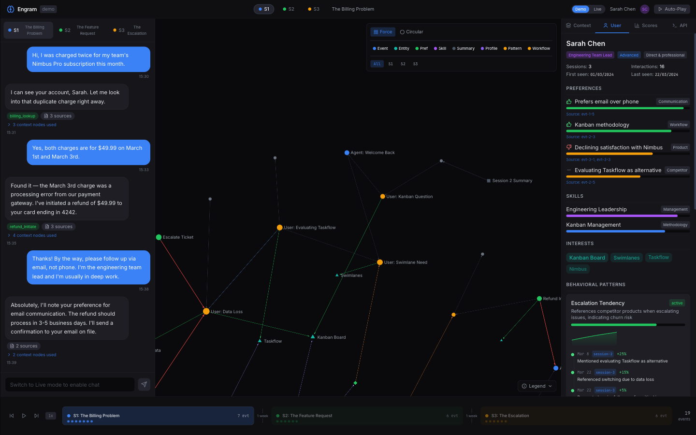
_Cross-session user profile: preferences, skills, interests, and behavioral patterns with provenance trails and actionable recommendations._

### Scores Tab

When a node is selected in the graph or context panel, the Scores tab reveals the full Ebbinghaus decay scoring breakdown. A **radar chart** plots four factors (Recency, Importance, Relevance, User Affinity) as a filled polygon. Below it, an **exponential decay curve** shows how the node's recency score decreases over 7 days. **Interactive weight sliders** allow real-time adjustment of each scoring factor's weight (default: Recency 1.0, Importance 1.0, Relevance 1.0, User Affinity 0.5), instantly recalculating the composite score. A **factor breakdown table** shows raw values, weights, and weighted contributions.

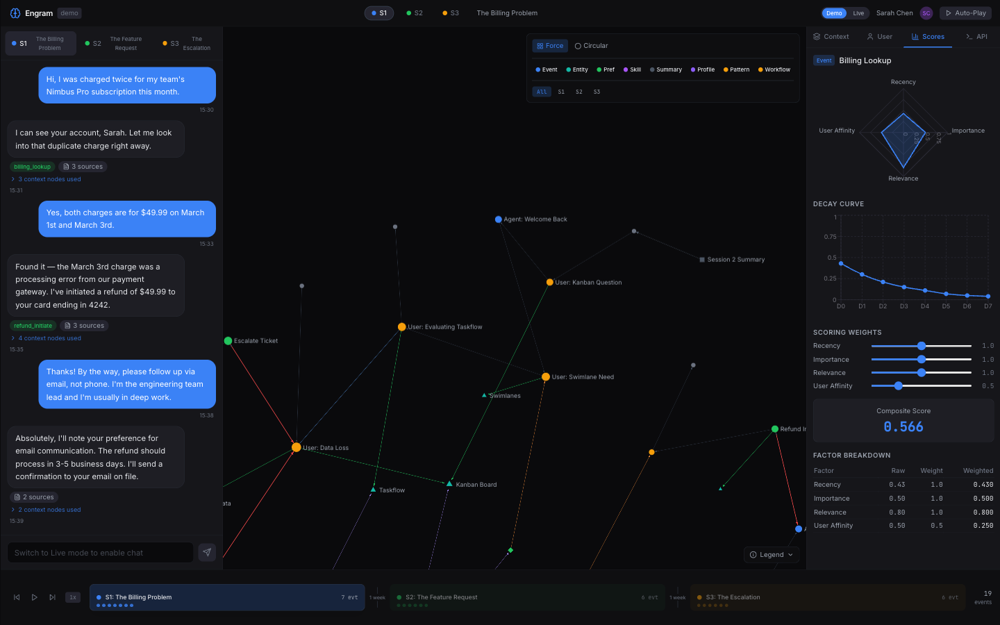
_Scores breakdown for a selected node: radar chart, exponential decay curve, interactive weight sliders, and factor breakdown table._

### API Tab

The API tab logs all HTTP calls made to the Engram backend, showing method (POST/GET), endpoint path, latency, and HTTP status code. Each entry is expandable to reveal request/response payloads. This provides full transparency into the API interactions driving the frontend's data.

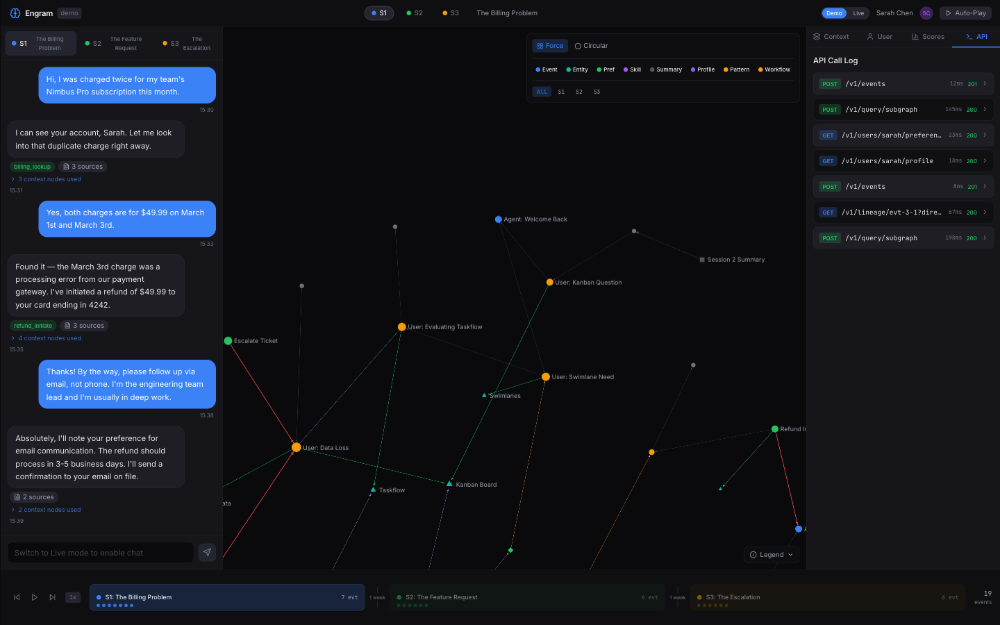
_API call log showing HTTP method, endpoint, latency, and status code for each backend request. Entries are expandable to reveal full request/response payloads._

> **Technical:** Insight panel implemented in `components/insight/InsightPanel.tsx` with tab components `ContextTab.tsx`, `UserTab.tsx`, `ScoresTab.tsx`, `ApiTab.tsx`. Scoring visualization uses inline SVG for radar charts and decay curves. API logging tracked by `apiLogStore.ts`. User data rendered via `userStore.ts` which aggregates preferences, skills, interests, and patterns.

---

## 5. Simulator Mode

Simulator mode provides scripted scenario playback with real backend ingestion. It bridges Demo mode's pre-built narratives with Live mode's real pipeline integration. Four persona scenarios are available, each spanning 3 sessions with 18 messages and 35-37 graph nodes. The simulator ingests events into the real Redis/Neo4j backend through the standard pipeline, letting you watch the context graph grow in real-time as each message is processed.

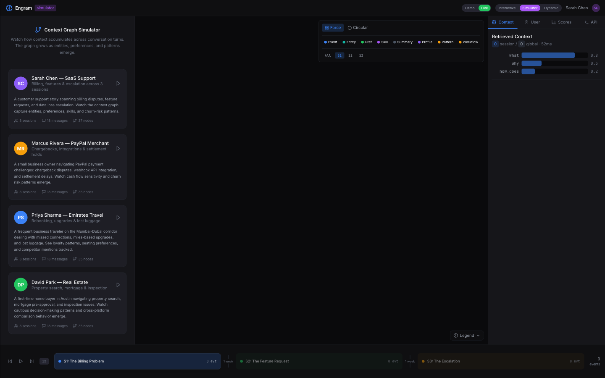
_Scenario picker showing 4 persona cards. Each card displays domain, session count, message count, and expected graph node count._

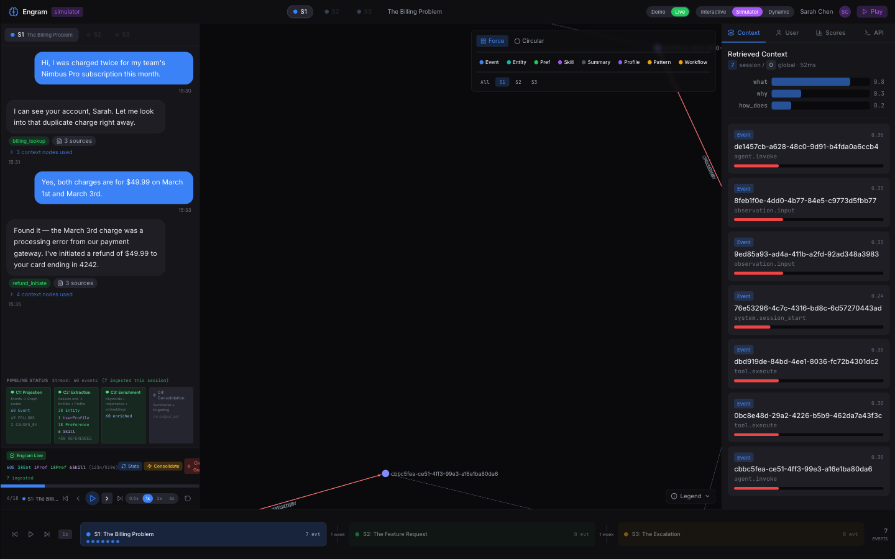
_Mid-playback at message 4/18. Chat shows tool badges, graph displays newly projected Event nodes, and pipeline status tracks all 4 consumers in real time._

**Key interactions:**

- Click a scenario card to load it and begin playback
- Use transport controls: **Skip to start**, **Step backward**, **Play** (auto-advance), **Step forward**, **Skip to end** (ingest all + reconsolidate)
- Adjust playback speed with 0.5x, 1x, 2x, 3x buttons
- The pipeline status panel shows all 4 consumers updating in real-time as events are processed
- The "Engram Live" badge displays live statistics: Event count, Entity count, Profile count, Preference count, Skill count, and total nodes/edges
- **Stats** button refreshes pipeline statistics from the backend
- **Consolidate** button manually triggers the consolidation pipeline
- **Clear Graph** button resets the context graph for a fresh run
- Click "Back to scenarios" to return to the scenario picker

> **Technical:** `simulatorStore.ts` manages scenario data, playback position, and ingestion state. `SimulatorChat.tsx` renders the conversation with progressive reveal. `SimulatorControls.tsx` handles transport, speed, and pipeline actions. `api/pipeline.ts` provides shared utilities for event batching and pipeline status polling. Scenarios defined in `data/` as `mockSessions.ts` (Sarah Chen), `merchantScenario.ts` (Marcus Rivera), `travelScenario.ts` (Priya Sharma), and `realEstateScenario.ts` (David Park), aggregated via `data/scenarios.ts`.

---

## 6. Dynamic Conversation Mode

Dynamic mode enables real-time LLM-generated two-agent conversations where a customer persona and support agent persona interact through the Engram pipeline. Unlike Simulator's scripted playback, each conversation is unique -- generated turn-by-turn via the `/v1/simulate/turn` SSE endpoint. The mode offers both **Quick Start** presets (4 pre-configured scenario pairs) and a **Mix & Match** builder where you can combine any customer with any agent and specify a custom topic.

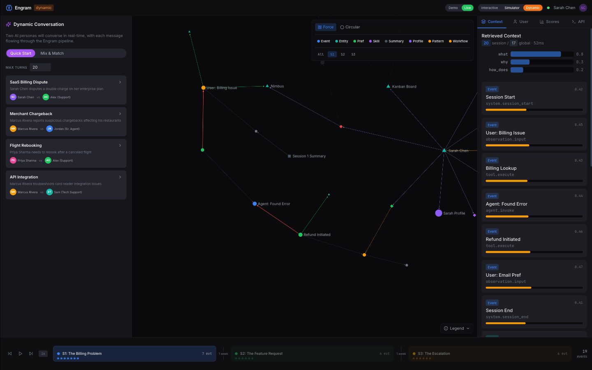
_Quick Start tab with 4 preset scenario cards pairing customer and agent personas._

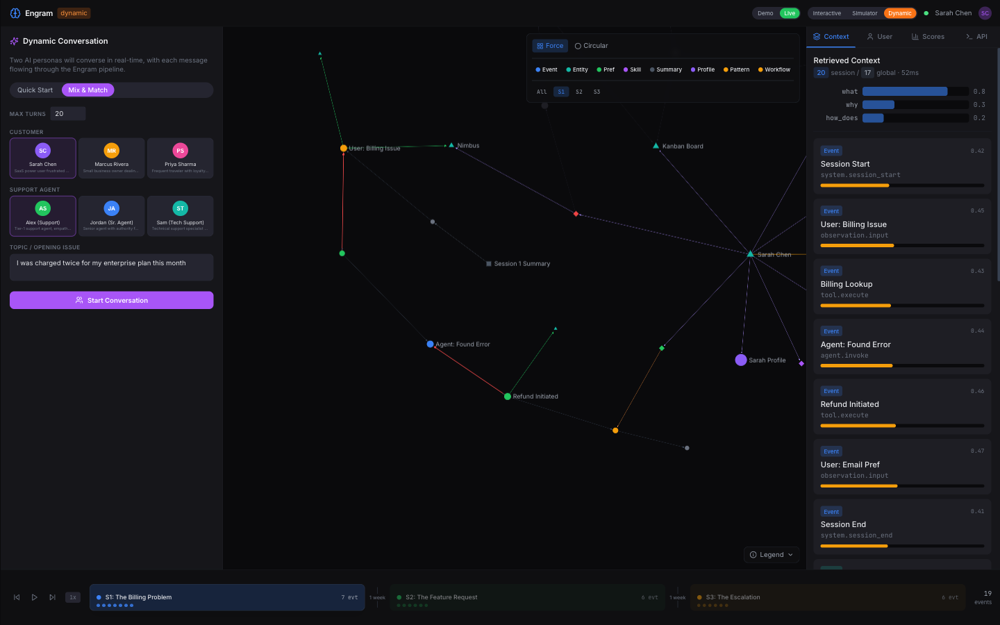
_Mix & Match builder: separate customer and agent grids, custom topic field, and Start Conversation button._

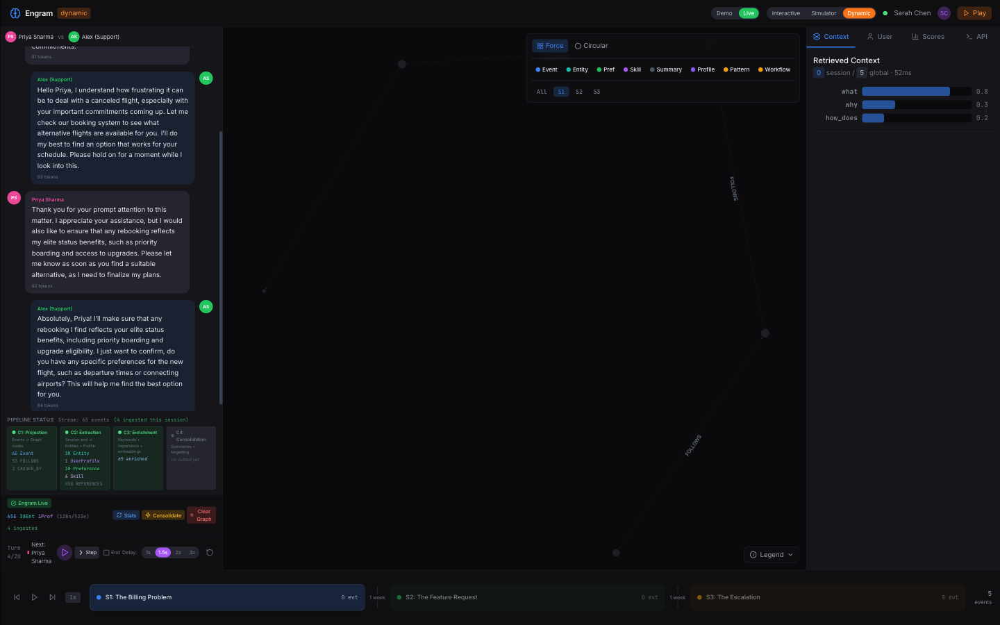
_Active conversation at Turn 4/20. Alternating persona messages with token counts, pipeline status updating live._

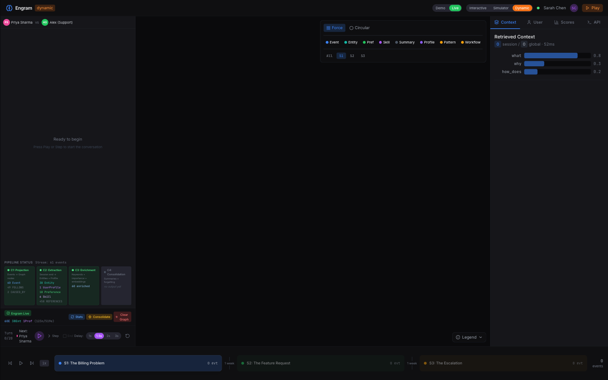
_Dynamic mode ready state with persona header, pipeline status, Engram Live stats badge, and transport controls._

**Key interactions:**

- Choose between **Quick Start** presets or **Mix & Match** custom configuration
- Adjust **Max Turns** spinner to set conversation length (default: 20)
- In Mix & Match: select a Customer persona, a Support Agent persona, enter a custom topic, then click **Start Conversation**
- Use **Play** button to auto-advance turns with configurable delay (1s, 1.5s, 2s, 3s)
- Use **Step** button to advance one turn at a time, watching the LLM generate each response
- Click **End Session** to cleanly terminate the conversation and trigger session-end processing
- Each generated message shows token count for LLM cost visibility
- Pipeline status updates in real-time as each turn is ingested

### Cross-Session Context Injection

A key differentiator of Dynamic mode is **cross-session context injection**: before each support agent turn, the system queries the Engram graph for the customer's accumulated profile data from previous sessions. This includes preferences (e.g., "User uses courteous phrasing throughout", "Prefers confirmation before completing actions"), skills (e.g., "Airline rebooking and upgrade process knowledge"), and interests (e.g., "flight upgrades", "platinum miles"). This retrieved context is appended to the support agent's system prompt, enabling the LLM to deliver personalized, history-aware responses without the customer needing to repeat information.

The context injection pipeline works as follows:

1. Consumer 2 (Extraction) runs at session end, extracting entities, preferences, skills, and interests into Neo4j
2. On subsequent sessions, `_retrievePastContext()` in `dynamicSimStore.ts` queries `/v1/users/{id}/preferences`, `/v1/users/{id}/skills`, and `/v1/users/{id}/interests`
3. Retrieved data is formatted as a structured prompt supplement and appended to the support agent's `system_prompt`
4. The LLM naturally incorporates past context into its responses, demonstrating the value of persistent memory

This closes the loop on the Engram value proposition: events flow in, the graph accumulates knowledge, and that knowledge flows back to improve future agent interactions.

> **Technical:** `dynamicSimStore.ts` manages persona selection, conversation state, SSE streaming, and cross-session context retrieval via `_retrievePastContext()`. `DynamicChat.tsx` renders the alternating-persona conversation log. `DynamicControls.tsx` handles turn advancement, delay configuration, and session lifecycle. `PersonaPicker.tsx` implements both Quick Start and Mix & Match selection modes. The backend `/v1/simulate/turn` endpoint uses Server-Sent Events for streaming token delivery. User data endpoints (`/v1/users/`) provide the cross-session context. Persona definitions in `data/personas.ts`.

---

## 7. Pipeline Integration

Both Simulator and Dynamic modes provide deep visibility into the Engram backend pipeline through a dedicated Pipeline Status panel. This panel shows all four consumer groups that process events after ingestion, their current output statistics, and the overall stream state. The "Engram Live" stats badge in the controls area provides a compact summary of the current graph size.

The four consumers operate as follows:

| Consumer              | Role                             | Typical Output                                                   |
| --------------------- | -------------------------------- | ---------------------------------------------------------------- |
| **C1: Projection**    | Events to Graph nodes            | Event nodes, FOLLOWS edges, CAUSED_BY edges                      |
| **C2: Extraction**    | Session-end LLM extraction       | Entity nodes, UserProfile, Preferences, Skills, REFERENCES edges |
| **C3: Enrichment**    | Keywords, importance, embeddings | Enriched event count                                             |
| **C4: Consolidation** | Summaries, forgetting, patterns  | Summary nodes (triggered on demand or scheduled)                 |

_Pipeline status panel visible during simulator playback (detail from §5). C1–C4 consumer output stats, stream event count, and Engram Live badge are all visible in the lower-right controls area._

**Key interactions:**

- Pipeline status automatically updates after each event ingestion
- Click **Stats** to manually refresh pipeline statistics from the backend
- Click **Consolidate** to trigger the consolidation consumer (C4) on demand, producing Summary nodes
- Click **Clear Graph** to reset the entire context graph (Redis streams + Neo4j) for a clean slate
- The "ingested this session" counter tracks new events added during the current simulator/dynamic run
- Each consumer box is color-coded: green for active consumers (C1, C2, C3), gray for pending (C4)

> **Technical:** Pipeline status implemented in `SimulatorControls.tsx` and `DynamicControls.tsx` using shared `api/pipeline.ts` utilities. Stats fetched from `GET /v1/admin/stats`. Consolidation triggered via `POST /v1/admin/consolidate`. Graph clearing via `POST /v1/admin/clear`. The Engram Live badge component is shared across both Simulator and Dynamic modes.

---

## Appendix: Technical Architecture

> This section is a developer reference. If you're reading this document as a feature overview, feel free to stop here — the sections above cover the complete user-facing feature set.

The Engram frontend is a React 18 + TypeScript application built with Vite, using Zustand for state management and Tailwind CSS for styling. The architecture follows a store-driven pattern where each major feature area has its own Zustand store, and React components subscribe to slices of state they need.

### Zustand Stores (11 stores)

| Store             | File                        | Purpose                                                            |
| ----------------- | --------------------------- | ------------------------------------------------------------------ |
| `sessionStore`    | `stores/sessionStore.ts`    | Session state, message history, event data, session switching      |
| `graphStore`      | `stores/graphStore.ts`      | Graph nodes, edges, layout state, node selection, filter state     |
| `insightStore`    | `stores/insightStore.ts`    | Context retrieval results, intent inference, selected node details |
| `userStore`       | `stores/userStore.ts`       | User profile, preferences, skills, interests, behavioral patterns  |
| `apiLogStore`     | `stores/apiLogStore.ts`     | API call history with method, path, latency, status, payloads      |
| `simulatorStore`  | `stores/simulatorStore.ts`  | Scenario data, playback position, pipeline stats, ingestion state  |
| `dynamicSimStore` | `stores/dynamicSimStore.ts` | Persona selection, LLM conversation, SSE state, turn counter       |
| `chatStore`       | `stores/chatStore.ts`       | Interactive mode chat state, message submission                    |
| `animationStore`  | `stores/animationStore.ts`  | Graph traversal animation state, retrieval color mapping           |
| `announceStore`   | `stores/announceStore.ts`   | Accessibility announcements for screen readers                     |
| `debugStore`      | `stores/debugStore.ts`      | Stream event inspection, consumer group status, latency metrics    |

### Custom Hooks (6 hooks)

| Hook                     | Purpose                                                           |
| ------------------------ | ----------------------------------------------------------------- |
| `useSimulatorPlayback`   | Timer hook that drives simulator auto-play step advancement       |
| `useDynamicPlayback`     | Timer hook that fires between dynamic simulation turns            |
| `useKeyboardNavigation`  | Global keyboard shortcuts for session and playback navigation     |
| `useGraphExport`         | Exports the current Sigma.js graph as a PNG image                 |
| `usePlaybackUrl`         | Syncs session, graph layout, and playback state to the URL hash   |
| `useTraversalAnimation`  | Drives step-by-step graph traversal animation from animationStore |

### API Layer

The `api/engram.ts` module provides the `EngramClient` SDK class wrapping all backend REST endpoints:

- `POST /v1/events/batch` -- Event ingestion
- `POST /v1/context` -- Context retrieval with intent inference
- `POST /v1/query/subgraph` -- Bounded graph traversal
- `GET /v1/lineage/{node_id}` -- Provenance chain traversal
- `GET /v1/users/{id}/profile` -- User profile retrieval
- `GET /v1/users/{id}/preferences` -- User preferences
- `POST /v1/simulate/turn` -- Dynamic conversation SSE endpoint
- `GET /v1/admin/stats` -- Pipeline statistics
- `POST /v1/admin/consolidate` -- Trigger consolidation

The `pipeline.ts` module extracts shared utilities for event batching, pipeline status polling, and consumer output aggregation used by both Simulator and Dynamic stores.

### Type System

The frontend type system mirrors the backend's domain model:

- **11 Node Types:** Event, Entity, Summary, UserProfile, Preference, Skill, Workflow, BehavioralPattern, Belief, Goal, Episode
- **20 Edge Types:** FOLLOWS, CAUSED_BY, SIMILAR_TO, REFERENCES, SUMMARIZES, SAME_AS, RELATED_TO, HAS_PROFILE, HAS_PREFERENCE, HAS_SKILL, DERIVED_FROM, EXHIBITS_PATTERN, INTERESTED_IN, ABOUT, ABSTRACTED_FROM, PARENT_SKILL, CONTRADICTS, SUPERSEDES, PURSUES, CONTAINS
- **8 Intent Types:** why, when, what, related, general, who_is, how_does, personalize

### Demo Scenarios (4 personas)

| Persona       | Domain          | Sessions | Messages | Nodes | Key Themes                                                                   |
| ------------- | --------------- | -------- | -------- | ----- | ---------------------------------------------------------------------------- |
| Sarah Chen    | SaaS Support    | 3        | 18       | 37    | Billing disputes, feature requests, data loss escalation, churn risk         |
| Marcus Rivera | PayPal Merchant | 3        | 18       | 36    | Chargebacks, API integration, settlement holds, cash flow sensitivity        |
| Priya Sharma  | Emirates Travel | 3        | 18       | 35    | Flight rebooking, miles upgrades, lost luggage, loyalty patterns             |
| David Park    | Real Estate     | 3        | 18       | 35    | Property search, mortgage pre-approval, inspection issues, decision patterns |

Each scenario provides structured `ScenarioData` with session metadata, message arrays, expected graph nodes, and mock context responses for Demo mode. Scenario files are aggregated via `data/scenarios.ts`. Persona definitions for Dynamic mode live in `data/personas.ts`. The same persona data powers both Simulator's scripted playback and Dynamic mode's Quick Start presets.

---

_Generated from the Engram FE Shell running at `http://localhost:5173` with all backend services (Redis Stack, Neo4j, FastAPI, consumer workers) active. Screenshots captured at 1440x900 viewport. Additional screenshots from earlier capture passes are available in `docs/screenshots/showcase/` (prefixed `showcase-0X-`) for supplementary use._
