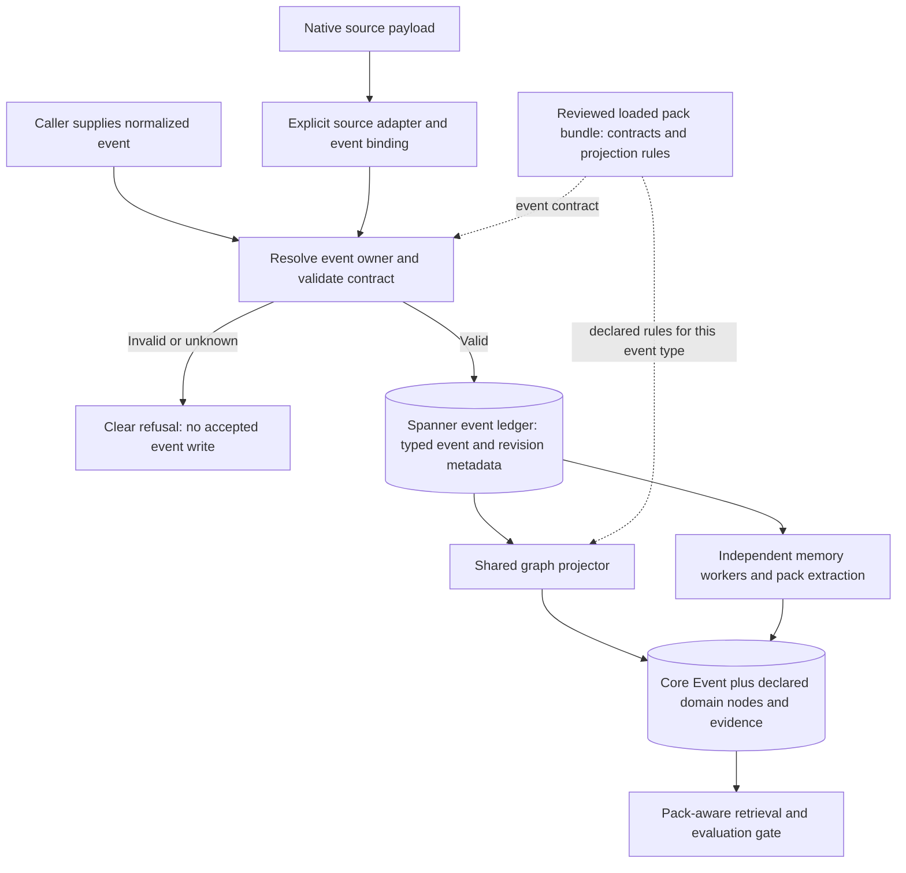

# Engram → Spanner compatibility plan

Authoritative current execution state: [status.md](spanner-compatibility/status.md), [scenario matrix](spanner-compatibility/scenarios.csv), and [remaining coverage](spanner-compatibility/remaining-coverage.json). Checkpoints below preserve historical conditions; later evidence supersedes earlier provisioning/dependency blockers.
Status: reviewed plan persisted; real-Spanner execution underway under token bootstrap; happy journeys and boundary subchecks recorded, confirmed failures remain; no compatibility sign-off. Owner: Engram session. Baseline: `feature/engram-walkthrough`, `6a30dcfd376d21b2732ffc36b8ed8847abb2a9de`. Updated: 2026-10-06.

## Scope and proof

Exercise Engram's real API, composition roots, worker loops and operational CLI against real Spanner. All five storage ports (event log, subscriptions, graph, keyword and vector) select Spanner. No Redis/Neo4j runners, no cross-backend migration, and no memory backend substitution in a cloud acceptance journey. Direct database reads diagnose and verify persisted state; they are not replacements for Engram entry points. Existing port conformance tests supply assertions for the application journeys rather than constitute E2E proof on their own.

A successful journey is API/CLI input → Spanner ledger → worker subscription → projection/derived writes → retrieval API → expected answer with persisted provenance. Run API and workers in separate processes for final acceptance, including process restart. Same-process ASGI tests are useful rehearsal but are not deployment proof.

This plan covers the implemented Engram surface, not undefined Keymaker workflows or every imaginable pack. Keymaker sources, expected questions and evidence requirements remain an explicit product-coverage dependency. Add concrete app journeys to the matrix before claiming app readiness.

## Persistent records

- `spanner-compatibility/scenarios.csv`: required scenario inventory, status, latest run and issue links.
- `spanner-compatibility/surface-inventory.md`: routes, worker composition roots and public port methods mapped to scenario families; regenerate/reconcile on source changes.
- `spanner-compatibility/runs.jsonl`: append-only start/finish records; one UUID/run ID per attempt, including blocked attempts.
- `spanner-compatibility/runs/<run-id>/`: manifest, configuration (redacted), scenario results, logs and cleanup receipt.
- `spanner-compatibility/findings.md`: verified failures, suspected failures, prerequisites, review dispositions and links.

Each scenario result records ID, expected/actual result, pass/fail/blocked/not-run, UTC timestamps, exact entry point, configuration/features, input IDs, evidence path, backend identity, issue and cleanup result. Distinguish a scenario's verdict from whether the test runner successfully executed it. A known bug reproduced is a failed product scenario, never a pass. Never overwrite old runs to hide failures. After each batch append finish records and update latest scenario status and findings. Use `python scripts/track_spanner_compatibility.py start --run-id ID --manifest SANITIZED.json` before the run and `finish --run-id ID --results RESULTS.json` afterward; the helper only tracks supplied evidence and makes no cloud calls. The JSON result shape is documented in its module docstring. Rechecks always use new run IDs. Commit no tokens, auth headers, credential contents or environment dumps. Before persisting logs, inspect/redact them; file credentials remain outside the repo.

Run manifests pin commit plus dirty diff hash, dependency versions, database/resource identity, enabled packs, worker groups/replicas, embedding dimensions, fixture version, scenario IDs, exact command/harness revision, UTC deadline, row/event limits, model mode and resource changes. Historic runs with incomplete provenance are labelled retrospective, not current cloud acceptance.

## Credential and isolation gates

1. Prepare harness and expected results before issuing a fresh token. Parse the captured environment as data; do not shell-source arbitrary output or print the token.
2. Map `GOOGLE_CLOUD_PROJECT`, `SPANNER_INSTANCE_ID`, `SPANNER_DATABASE_ID` to `CG_SPANNER_PROJECT`, `CG_SPANNER_INSTANCE`, `CG_SPANNER_DATABASE`; all `CG_STORAGE_*` ports select Spanner. Remove both emulator-host variables; creation/DDL flags are false during test execution.
3. The trial script explicitly constructs token Credentials. Ordinary `adapters/spanner/schema.py::open_database` currently calls `spanner.Client(project=...)` without consuming `GOOGLE_OAUTH_ACCESS_TOKEN`. Decide and record supported credentials before launching ordinary API/worker processes. A test-only explicit credential bootstrap may inject credentials into the SDK client in every process, without replacing Engram stores. Such runs prove storage behavior but do not prove unmodified deployment authentication. Record normal production ADC startup as blocked until exercised.
4. Verify resource identity, schema and index readiness, read/write/query access and token expiry. Do not assume a one-hour lifetime means a previously issued token has an hour remaining. Use a bounded read-only preflight, record permissions without exposing secrets, and stop cleanly on expiration/permission denial. Never silently refresh credentials or fall back to ADC/emulator during a token run.
5. Dedicated disposable test databases are mandatory for broad runs. Separate databases/configurations for agent-memory, PDLC, CRM, combined packs and destructive lifecycle/rebuild fixtures. Namespaced IDs alone do not isolate `OntologyState:active`, content-addressed nodes, global reads, `delete_all`, retention or force rebuild.
6. No tests against a populated shared database unless every operation is demonstrably scoped. No whole-database clears, broad expiry/pruning or forced ontology-state overwrite on the existing `engram` database. Provisioning separate databases/schema is a prerequisite, not a hidden test side effect; record the exact authorized resources before provisioning.
7. On a fresh credential, confirm the available test databases and permissions before any write. If unavailable, record a blocked run and explain the prerequisite. Preserve existing cloud data. Cleanup must be restricted to manifest-owned resources; record leftovers explicitly. Reserve cleanup time, but if the token expires do not pretend cleanup succeeded.

## Coverage and corner cases

The accompanying CSV contains executable-sized scenarios. Families below are the review checklist; every row must receive a result or explicit blocker.

| Family | Engram entry points and requirements |
|---|---|
| BOOT | API lifespan, `open_stores`, worker CLI for all five consumers, ontology CLI: correct adapter identities, schema mismatch/refusal, normal and token-bootstrap auth, bad/expired/insufficient credential, clean startup/shutdown, shared persistence across processes. |
| ING | `/v1/events`, batch and import: valid/invalid/mixed input, empty/max/max+1, gzip integrity/decoded limits, stalled reads, timezone offsets/naive times/future drift, unknown namespaces/reserved identities, nullable/missing payloads, duplicate and conflicting event IDs, uncertain commit retries, outcome cardinality and ordering. |
| HOOK | GitHub and Jira through signed routes: every translator handler/action plus unsupported types, missing/wrong signature/secret, replay under changed delivery ID, malformed nested structures, future/missing times, translation fan-out/partial writes, normalization and source trust. GitHub file-list absence and other documented connector limitations must be reported rather than treated as complete source coverage. |
| LED | Exercise ledger reads via workers/import/replay: lossless JSON (especially tagged nonintegral floats, null, bool, list, nested data, Unicode and datetime), event IDs/positions, zero/one/multiple pages, tie timestamps, session order vs arrival order, absent docs, unknown IDs, metadata/enrichment write-read behavior, idempotence across process restart. |
| SUB | Actual worker loops: independent groups, late-created groups, multiple consumers, same-session contention, shard coverage, partial batch ACK, read blocking wakeup, pending drain beyond one page, orphan claim pagination, retry counts/DLQ, crash before/after write/ACK, worker stop during backoff, lag counts unread items per Subscription contract; assert pending deliveries, acknowledgements and DLQ separately. Preserve per-session order; do not demand global producer occurrence-time order. |
| PROJ | Projection worker: nodes/FOLLOWS/CAUSED_BY, absent parent, session end, idle/stop flush, replay and cache eviction, alternating replicas, partial commit failure, payload planning error and DLQ, no successful ACK before required writes. Pack rules: custom and content-addressed keys, types/defaults/null removal, stubs, lifecycle guards, direct/list/prefix/latest lookups, lookup limits, node-before-edge dependency and provenance. |
| ENR | Enrichment worker: keywords/importance and actual persisted event embedding; disabled/failing embedder and missing node/document, delayed projection, repeat delivery. |
| EXT | Entity/user extraction worker: scripted valid/invalid/model failure output; entity resolution and clusters, references, user profile/preferences/skills/interests, contradictory preference supersession, typed DERIVED_FROM policy, embeddings; delayed projection and replay. |
| PEXT | Pack extraction worker: valid/rejected proposals, invalid/empty model output, confidence ceilings, proposed/rejected/confirmed links, trust, evidence, no overwrite of authoritative data, known-item limits, extraction-before-projection, missing endpoints, retry/replay and partial write failure. |
| CONS | Consolidation stream and timer: summary/edges, session threshold/end, entity clustering, centrality/importance, trigger overlap/guard, disabled/failing summarizer, repeat cycle and large batches, forgetting and retention. |
| MEM | `/v1/context`, `/v1/nodes/{id}/lineage`, `/v1/query/subgraph`: graph-only, keyword-only, vector-only, combined and empty channels, graph/keyword/vector errors, depth/node/time budgets, cursors/pages, cyclic paths, missing seed, disconnected graph, cross-session expansion, access counters; RRF/PPR/MMR/decay/reranking/intent/HyDE options when configured, and provider degradation. |
| ART | `/v1/query/artifacts`: every PDLC/OpenDAL and CRM competency question; IDs/composite keys vs text seeds; intent inference/explicit intent/direction; trust/supersession/rejected/proposed links; completeness budget and neighbor truncation; bounded scans, provenance/source positions; every page, empty answers, multiple active packs and evaluation-pending TTL/stale-read behavior. |
| SEARCH | Through retrieval/enrichment/extraction: full-text tokenization/punctuation/Unicode/case, session filters, absent/empty terms, thresholds/top-k/rank ordering; vectors exact stored dimensions, zero/invalid/wrong size, self-hit, indexed approximate recall with expected fixture relevance, index not-ready/errors. Do not require exact memory/native ranking equality. |
| USER | User APIs: profile/preferences/skills/patterns/interests/export/delete; missing user, stable ordering, supersession, reobservation, provenance, deletion does not affect other users or unrelated graph evidence; entity API with references and missing entity. |
| FB | Feedback API: audit ledger event and graph score changes, min/max clamp, duplicate IDs in input, same query resubmission, missing nodes, ledger success followed by graph failure, recovery outcome. Do not assume cross-ledger/graph atomicity or undocumented feedback idempotence. |
| ONT | Describe/status/evaluate with and without record; pending gating; initial/additive/mapping/breaking changes, semantic version refusal/override, failed replay/restart, missing eval set, failing gate, interrupted rebuild, missing docs, same-backend Spanner graph rebuild/cutover preserves source ledger and concurrent writes. No cross-backend migration. |
| LIFE | Admin stats/health/reconsolidate/prune dry/live/replay; replay more than100 rows, timestamp ties, interleaved sessions, pack-derived nodes/evaluation state; graph forgetting/orphan cleanup, retention protects all five groups including pending and unread history imports, archive failure/write/restore, dedup cleanup/session indexes, large deletion commit splitting. Archive restoration/recovery behavior must be exercised only where implemented; missing recovery is a finding. |
| OPS | Authentication/admin separation, request/event limits, health/detailed health/metrics/stats accuracy, response timeout/cancellation (including SDK work in threads), token expiry mid-run, process exit/restart, session pool pressure and closed clients; query p50/p95/p99, calls/rows, bounded representative concurrency. |
| APP | Agent-memory, signed PDLC, CRM import and combined-pack journeys; deterministic model/embedding fixtures first, separately labelled live-provider smoke if configured. `/v1/simulate/turn` is LLM-only; assert its resulting inputs through ingestion if simulation→memory is an app requirement, not claim the endpoint itself touches Spanner. |

## Execution guards required in the harness

Before EACH destructive API/CLI case, re-verify the project's instance/database identity against the manifest-owned disposable resource allowlist; initial startup checks alone are insufficient. Refuse any shared or unapproved target; the explicitly approved disposable `engram` target is allowed under the authorization below. Never call `spanner_probes.py` retrieval/force rebuild against the existing database. Its `force=True` path mutates global ontology state and is diagnostic-only.

Admin replay LIFE-04 must have an independent process deadline and a no-progress/repeated-page detector. Request cancellation alone cannot stop work already running in SDK threads. The test process must be killable, its groups/resources known, and its partial ledger/graph state inspected after termination. Do not execute replay before these guards exist: inclusive occurred_at pagination can repeat a100-row timestamp-tied page. Report counts, actual unique projected IDs, pack-derived nodes and ontology state after replay. A detected loop is a failed scenario and documented finding, not a test timeout interpreted as infrastructure noise.

## Known issues and desired outcomes

- ING/HOOK trust and payload contract: #4, #5, #15, #16, #17.
- SUB/LIFE live recovery and protected documents: #14, #19.
- PROJ/PEXT correct lookups, evidence, ordering/dependencies: #8, #9, #10, #18.
- ART rejected links and incomplete-search uncertainty: #6, #7.
- ONT failed replay, incomplete rebuild and ledger-preserving cutover: #11, #12, #13.

Recheck each on real Spanner using Engram entry points. Record common engine defects separately from Spanner adapter/SQL/auth/index-specific failures and harness/environment failures. File new GitHub issues only for verified nonduplicate failures, attaching the sanitized run/scenario evidence and reproduction. Suspected findings remain in findings.md until verified. Never infer resolution from a probe not reproducing; explain changed conditions. These issues are not assumed to be the entire backlog.

## Execution order

1. PREP: persist/review inventory, fixtures/expected answers, harness credential/isolation checks; rehearse on Spanner emulator only. Every public runtime route and port method must map to a scenario or explicit exclusion. Resolve Astra findings before cloud acceptance.
2. CLOUD-A: fresh token → read-only preflight → valid ingestion/ledger/subscription contracts → separate-process basic agent-memory, PDLC and CRM journeys. Small fixed event limits; record ledger/graph checkpoints before retrieval.
3. CLOUD-B: retrieval and real SQL/GQL/full-text/vector semantics → extraction/user/feedback/consolidation and feature combinations → combined-pack namespace/gating checks. Check expected answers independent of shared engine implementation.
4. CLOUD-C: all known issue reproductions, restart/crash/contention and transaction failure injection → retention/archive and admin replay → isolated ontology changes/rebuild/cutover → bounded performance. Do not interrupt shared services to inject failures; target owned processes/credential sessions or controlled SDK failures. Separate genuinely real-service failure evidence from synthetic injection.
5. FINAL: reconcile all scenario results/findings and resource manifests, cleanup verification and unresolved blockers. Token windows may require further batches; never skip a family to fit a deadline.

Use deadline shorter than remaining credential validity, with at least10 minutes reserved for evidence/cleanup. Time, event/node/byte limits and concurrency must be explicit in each run manifest; the plan does not invent a paid-instance load-test budget or latency SLO. Select small correctness datasets first, including boundary-specific datasets; agree workload/latency gates before performance sign-off. No automatic token refresh or prolonged soak hidden in correctness runs.

## Acceptance and limits

Cloud compatibility requires every in-scope scenario passed, no unresolved failures in data preservation/trust/order/provenance/answers, every enabled optional provider/feature verified or explicitly outside the declared deployment, and no orphan test resources concealed. No Redis/Neo4j runners or silently substituted backends. Existing model/storage defects remain visible even if SDK access works. Emulator-only, harness-auth-only and synthetic failure runs cannot establish real-instance/production-auth behavior.

We can complete an honest audit with failed/blocked scenarios; that is not compatibility sign-off. Review accepted coverage is not evidence of executed behavior. Record all skipped, not-run and blocked rows. Never claim every corner case is mathematically exhausted; the closure rule is complete coverage of the inventoried supported surface and explicit requirements.

## Review

Astra (`gpt-6-astra`, low effort) independent review requested by the user; review completed with four findings; all plan corrections accepted below. Execution readiness remains conditional on the harness, owned resources and concrete scenario assertions. Review checked inventory-to-scenario coverage and unsafe fixture reuse, production startup/credential distinction, missing worker/API paths, real-service semantics and corner cases. Append exact findings and dispositions to findings.md, with a review run record.

### Astra dispositions (2026-10-06)

1. P1 replay process deadline/no-progress guard: accepted; guard section and LIFE-04 require it. Suspected underlying defect tracked separately pending reproduction.
2. P2 lag contract: accepted; unread lag is checked separately from pending/ACK/DLQ counters.
3. P2 per-case isolation: accepted; every destructive case verifies manifest ownership and forbids shared database and legacy forced rebuild.
4. P2 traceability: accepted; generated AST inventory covers route decorators, inherited public storage contracts and concrete scenario IDs. Execution must further attach per-method assertions/results; inventory mapping is not runtime evidence.

Reviewer: `gpt-6-astra`, low effort, independent read-only pass. No cloud execution by reviewer. Coverage structure accepted after correction; no compatibility sign-off claimed.

## Current execution checkpoint

Read-only run `20261006-cloud-preflight-9c6120b9` verified real Engram store composition, schema and health under token bootstrap. Database listing was denied; isolated disposable targets are not established. BOOT-02/BOOT-03 remain blocked for their full acceptance requirements. No cloud writes, full HTTP/worker journey, normal ADC proof or compatibility sign-off. The65 scenario rows remain the work ledger; historical emulator proof is recorded separately.

### Existing database checkpoint

The user confirmed the existing `engram` database as target. Read-only real HTTP run `20261006-cloud-api-readonly-ae2eb216` passed six API subchecks (health/ontology/stats/empty context/missing lineage/empty subgraph), with no cloud mutations. Continue scoped checks where writes and reads can be isolated to run-owned records and groups. Do not equate the database's existence with permission to clear shared graph/ontology state or expire/prune existing history. Broad worker replay and lifecycle tests require ownership/isolation guards.

## Disposable target authorization

User explicitly confirmed on2026-10-06 that the existing `engram` database is disposable. This satisfies the data-preservation gate for fixture reset, graph clears, replay, retention and pruning on exactly project `portiq-mvp`, instance `engram-experiment`, database `engram`. Keep database/schema intact; reset owned test data between batches, stop all fixture processes before resets, record affected tables/rows and preserve evidence. Same-backend blue/green still needs a separate target and its provisioning permission; disposable source permission does not imply DDL privilege.

## Execution checkpoint

Real cloud records now include agent-memory, signed PDLC and CRM journeys, ingestion edge cases, extraction, user deletion, feedback, admin/timer summary creation and independently launched API/five worker processes. See the CSV and `findings.md` for the latest evidence. The test dependency environment has now installed the declared embedding extra and verified384-dimensional model output. Earlier initialization logs alone did not establish that optional dependency was present. Cold query startup exceeded a10-second client deadline; a new bounded run uses60 seconds and retains the timeout record.

The CLI runner is `scripts/engram_spanner_compat.py`; test-only token/provider process bootstrap is `scripts/engram_spanner_process_bootstrap.py`. Phases are journeys, boundaries, knowledge, processes, search, replay and retention. Runs are serialized with a process lock; no two fixture resets may overlap. `search` reads the prior populated process fixture without reset; other destructive phases reset authorized fixture rows. All phase starts/finishes and harness snapshots are retained. Provider output is scripted except the local embedding model; live paid providers are separate pending coverage. Do not infer a full scenario pass from a successful subcheck.

New issue [#20](https://github.com/arunmenon/Engram/issues/20) tracks interest-provenance extraction failure. The matrix is a coverage checklist, not proof that these are all possible defects.

## Second target authorization

User created `engram-compat-target` on the same project/instance for the requested disposable rebuild tests. It is now the exact additional allowed target. Preserve its database and schema; only initialize the canonical schema if it is empty, then clear test rows before reuse. Target identity must be checked before each write/reset. Separate target-scoped IAM setup is recorded in the ledger. A new target does not make issue13 disappear: the original event ledger must remain selected through graph cutover. No cross-backend migration.

## PDLC pack coverage

PDLC is explicitly in scope, independently of CRM and agent-memory. Record signed GitHub/Jira ingestion, declarative projection/lifecycle/provenance, pack extraction and artifact HTTP answers; then replay the same ledger into the second Spanner graph with evaluation gates. The small eight-delivery fixture has 11 competency questions covering ticket/PR/test/review/release/deployment relationships. Both source and rebuilt-target evaluations passed at F1=1.0 in `20261006-cloud-pdlc-8c327a69`. This does not close all PDLC corners.

The larger OpenDAL fixture supplies 292 signed deliveries (288 merged PRs and four releases), with independent expected answers derived from git/changelog. It covers release contents/membership, reverts, lexical change lookup and feature-to-release traversal; it contains no Jira, review, CI or deployment evidence. Run its graph evaluation and HTTP artifact questions separately, preserve any below-perfect question scores even if the configured 0.9 mean-F1 gate passes. First attempt stopped on HTTP429 before projection; retain it and retry with bounded server-delay handling. Explicit phase names: `pdlc`, `pdlc-api`; `stats` checks the rebuilt PDLC target without reset.

## Resumed window (2026-10-06, 13:30 UTC onward)

User requested resumption. Obtain a separate fresh token through the existing local script, privately captured; do not renew implicitly during a running phase. New `combined` phase uses a maximum 19 events, independent API and projection processes, CRM NDJSON admin import and signed PDLC deliveries, matching-version combined evaluation and both packs' HTTP assertions plus memory context. New `recovery` phase uses four events total, one owned projection process at a time: controlled pause before graph commit or before ACK followed by real process SIGKILL/restart, one-shot synthetic transient/non-transient failures at real port calls. Claim idle is explicitly lowered to 500ms for bounded orphan recovery. Test injections are not evidence of a real Cloud Spanner service outage. Preserve source/target schemas, serialize resets, snapshot companion/bootstrap scripts, record individual cleanup receipts. Further credential/schema negatives, concurrent workers, boundary APIs and upgrade/rebuild failure cases follow; all remain open until individually evidenced.

## Resumption checkpoint — 2026-10-06, 14:21 UTC

The13:30 token window has completed its bounded cloud runs; no further cloud phase is launched in its cleanup reserve. All phases finish in the append-only ledger. Both `engram` and `engram-compat-target` database/schema objects remain. Fixture rows are retained for inspection. Normal ADC remains unconfigured; the tested SDK uses an explicit token bootstrap. No Redis/Neo4j runner, alternative memory storage, runtime source fix, commit or push.

New completed phase families: combined CRM/PDLC independent processes; crash/transient/permanent recovery; live replicas and orphan pagination; invalid credential/database and dimension handshake; context/lineage/native ANN/feedback boundaries; real custom-pack upgrades/rebuild negatives; SDK shutdown; JSON codec; pack lookups/lifecycle/extraction ordering; complete consolidation timer; commit budget/concurrent/uncertain retry; pack proposal policy; safe entity/user extraction isolating known interest failure; native keyword and enabled retrieval features; all-shard/late-group/ACK/DLQ/wakeup; supported signed webhook handlers; enrichment provider/vector/storage boundaries; FS archive/import recovery; enrichment/causal-parent races; one bounded configured live-model pack extraction; user read/export/delete and feedback clamps, followed by read-only deletion-residue verification. Exact assertions and limitations are in each run's observations and findings.md.

Issues23–30 were filed with code locations, real-cloud receipts, reproduction, acceptance criteria, sizing and review expectations. They cover dimension handshake, lineage bounds/pagination, vector seed hydration, SDK shutdown, JSON tag collisions, transient ingress errors, enrichment dependency loss and late-parent causal links. Existing issues8/9/10/11/12/14/18 also have cloud recheck comments. Common engine/API findings are distinguished from Spanner-specific adapter faults. Synthetic provider/storage failures are labelled; no actual Cloud Spanner outage is claimed.

Current full-row matrix:65 scenarios,33 failed,9 passed,21 partially executed/not_run and2 blocked. These counts express row closure, not individual test counts or unique bugs. Successful PDLC/OpenDAL, CRM, combined-pack, real-model and native search subchecks do not imply compatibility sign-off. Historical harness errors and retries remain visible and interpreted in findings.md; they are not product failures.

The last source fixture is the completed user/feedback boundary case. Final read-only check verifies owned profile/preferences/pattern nodes and edges removed, shared Skill/topic/other-user profile preserved, REDACTED user tombstone retained and five ledger Events intact. All owned processes/loops stopped. Remote SDK session cleanup is not fully verified because normal Stores.close does not register the Spanner SDK closer (#26); do not delete unrelated sessions or conceal that limitation.

Future child launches now execute the exact saved bootstrap copy and record its hash/controlled flags. Future manifests additionally hash companion scripts. Historical records retain their contemporaneous snapshots; do not rewrite finished manifests to imply the newer tracing existed earlier. Raw credentials remain private and are scrubbed from logs; no token/key belongs in repository artifacts.

### Work still required for full coverage

Use remaining-coverage.json and CSV requirements as the authoritative pending work list. Each partially executed row needs explicit per-assertion closure; a known failed row does not prove every other corner in it. Prioritize:

1. Remaining transport/import/count/byte/time limits, every partial ingress outcome and pack-payload refusal across single/batch/import. The existing validation/JSON failures stay open until fixes are independently rechecked.
2. Core/pack projection defaults, typed/null/stub/authoritative updates and failed partial plans; entity resolution/merging, invalid model output/outages, contradictions/re-observation and extraction/known-item caps. Interest creation remains blocked by #20; new dependency failures29/30 must not be hidden by scheduling projection first.
3. Artifact admission combinations/alternate valid routes and each traversal budget; evaluation pending/TTL/read-error gates; complete memory ranking/intent/HyDE/cross-session quality and cancellation/thread completion. Bounded feature smoke is not quality or timeout sign-off.
4. Repeated/failed provider consolidation, overlap guard and cluster operations; nonzero archive graph deletion, all five consumer retention protections, archive failure/recovery permutations, prune scan/large-commit boundaries and replay restoration/interruption. FS round-trip passed; no GCS bucket is configured and GCS compatibility is untested, not substituted.
5. Upgrade/rebuild interruptions, partial write/gate failures and same-Spanner concurrent cutover/catchup/rollback. Never implement a Redis-to-Spanner migration in this plan.
6. Standard deployment ADC, missing/wrong schema/index definitions on an explicitly owned negative-test resource, real mid-worker credential expiry/permission failure and bounded service/session recovery. Preserve both current user schemas. The service account's database-create permission was denied earlier; normal ADC and Keymaker app requirements remain blocked. Keymaker needs actual source payloads and expected questions/provenance before app sign-off.
7. Complete live entity/user-provider journey separately from the one-call live pack smoke, and a declared bounded workload with per-request latency distributions. No latency SLO or load-budget acceptance has been invented.

Renew credentials only as a separately declared new window after current cleanup. Continue serial guarded runs with explicit limits, retain failed attempts, update rows through track_spanner_compatibility.py and file verified nonduplicate issues. This checkpoint is **failed/incomplete compatibility**, not completion or production readiness.

## Resumed execution checkpoint — 2026-10-06 16:38 UTC

Renewed credential window started16:22:36UTC; no refresh inside a phase. Serial remaining-coverage runs exercised batch/import limits and partial commits, tied/distinct context paging and read budgets, repeated/overlapping/failed-provider consolidation, combined PDLC+CRM evaluation status and record modes, malformed extraction/pack proposals and provider outage, alias resolution/native cluster writes, bounded two-app context workload, and real archive graph deletion plus admin pruning. Every attempt, including harness errors, has a finish record.

Reconciliation08: **36 failed,14 passed,13 partial (`not_run`),2 blocked**,65 rows. Three new issues: context cursor ordering31, retrieval read deadlines32, and warm/cold admin prune50033. These are common engine/integration gaps reproduced on actual Spanner; SDK deadline propagation is additionally Spanner-specific. The previously identified batch pack validation gap4 persists. Native worker archive deletion succeeds independently of the failing admin pruning API. No compatibility sign-off.

Warm context ASGI observations:24 samples, max concurrency2, two independent SDK-backed app lifespans in one OS process: p50=.645s,p95=.943s,p99=.959s. This is a declared bounded fixture, not cold network/server startup, throughput capacity or an SLO pass. GCS remains unconfigured; FS archive conditional assertions close without a GCS claim.

The current remaining-coverage.json now lists specific uncovered assertions for every partial row and the requirements/issue links of all failed rows. Ordinary ADC and unspecified Keymaker inputs remain blocked. Remote Spanner SDK session deletion remains unverified (#26), although all owned fixture loops/processes exit. User source and target databases/schemas are preserved; source retains final fixture for review. No src changes, commit, push, or unrelated uv.lock modification.

## Implementation plan — five waves

Status: implementation in progress. Seven issues (#15/#16/#23/#26/#27/#28/#33) have local fixes and scoped real-Spanner rechecks; Astra low implementation review completed with two verified defects (#26/#27); correction/recheck and full acceptance remain pending. The original planning step made no runtime changes. Baseline remains `feature/engram-walkthrough` at `6a30dcf`. All 30 open issues (#4–#33) were checked against GitHub and mapped exactly once in [implementation-waves.csv](spanner-compatibility/implementation-waves.csv). That file carries dependencies, affected scenario IDs, implementation status, verification-run IDs and review evidence. Existing scenario verdicts remain unchanged:14 passed, 36 failed, 13 partial, 2 blocked. A failed scenario can reference several issues; one issue can affect several scenarios.

The issues' existing reproductions and acceptance criteria remain the source of truth. The changes below are proposed scopes, to be confirmed against the current code before implementation. Reuse the existing event ledger, subscriptions, graph ports, ontology registry and SDK. Add infrastructure only when a bounded reproduction proves those components cannot meet an acceptance criterion. Neither Redis/Neo4j runners nor cross-backend migration are in scope. Preserve `engram` and `engram-compat-target` databases and schemas.

### Wave 1 — protect accepted data

Issues: [#4](https://github.com/arunmenon/Engram/issues/4), [#5](https://github.com/arunmenon/Engram/issues/5), [#14](https://github.com/arunmenon/Engram/issues/14), [#15](https://github.com/arunmenon/Engram/issues/15), [#16](https://github.com/arunmenon/Engram/issues/16), [#17](https://github.com/arunmenon/Engram/issues/17), [#19](https://github.com/arunmenon/Engram/issues/19), [#28](https://github.com/arunmenon/Engram/issues/28), [#33](https://github.com/arunmenon/Engram/issues/33).

Start with a shared ingestion boundary: pack-specific fields, authenticated trust, normalized timestamps, complete gzip and consistent webhook validation. Preserve per-input batch/import outcomes and committed prefixes. Then implement live pending retries/reclaim and retention protection together: all five consumer groups participate, permanent failure terminates deliberately, and missing content is never acknowledged as completed work. Align admin pruning with actual relationship scores and worker retention semantics.

Decide before coding: the source-identity contract for existing API authentication; which errors are retryable; retry/backoff/reclaim limits; missing-document terminal behavior; uncertain-commit and partial-write response semantics; retention protection for unread as well as delivered events. Use existing subscription metadata where sufficient.

Exit proof: malformed inputs produce no ledger writes; signed valid GitHub/Jira and CRM imports still project; transient failure recovers while workers stay running; permanent failure reaches bounded DLQ; crashes/retries do not duplicate effects; pending content survives retention; raw/gzip count/byte boundaries and partial import outcomes are correct; warm/cold dry-run and live counts agree with persisted graph state. Includes remaining OPS-02 and FB-02 behavior/contract work.

### Wave 2 — reliable graph construction and evidence

Issues: [#8](https://github.com/arunmenon/Engram/issues/8), [#9](https://github.com/arunmenon/Engram/issues/9), [#10](https://github.com/arunmenon/Engram/issues/10), [#18](https://github.com/arunmenon/Engram/issues/18), [#20](https://github.com/arunmenon/Engram/issues/20), [#29](https://github.com/arunmenon/Engram/issues/29), [#30](https://github.com/arunmenon/Engram/issues/30).

Fix capped lookup/latest selection, direct lifecycle provenance, replica-safe predecessor selection and typed interest provenance. Choose the smallest durable retry/reconciliation behavior that preserves extraction/enrichment evidence when projection or causal parents arrive later. Waiting for projection in the happy fixture alone does not fix ordering races.

Dependencies: Wave 1 retry and retention behavior must be stable before dependency-repair proof (#10/#18/#29/#30). Lookup and typed provenance changes can be implemented independently. Decide durable session predecessor ordering and what acknowledged derived work guarantees; use ledger position for ingestion order and occurrence time only where the domain contract requires it.

Exit proof: force each ordering permutation, multi-worker interleaving, duplicate replay and interruption; assert exact nodes, relationships and source evidence, not counts alone. Complete PROJ-02 defaults/null/stub/authoritative updates, EXT-01 semantic resolution/merges, USER-01 stable reads/export/contradictions, CONS-01/02 summary/cluster overlap and mutation boundaries. Run PDLC, CRM and combined fixture journeys.

### Wave 3 — retrieval correctness and bounded work

Issues: [#6](https://github.com/arunmenon/Engram/issues/6), [#7](https://github.com/arunmenon/Engram/issues/7), [#24](https://github.com/arunmenon/Engram/issues/24), [#25](https://github.com/arunmenon/Engram/issues/25), [#31](https://github.com/arunmenon/Engram/issues/31), [#32](https://github.com/arunmenon/Engram/issues/32).

Fix context/lineage cursor progress and node limits, relationship admission, incomplete-search answers and Entity-vector hydration with event evidence. Define the query deadline contract and propagate remaining budgets to native SDK work. Cancelling an async await is insufficient proof that a thread or remote request stopped.

Dependencies: vector proof needs schema handshake23 and preserved enrichment29; lineage needs predecessor18; deadline/shutdown proof needs SDK cleanup26. Pagination and admission fixes can start independently.

Exit proof: tied/distinct timestamps and short/final pages cover every expected ID exactly once; node/access budgets hold; rejected paths never reappear through another traversal; truncated/read-failed searches report uncertainty; ANN seeds hydrate with correct session/evidence; synthetic slow native calls hit a deliberate deadline and terminate. Complete MEM-04 feature oracles, ART-01/02 competencies and APP-02 PDLC evidence. Preserve the previously recorded OpenDAL over-return discrepancies; aggregate F1 success does not erase exact-answer differences.

### Wave 4 — Spanner adapters and operational tools

Issues: [#21](https://github.com/arunmenon/Engram/issues/21), [#22](https://github.com/arunmenon/Engram/issues/22), [#23](https://github.com/arunmenon/Engram/issues/23), [#26](https://github.com/arunmenon/Engram/issues/26), [#27](https://github.com/arunmenon/Engram/issues/27).

Execute the codec27, schema23 and SDK ownership26 prerequisites early, before the dependent waves' acceptance runs. Replay cursor21 and pack-aware stats22 complete the operational tool work before Wave 5. These remain one logical wave with two execution points, not a requirement to postpone foundational adapter fixes until after retrieval.

Decide the compatibility policy for already-written codec markers; whether an incompatible database is refused or explicitly repaired on an owned resource; and how bounded SDK shutdown proves owned session deletion. Do not silently reinterpret historical payloads or mutate the user's existing schemas as negative-test setup.

Exit proof: lossless JSON marker round trips and known legacy policy; startup refuses incompatible vector/schema definitions; all five ports stay selected as Spanner; owned API/worker SDK session managers close with actual cleanup evidence; replay advances across ties and interruptions; stats include every active pack label/relationship. Complete OPS-05 independent-process cold/warm latency distributions and bounded replica/backlog checks. Ordinary ADC remains a separate prerequisite; token-bootstrap success is not ADC proof.

### Wave 5 — safe ontology replay, rebuild and same-backend cutover

Issues: [#11](https://github.com/arunmenon/Engram/issues/11), [#12](https://github.com/arunmenon/Engram/issues/12), [#13](https://github.com/arunmenon/Engram/issues/13).

Preserve incomplete replay state for repair, fail rebuild completeness/gates deliberately, and keep ledger identity independent of the rebuilt graph target. Establish catchup, concurrent-ingress switch and rollback behavior within Spanner. No Redis-to-Spanner migration.

Dependencies: correct graph/evidence construction, retention protection19, retry14, codec27, replay21 and SDK ownership26 must be verified before cutover acceptance. Decide operator-visible failed/incomplete states, replay repair semantics, completeness exceptions if any, and source/target ownership before changes.

Exit proof: synthetic partial writes, absent historical documents, interrupted replay/rebuild and restart recover or fail closed; evaluation gate/record state is truthful; accepted concurrent events and all required provenance survive catchup/switch/rollback; original ledger identity and both database objects remain preserved. Re-run PDLC and CRM evaluations and end-to-end APIs on the target graph.

### Execution order, reviews and tracking

Suggested dependency order: Wave 4 prerequisites #27/#23/#26 → Wave 1 → Wave 2 → Wave 3 → remaining Wave 4 tools #21/#22 → Wave 5. Independent small fixes may proceed earlier; release/verification gates must obey the CSV dependencies. The dependency list describes verification prerequisites, not a mandate to combine all issues into a single PR. Ship focused changes grouped only when they share a required behavior. Do not invent calendar or effort estimates before the unresolved contracts are decided.

For each issue/change:

1. Read the current code and existing issue evidence; record any chosen behavior or scope adjustment in this plan/issue before implementation.
2. Add a regression reproducing the failure, make the smallest coherent runtime fix, and run affected local checks. Backend-neutral unit checks are permitted; cloud compatibility journeys continue to use actual Spanner and no alternative storage runner.
3. Obtain independent review of implementation and failure semantics, resolve findings, and preserve the review evidence. The earlier Astra review covered the test plan, not future runtime fixes.
4. Start a new ledger record before every real-Spanner recheck, pin the implementation commit/diff, configuration, resources, limits and credential window, and retain finish records including failures. Exercise API → ledger → actual worker → graph → retrieval, plus the relevant failure case.
5. Update implementation-waves.csv status/run/review fields, issue evidence, findings and scenario matrix together. Only mark a scenario passed after all its declared assertions pass. A fixed issue does not automatically close every linked scenario. Keep historical failed runs.

Suggested implementation statuses: planned → implementing → implemented → reviewed → verified; use blocked only with a concrete recorded prerequisite. GitHub issue closure requires acceptance criteria, independent review and linked recheck evidence; no issue is closed by this planning step. If new work is discovered, file a verified nonduplicate issue, map it to a wave and add its reproduction before claiming completeness.

All 13 partial rows are explicitly assigned above: PROJ-02/EXT-01/CONS-01/CONS-02/USER-01 to Wave 2; MEM-04/ART-01/ART-02/APP-02 to Wave 3; FB-02/OPS-02 to Wave 1; OPS-05 to Wave 4. APP-05 is a cross-wave bounded live-provider check after Wave 2/3, separate from scripted tests and the existing one-call pack smoke. Record model configuration and a bounded call/token budget before the run; no full live entity/user quality claim from a pack-only smoke.

Final sign-off requires every applicable scenario and uncovered corner to be executed/reconciled, accepted outcomes for every known defect, independent review, real end-to-end evidence, and documented cleanup. BOOT-02 ordinary ADC and APP-06 Keymaker payload/questions/provenance remain blocked until those prerequisites are supplied. Unconfigured GCS remains untested; FS evidence cannot be presented as GCS compatibility. Release scope exceptions require explicit documented disposition and never silently change the test plan.

### Implementation checkpoint — 2026-10-06

Seven fixes are implemented locally and remain uncommitted: timezone normalization/refusal15, complete gzip validation16, physical vector handshake23, SDK ownership/shutdown26, collision-safe JSON27, deliberate transient503/retry guidance28, and real edge-based/bounded-ID admin pruning33.188 focused unit regressions pass (10 external integration cases deselected), plus five mocked registry startup checks previously passed. Ruff and whitespace checks pass. No Redis/Neo4j service runners were used. Each issue is still open and carries its implementation/evidence limitations.

Actual cloud evidence: `20261006-cloud-foundation-recheck-2b1052d9` passes five adapter prerequisite checks; `20261006-cloud-ingress-safety-recheck-ea36e04b` passes three ingress checks; `20261006-cloud-retention-completion-27c3df0c` passes three retention/admin checks. All pin unchanged runtime source during execution. Failed attempts with wrong harness oracles are retained and explained in findings.md.

The30-issue wave mapping remains the execution backlog.23 issues are still planned. Next Wave1 contracts:4 needs explicit pack payload declarations derived from producer/identity inputs and a shared preappend validator for all four routes;5 needs durable authenticated source identity separate from agent_id;14 needs periodic bounded pending/reclaim retries, durable counts, backoff/fair paging and deferred-buffer deduplication;19 depends on that retry contract and must protect unread/pending content across all five groups;17 depends on4/5 and must validate signed source shape plus normalized envelopes before any delivery writes. The33 large-cloud-batch/truncated-scan corner remains pending despite the bounded-ID implementation and small real-cloud pass. Do not start cutover acceptance before its prerequisites are verified.

Astra low implementation review completed on2026-10-07: P1 existing JSON escape-marker literal reinterpretation27 and P2 cancellation during database acquisition leaks the eventual handle26. Both accepted for correction; the other five fixes are ready only for their evidenced scope. Report: [Astra implementation review](spanner-compatibility/2026-10-07-astra-implementation-review.md). The earlier Astra review covered the compatibility test plan only. No issue is closed, no compatibility sign-off given, and the historical65-row matrix remains14 passed/36 failed/13 partial/2 blocked until every row's complete acceptance evidence is reconciled. New scoped rechecks supersede specific historical bug observations only; they are not proof of whole-row closure. Planning comments for all30 issues and implementation comments for the seven fixes are recorded in implementation-issue-updates.json and implementation-progress-issue-updates.json.

### User priority update — 2026-10-07

Prioritize bucket1 ingestion/data protection, bucket2 projection/evidence, then bucket3 retrieval. One compact Astra low-effort bulk review has been requested per bucket (22 open issues total). Review existing bugs and fix contracts for planned issues; assess implementation and remaining evidence for the four already implemented bucket1 fixes. Review requests, source fingerprints and eventual reports are recorded in implementation-bucket-review-requests.json. No runtime changes during these reviews.

Bucket4/5 remain in the backlog. Correct the reviewed prerequisite defects26/27 where required to make priority-bucket verification safe; this does not promote the whole adapter/admin bucket ahead of1–3. Existing dependency gates still apply.

All three priority-bucket bulk reviews are complete. [Consolidated findings and order](spanner-compatibility/2026-10-07-priority-bucket-review-summary.md) records22 issue dispositions and refined contracts. Existing pruning scan-progress/read-bound gap33 requires follow-up; the small-batch warm and bounded-deletion fixes remain evidenced. Source fingerprints unchanged, no runtime changes/cloud calls, no closure/sign-off.

### Payload-contract priority clarification — 2026-10-07

For issue4, PDLC is the primary ontology acceptance target; CRM remains a second-pack generality check. The common engine resolves the active pack event contract; do not implement CRM-specific validation or a separate pipeline per ontology. Explicit PDLC cases include Change identity (repo/number), approved Spec identity (doc_id/version), and Decision statement, with required versus optional fields derived from actual producer and projection needs rather than every node property. Final allowed types/coercion/null policies must be declared in the pack.

Prove missing/wrong-type required PDLC fields produce field-level refusal and zero ledger writes through single/batch/import and signed translated webhooks. Preserve batch/import valid-item outcomes; define validation-before-any-append behavior for multi-event webhook deliveries. Prove valid PDLC events pass actual Engram ingestion→Spanner ledger→worker projection→artifact retrieval with the expected node IDs/provenance. Repeat representative CRM positive/negative cases and combined-pack resolution. This is acceptance clarification; issue4 remains unimplemented and no new cloud run is claimed.

## Detailed design — pack contracts and reliable processing (2026-10-07)

This section is the design extension requested by the user. It is **proposed implementation**, not a statement that the controls exist. PDLC is the primary acceptance pack; CRM checks generality and combined-pack isolation. Prioritize buckets1–3, preserving the dependency gates for adapter defects26/27 and upgrade safety. Reuse the pack files, registry, ingestion helpers, ledger, subscriptions and workers. No new control-plane service, queue or dynamically executed adapter code is selected.

### Step 0 — agree what the engine and a pack each promise

A pack supplies domain types, event contracts, deterministic projection rules, allowed extraction proposals and retrieval behavior. The shared engine validates and executes these declarations. A source adapter translates a particular source's vocabulary into a declared event contract; adding a graph type alone does not require an adapter. `pdlc.change.created` already maps payload `repo`/`number` to Change identity and `title` to a property. The engine does not infer that mapping.

| Worker | Current responsibility | Required design change |
|---|---|---|
| Graph projection | Core Event/FOLLOWS/CAUSED_BY plus active pack rules | Contract/version agreement, complete lookups, provenance, authoritative predecessor and missing-endpoint recovery |
| Session knowledge extraction | Existing memory/user entities, preferences, skills and interests | Correct typed evidence and idempotent partial-session retries; no promise of arbitrary domain extraction |
| Enrichment | Event keywords, importance and optional embeddings | Depend on Event readiness; preserve derived fields through replay and partial retries |
| Consolidation | Memory episodes/summaries, forgetting and ledger retention | Protect all required unread/pending work; keep summary/retention effects idempotent and observable |
| Pack extraction (additional worker) | Pack-generated prompts/output constraints and domain proposals | Wait for required projection/candidates before model invocation; retain provenance through retries |

Workers are independent consumers, not five synchronous stages. Default new-pack scope is deterministic domain projection and declared retrieval; optional extraction requires an implemented profile. Domain-object summaries, custom enrichment, `embed_fields`, pack-specific decay and automatic mapping declarations are **not** implied. The current authoring runbook lists several accepted-but-unimplemented settings; onboarding must expose these limits and reject unsupported required behavior rather than advertise it as active. Retain existing memory/user behavior. Deciding to implement a new domain-summary capability is separate scope, not a prerequisite for payload validation.

Current grounding: `domain/ontology.py` EventDef has aliases/note only; `ontology/runtime.py` loads configured registries; `worker/__main__.py` builds the projector/extraction profiles at startup; `domain/pack_projection.py` selects rules by event type; `sources/github.py`/`jira.py` translate source payloads. No runtime hot discovery or generated adapters are currently implemented.

### Step 1 — declare a bounded payload contract in the pack (#4)

Proposed event declarations add a payload contract alongside existing projection rules. It must describe object fields, required versus optional, scalar/list/object types, explicit nullability and useful identity/value constraints. Example intent (syntax not yet a supported YAML feature): change-created requires a nonempty repo and valid PR number; spec-approved requires doc_id/version; decision-recorded requires a nonempty statement. Do not make every projected property mandatory. Enumerate **all** current PDLC and CRM event producers/rules, including declared events with no projection rule, and state their acceptance behavior.

Selected semantic defaults: no silent payload type coercion; required/null/empty are distinct; optional defaults must be declared and deterministic. Preserve extra producer fields by default, but only declared mappings may affect graph writes. Packs may explicitly forbid extras. Adapter normalization handles source-specific coercion. Numeric-string identity compatibility must be explicit per existing producer and verified against stable node IDs; booleans are not integer IDs. Bad or missing identity must not become an empty/hash-of-missing node.

Before choosing schema machinery, implement a small contract prototype with missing keys, nullable fields, list items and invalid declarations. Prefer existing Pydantic/pack-model facilities; if a standard schema validator substantially reduces bespoke logic, record the dependency and support a bounded subset. No remote schema references, arbitrary Python, unbounded recursion or unbounded regex evaluation. Test the chosen subset before declaring syntax stable. Open decision: exact schema representation, allowed depth/field limits and legacy numeric-string policy. These are bounded implementation decisions, not reasons to create a schema service.

### Step 2 — verify source-to-contract and contract-to-graph mappings (#4/#8/#9)

Keep two explicit mappings: source adapter → normalized event, then pack projection → graph. A generic API caller supplies a normalized event; native GitHub/Jira routes perform source translation. A new source needs a reviewed translation if its fields/semantics differ. Event aliases do not perform payload translation.

Extend pack-load checks to reference the payload contract: valid event ownership, readable field paths, compatible key/property types and list fan-out, optional values guarded/defaulted where required. Existing expression/type/endpoint checks remain. Check nested paths and expressions, not only direct `$.field` reads. Dynamic expressions whose result type cannot be proven need representative mapping tests and runtime outcome checks; static validation must not claim certainty it cannot establish. Validate lifecycle transitions, edge endpoints and extraction output limits. Reject ambiguous ownership and conflicting active packs. API and workers must use the same immutable bundle/version; callers cannot activate arbitrary packs by naming an event.

### Step 3 — one validated boundary before ledger writes (#4/#5/#15/#16/#17/#28)

Order: bound/read/decompress request → authenticate source → parse/translate source payload → validate envelope/timestamps → resolve active event contract → validate payload → attach server-controlled provenance/version metadata → append. Signature verification uses the original bounded source bytes before translation; do not decompress or alter signed bytes implicitly. Batch/import authentication is per request and validation/outcomes per input. Source-specific malformed nested objects must produce deliberate refusals, not AttributeError/500. Quotas, body timeouts and byte/event limits remain enforced.

| API path | Proposed acceptance/refusal behavior |
|---|---|
| Single event | Invalid envelope/payload422 with safe field/constraint; zero writes. Valid input uses existing created/duplicate receipt |
| Batch | Validate all items first; preserve original indexes and valid-item acceptance. All-invalid422; storage errors retain deliberate partial outcomes |
| NDJSON import | Preserve per-input outcomes and committed prefixes; rejected inputs never appended. A200 stream is not proof every item succeeded |
| Signed GitHub/Jira | Validate source shape and **all** translated normalized events before first append; invalid delivery422/appropriate malformed-body400 with zero writes. Once appending starts, storage failure may commit a prefix; stable IDs make redelivery safe |

Do not include whole payloads/secrets in errors. Return event/index, field path and expected constraint. Preserve deterministic webhook IDs and original event IDs for retries. Timeout/uncertain commit503 is not evidence that nothing was stored; preserve Retry-After and safe replay guidance. Specify first/middle/final import chunk failure and stream disconnect behavior. Payload validation does not replace authentication or resource limits.

Trust design: `agent_id` remains descriptive. Persist source identity derived from authenticated ingress, not caller claims. Signed webhook provenance comes from verified source/signature; generic identity needs configured credential-to-source binding. Auth-disabled development traffic is untrusted. Admin credentials authorize import but must not silently prove the historical source of arbitrary content. Define an explicit auditable restoration policy. Strip/reject client-supplied reserved provenance fields. Do not persist credentials/signatures as identity. Open decision: concrete metadata fields and compatibility for existing authenticated clients; cover all ingress routes before enabling trusted projection.

### Step 4 — preserve meaning across acceptance, retries and upgrades (#4/#11/#12/#13/#21/#27)

Keep envelope schema version, event payload-contract revision and pack/mapping revision distinct; the current Event.schema_version must not silently acquire a different meaning. Proposed server metadata records the accepted contract identifier/digest, authenticated source context and applicable bundle/mapping identity. Persist it with the normalized event, not just in process memory. Verify lossless round trips with the corrected codec27 before acceptance tests.

Normal delivery uses the recorded acceptance contract and compatible deployed projection rules. Intentional replay may apply a selected newer mapping after compatibility checks; record that choice. Never rewrite historical ledger payloads silently. Preserve old contract/bundle artifacts needed for replay. A rolling deployment must accept a deliberate compatible revision set; unknown/incompatible revision means a clear refusal/deferred processing, not interpretation using whichever pack a worker happens to have loaded. Metadata rollout must remain readable by supported consumers; prototype additive fields and all adapter serde paths before enabling writes.

Legacy policy: explicitly inventory schema-less core/agent and existing domain events. Keep documented legacy core/agent compatibility where needed; require declared contracts for newly onboarded domain packs. Historic missing metadata uses an explicit legacy profile, not a guessed version. Stricter contracts apply at new ingress; historical invalid events require visible replay disposition/repair, not retroactive successful validation. Tightening required fields/types is a producer compatibility change and must be reflected in version classification/tests. Upgrade/rebuild cannot mark success after failed/missing documents; keep original Spanner ledger across graph cutover. No cross-backend migration or unreviewed runtime pack activation.

Open decision before runtime changes: exact revision storage/rolling-upgrade mechanism and which existing domain clients need a compatibility window. Existing registry fingerprints/reconciliation state should be reused where they meet the contract; no new registry service selected.

### Step 5 — make projection exact and idempotent (#8/#9/#18/#20/#29/#30)

Core Event identity and ingestion order come from the ledger. Compute the predecessor from authoritative ledger order, including session-end boundaries, not a replica's stale cache or occurrence timestamp. Apply prefix/time predicates before latest selection; expose incomplete lookups rather than treating caps as completeness. Upsert keys and relationships deterministically.

Record provenance for actual successful lifecycle changes, including transition-only rules; distinguish rejected/no-op attempts from applied state changes. Preserve enrichment-owned keywords, importance, embeddings and access fields on duplicate projection. Support typed Entity→Event evidence and test partial session retries. Preserve causal/FOLLOWS intent when an accepted endpoint has not projected yet; make eventual repair durable and bounded.

Do not block the only projector waiting for a parent still unread in its own stream. Let new work progress while missing-endpoint work remains recoverable. Distinguish known accepted-but-late dependencies from permanently absent references. Open bounded experiment: can existing ledger+pending deliveries represent durable dependency waits and restart-safe repair without extra storage? If not, identify the exact missing query/state and add only the necessary metadata/index/port operation. Test independently progressing replicas and replay before selecting a new dependency table/service.

### Step 6 — reliable independent worker handoffs (#10/#14/#19/#26/#29/#30)

Projection readiness is a demonstrated persisted prerequisite, not a sleep or assumption about launch order. Enrichment defers when the Event is absent; pack extraction defers **before candidate construction/model calls** when required own artifacts/source Event are absent. Missing source documents are errors with observable disposition, not successful empty extraction. Preserve deterministic writes and source evidence; do not assume provider outputs are deterministic across retries. If retaining a model result is necessary to avoid lost partial results or duplicated effects, first prove the case and prefer existing event/job metadata.

Implement periodic bounded pending retry/reclaim interleaved with new deliveries; cursor progress, backoff and durable counts survive restart. Deferred batches deduplicate positions and recover every member after fetch/write/ACK failure. Do not spend poison-message retries on healthy items merely waiting in a buffer, backend outages or known dependency waits. ACK means the worker's required persisted effects succeeded or an explicit recorded terminal disposition occurred; DLQ is a failure outcome, never “processed successfully.” Define dependency waiting limits/escalation separately from malformed/permanently failing work. Cancellation must release eventual acquired handles26; a cancelled await alone does not stop native SDK work32.

Retention protects required unread and pending content across all five configured consumer groups, including uninitialized cursors and historical occurred_at values. Consumer registration/backfill coverage must be explicit before expiration; an absent cursor cannot mean “finished.” Dead-lettered content needed for repair must remain recoverable under a documented terminal/archive policy. Atomic retention protection must prevent a check→expire race with concurrent ingress/delivery. Existing log trim and document expiration need the same protection contract. Scheduled consolidation must obey it even while other workers are delayed.

Open implementation decisions: retry/reclaim/page bounds, dependency-wait accounting, authoritative readiness query, absent-group behavior, DLQ repair retention and concurrency protection. Validate these with a bounded real-Spanner race/rollback probe before claiming the shared subscription metadata is sufficient.

### Step 7 — retrieval returns justified answers (#6/#7/#24/#25/#31/#32)

Pack-declared retrieval must follow admitted edges before expanding frontiers or completeness scopes. Per-subject/range completeness is required for “missing” and “proposed only”; incomplete checks produce unknown, not absence. Preserve positive evidence. Keep typed Entity/Event hydration and inbound source evidence scoped to the requested session. Use one deterministic timestamp/ID order for cursors; bound unique nodes, endpoints, visits and access writes.

Define request versus per-operation deadline explicitly and propagate remaining time through snapshot acquisition, SDK query, stream/retry and hydration. Prove actual worker/native termination after the response, not only async timeout. Pack evaluation gates remain required; a passing aggregate score does not erase incorrect exact-answer cases. An ingestion receipt is not a promise that projection/search are already current. Reuse current lag/evaluation surfaces and document what callers can observe; design an additional event-specific processing receipt only if a concrete app requirement cannot be met by existing surfaces.

### Step 8 — onboard packs and optionally generate adapters by PR (#4/#5/#17/#22)

Onboarding checklist: declared supported capabilities; unique versioned pack; complete producer/payload/mapping fixtures; payload/reference checks; source-auth binding; positive/negative API tests; worker order/replay tests; PDLC/CRM/combined retrieval evidence; evaluation gate; operational stats covering pack types; compatibility/rollback instructions. API and workers deploy a reviewed bundle together. Test wrong/stale bundle refusal and pack namespace isolation. Optional unsupported settings must be visible; required unsupported behavior blocks activation.

Later bounded experiment: give an agent a source specification, sanitized samples and the established pack contract; have it generate adapter code, fixtures and a PR. Do not infer contracts from a handful of examples alone. PR checks require semantic field mapping, IDs, timestamps, authenticated identity, deterministic replay, malformed-source refusals, no writes on invalid input and actual Spanner journey. Agent receives no production secrets and does not activate adapters on live traffic. Reuse existing source modules/pack language; no automatic runtime code generation or schema-changing live agent is selected. Creating/publishing a PR will be an explicit implementation action after contracts exist, not a claim made by this planning step.

### Step 9 — decisive acceptance matrix and run tracking

Every cloud run starts/finishes in the existing ledger with source/diff fingerprints, resource names, credential window, event/byte/model/concurrency bounds, observations, issue links and cleanup. Serial guarded fixture resets only on disposable databases; preserve databases/schema. Real cloud journeys use Engram with Spanner for configured storage ports, no Redis/Neo4j runners or memory substitution. Local backend-neutral tests are useful but labeled separately. No unbounded paid model sweep; use scripted deterministic failure probes plus an explicitly bounded configured-model journey when required. Each outcome must distinguish accepted, projected, extracted, retrievable, terminal failure and unknown.

| Test group | Required cases/oracle | Issues |
|---|---|---|
| Contract declaration/load | Invalid schema; undeclared/mistyped paths; optional/null/default; list fan-out; unknown namespace; conflicting packs; unsupported required behavior |4,8,9 |
| PDLC identities | Change repo/number, Spec doc_id/version, Decision statement; missing/null/empty/wrong-type and valid controls; enumerate remaining PDLC producers |4 |
| Cross-pack behavior | CRM positive/negative; PDLC-only/CRM-only/combined; unknown types; no namespace or identity leakage |4,5,7,25 |
| API boundary | Single/batch/import/signed webhooks; mixed items; malformed nested source; multi-event delivery prevalidation; no writes for rejected inputs |4,17 |
| Envelope/transport | Timezone/future/ended ordering; gzip EOF/CRC/trailing/concatenation; byte/event/time/quota boundaries |15,16,17 |
| Identity/trust | Claimed agent/reserved metadata; disabled auth; credential-bound source; signed source; admin restoration policy; no credential persistence |5,17 |
| Retry receipts | First/middle/final chunk failure; actual committed-but-uncertain response; same-ID replay; stable per-input outcomes/committed prefix |28 |
| Live worker recovery | Fail-once, poison before healthy, continuous/idle traffic, peer crash/reclaim, counts across restart, deferred batch flush/ACK fault |14,26 |
| Retention race | Each of five groups unread/pending/absent cursor; old import; concurrent expiry/delivery; missing doc; DLQ/archive recovery |19 |
| Graph ordering | Alternating replicas, session-end, tied occurrence times, reverse projection, causal child-first/same-batch/never-accepted parent |18,30 |
| Lookup/evidence | cap−1/cap/cap+1; prefix src/src2; cutoff/ties; transition-only/no-op/stale; crash between state and evidence; Entity interest retry |8,9,20 |
| Extraction handoff | Extraction-first, missing own candidates/source Event, invalid model result, partial graph writes, restart and repeated delivery |10,14 |
| Enrichment ownership | Enrich-before-project; project→enrich→reproject; disabled/failing provider; partial keywords/vector writes; stable derived fields |29 |
| Retention/pruning bounds | Warm actual edge scores, cold previewed IDs;10001+ nodes with retained oldest prefix; deterministic progress; bounded reads/deletes |33 |
| Retrieval truth | Rejected-only/alternative-valid/proposed/legacy paths and completeness joins; budget exhaustion/unseen confirmed tail; checked versus unknown subjects |6,7 |
| Retrieval pages/evidence | Tied/distinct ordering; chain/branch/cycle; max_nodes1; stable cursor/mutation policy; Entity-only ANN, colliding typed IDs, two sessions |24,25,31 |
| Native deadline/lifecycle | Delayed acquisition/query/stream/retry/hydration; cancellation; actual work termination and owned resource cleanup |26,32 |
| Storage/ops prerequisites | Legacy literal codec preservation; vector dimension/index refusal; pack-aware counts; timestamp-tied replay |21,22,23,27 |
| Version/upgrade | Acceptance metadata round trip; mismatch/rolling set; legacy schema-less history; changed mapping; interrupted replay; absent docs; same-Spanner cutover/rollback |4,11,12,13,21,27 |
| End-to-end readiness | Valid PDLC+CRM event→ledger→actual worker→exact graph IDs/provenance→gated artifact retrieval; counts alone insufficient |4–33 as applicable |

Physical schema handshake #23 remains a prerequisite for vector evidence, and pruning scan progress #33 remains follow-up work despite its scoped small-batch pass.

### Step 10 — implementation slices and decision gates

1. **Contract prototype and producer inventory (#4/#5):** finalize bounded schema syntax, compatibility and authenticated metadata. Update ADR-0018 and authoring/import docs; add failing PDLC regressions before runtime changes. Complete existing codec/lifecycle corrective prerequisites27/26 for the acceptance paths that rely on them.
2. **Shared ingress (#4/#5/#17):** wire all routes and source translators through the contract; preserve15/16 and extend28 import evidence. Prove an early valid PDLC→Spanner journey, then adversarial API cases and CRM generality.
3. **Recovery/data protection (#14/#19):** agree ACK/dependency/retry/retention contracts together; prove restart/race/deferred-batch behavior. Finish33 candidate progress/read bounds. Independent typed provenance/lookup work20/8/9 may progress alongside these contracts.
4. **Graph and worker evidence (#8/#9/#10/#18/#20/#29/#30):** implement exact/idempotent writes, readiness and durable missing-endpoint repair; force every worker order and replay. Do not accept graph repair without stable retry/retention.
5. **Retrieval (#6/#7/#24/#25/#31/#32):** order31 independently,7 before6,25 with29,24 after lineage/order contracts; design deadlines early but close only with26/native termination proof. Complete failed and partial competency cases.
6. **Onboarding/version acceptance (#11/#12/#13/#21/#22):** follow existing later-wave dependencies; demonstrate safe replay/rebuild/rollback, pack-aware operational visibility and complete PDLC/CRM gated journeys. Adapter-generation PR experiment follows established contracts; it is not on the critical path for current producers.

Each slice updates existing GitHub issues, implementation-waves.csv and run evidence; statuses remain planned/needs-changes until implementation and review support advancement. Independent reviews already completed apply to the reviewed source only, not to this new design or future code. Do not claim a new Astra review, tests or compatibility acceptance for this design section. Open decisions above must be resolved and recorded in the relevant issue before that runtime slice, with bounded experiments where code cannot settle them.

### First-slice scope clarification — whole PDLC pack (2026-10-07)

The pull-request example is illustrative only. **Slice1 covers every event owned by the PDLC pack**, plus the contracts at cross-pack extraction boundaries. The current code inventory contains23 PDLC event types:16 have deterministic domain projection and7 do not.12 appear in the built-in GitHub/Jira source adapters; absence there does not prevent generic normalized ingestion/import. Inventory: [all-event checklist](spanner-compatibility/pdlc-event-contract-inventory.csv), [snapshot/counts](spanner-compatibility/pdlc-event-contract-inventory.json). These are code-derived usage inventories, not completed payload schemas or proof all producer fixtures have been checked.

The seven without deterministic domain projection are pdlc.testcaserun.skipped, pdlc.service.rolledback, pdlc.service.upgraded, pdlc.incident.reported, pdlc.request.created, pdlc.requirement.changed and pdlc.design.section_changed. Design-section changes are also extraction sources; absence of a deterministic rule is not automatically a defect. For every such event, explicitly decide whether it is intentionally ledger-only/extraction-only, needs a domain mapping, or must be refused until supported. Do not silently equate declared/accepted with a completed domain projection. Cross-pack core:observation.input extraction remains owned by core; do not silently impose PDLC's contract on all core events.

Slice1 exit artifacts for **each** event: source/normalized examples, versioned required/optional/type/null/default/extra-field contract, identity fields and conditional/list inputs, expected core/domain/extraction behavior, mapping/load checks, positive fixture and missing/wrong-type/boundary fixtures, historical compatibility decision. Producer requirements and projection usage must be reconciled manually; usage paths must not automatically become required fields. No event may be left unclassified at slice1 exit. Add a coverage gate comparing the catalog/contracts/fixtures to the registry's event set; adding an event to a future PDLC version must require its contract and tests. Engine validation resolves registry declarations and must contain no hardcoded PDLC event switch.

Supported payloads are bounded JSON objects whose nested objects, lists, scalar values and nullability obey the event's declared contract. Unknown fields use the explicit extra-field policy. This is not acceptance of arbitrary binary files or arbitrary unknown semantics/event types. All present/future declared pack events use the same validator; unknown PDLC types receive a deliberate refusal rather than guessed translation. No schema-less new domain event bypass. The common envelope remains shared.

Slice1 inventories and specifies the entire pack and prototypes the contract/load checks. Slice2 wires the shared validator into every API path and applies positive/negative checks across the complete event catalog. Later graph/worker slices prove the classified domain/extraction outputs and ordering recovery; retrieval/version acceptance verifies end-to-end behavior and upgrades. No event family is postponed out of the design merely because it lacks a built-in adapter or existing projection rule. Current inventory is complete for declarations; contracts, semantic classifications and full per-event test coverage remain pending.

### Pack-neutral design recheck and diagram — 2026-10-07

User requirement: the engine must work with any **compatible Engram ontology pack**, with PDLC the primary full-pack acceptance case. Compatible means expressible in the implemented pack language and declared engine capabilities. Arbitrary ontology formats, unknown functions and required-but-unimplemented settings need explicit support/refusal; loading a file is not proof of capability. This section refines the proposed design; no runtime changes or new acceptance runs.

The critical boundary is between raw source data and a normalized, typed Engram event. Current ingestion already requires an Event envelope; payload content is not yet pack-schema checked. A future validated ledger must not pretend that arbitrary untyped JSON can later be interpreted correctly merely by selecting a pack.

This shows target behavior. Pack projection/extraction and ledger consumers exist; preappend pack-payload validation, authenticated metadata, version agreement and reliable handoffs are still proposed/failing work. Other consumers must not bypass these acceptance semantics. Projection dependency waits and errors stay recoverable/observable; the graph arrow is not a claim every event must produce a domain object.

Recheck findings and explicit decisions:

1. **Choose event semantics before the validated ledger.** Native GitHub payloads require a reviewed source-to-event mapping; normalized API callers already supply one. The adapter/binding chooses an allowed target event type; the server resolves its owning pack. A pack name supplied by a caller cannot grant activation or trust. Source bindings belong to integration configuration/code and must be tested against the target contract; a projection pack does not implicitly implement arbitrary source translation.
2. **Separate event ownership from rule subscribers.** Registry event definitions have one owner, but multiple loaded packs can explicitly reference an event and contribute projection rules (`domain/ontology.py` adds rule lists by resolved event name). Validate against the owner's payload contract once, then apply all declared authorized rules from the pinned bundle. Selecting a different pack does not reinterpret field names automatically. Cross-pack projections require explicit references/dependencies, mapping compatibility and tests; no duplicate event ownership or accidental blanket fan-out.
3. **Make unknown-domain refusal explicit.** Current accepts_event_type accepts namespaces outside the loaded closed-namespace set. Thus an unloaded/unknown domain can be admitted as a legacy open event and have no domain rule. Proposed strict domain admission must require a known owner/contract, even when that pack is not loaded, with only explicitly documented legacy core/agent open namespaces exempt. Test unloaded PDLC/CRM, entirely unknown namespaces, typo event types and intentional ledger/extraction-only events. Do not claim the current closed-namespace check solves these cases.
4. **Define raw retention separately, if required.** If product needs “store any source payload now, map later,” retain it as raw/uninterpreted source material with source identity, size/type restrictions, timestamps and a visible unprocessed state, then explicitly normalize it into a new accepted event linked to that source. Prefer existing archive facilities where suitable. Raw storage is not a validated domain-event acceptance receipt or a successful graph projection. An opaque/raw-event mode, raw provenance bridge, storage/retention and replay policy require a separate bounded design decision before implementation; no additional raw store/service is selected here. Current critical path remains normalize/validate before the event ledger.
5. **Generalize the first-slice checklist beyond PDLC.** Inventory is registry-driven for every loaded pack; all23 PDLC types are primary data, CRM demonstrates a second domain, and an unfamiliar minimal third pack must work without edits to API/projector/event dispatch. Test nested/list/nullable payloads, conditional/multiple writes, non-core node names/keys and a declared external-event subscriber. A fixture-only third pack is a generality check, not another production capability promise. No special-case PDLC/CRM validators, type-name switches or property mappings in the engine. Whole-pack contracts/classifications precede acceptance.
6. **Pin the full interpretation.** Source binding revision, event payload-contract revision and projection bundle/mapping revision are distinct. Record enough server metadata to reproduce the accepted normalization and intentional replay interpretation; do not change immutable history silently. Unknown revision mismatches defer/refuse deliberately. Numeric/key canonicalization, units, timezone and source identifier meaning require semantic fixtures; matching JSON types alone is insufficient. One source delivery may emit several normalized events with stable identities; prevalidate the translation set and preserve safe retry/partial-storage outcomes.
7. **Test worker applicability, not universal processing.** Not every worker must act on every event. Document skip versus required processing per worker/profile, so an intentional no-op is distinguishable from missing mapping/evidence. Register the required consumers/protection before expiry; pack changes must not silently change the event's completion obligations. Preserve candidates and enrichment ownership across ordering/replay and never block a projector on its own unread future event.
8. **Do not confuse supported declarations with arbitrary extensibility.** New graph types and supported expressions should need only pack/config/fixtures. New source shape requires an adapter or explicit declarative mapping supported by the engine. A new algorithm or unsupported pack capability requires a reviewed engine extension. An agent may propose those changes through a PR after contracts exist; it does not generate/activate trusted runtime code from live payloads.

Additional acceptance checks: unknown/unloaded pack and stale revision; explicit cross-pack subscriber; all event contracts/fixtures matched to the registry set; unfamiliar third-pack no-engine-edit journey; unsupported required capability; normalized-source semantic mismatches; intentional ledger-only event; one delivery/multiple events; raw/uninterpreted source explicitly excluded from “accepted domain event” metrics. Run local checks separately and real acceptance via Engram→Spanner, with existing run tracking and bounded fixtures. These are requirements, not passing test claims.

Grounding probe `20261007-local-pack-neutral-design-01` confirmed current registry admission: unloaded PDLC and unknown namespaces are accepted as open events, while undeclared types in loaded PDLC are refused. This is a pure local registry probe, not a Spanner run or implementation pass. Loading PDLC also reports accepted-but-unimplemented capabilities, reinforcing the activation capability gate.

### Real-source PDLC payload experiment — 2026-10-07

This is a mandatory part of slice1 contract and producer design, covering the **entire23-event PDLC catalog**, not only pull requests. `spanner-compatibility/pdlc-payload-experiment-matrix.csv` gives every event a phase, candidate source, explicit oracle and execution status. Slice1 must resolve every row's contract, source mapping and intended behavior; slice2 and later slices execute ingress, worker, graph and retrieval checks. A supported declaration without a source adapter is recorded as an adapter gap; a source without sufficient semantics is not guessed into a domain event.

Follow each example through: native source record → reviewed source binding/adapter → normalized event type and payload → owner contract validation → ledger → applicable pack rules/workers → exact nodes, relationships and source evidence → retrieval expectation. Projection dispatch uses the normalized event type and declared rules, not arbitrary raw field names or a guessed ontology. A public REST record needs a separately labeled reconstructed webhook wrapper; it is not a captured delivery and carries no genuine delivery signature. Fixture signatures use a test secret only. Preserve nulls, nested structures, source timestamps and identifiers before deriving normalized payloads. Contracts come from declared semantics and provider specifications, not merely observed examples.

The corpus must span discovery/request, requirements/specification, design/decisions, implementation/review, CI/test outcomes, release, deployment/rollback/upgrade, and incident detection/report/resolution. Public repositories rarely expose all deployment, incident and approval history. Acquire public documents or official provider examples where available; otherwise use explicitly synthetic cases and keep the real-source evidence gap visible. A Markdown RFC is source content, not proof an approval occurred; an issue is not automatically a requirement or incident. Never invent those semantics. Current pack extraction consumes bounded top-level text strings, so nested/raw document content requires an explicit supported text-normalization mapping.

Initial inspection found the existing OpenDAL set contains292 **Git-history-derived reconstructed** deliveries (merged PRs and releases), not full lifecycle coverage. Its existing evaluation uses memory backends and does not establish cloud acceptance. Reuse it with its provenance label. A bounded anonymous capture also saved public OpenDAL issue, PR and release REST records under `spanner-compatibility/public-payload-corpus/`, with URLs, retrieval times and content hashes in `manifest.json`. The issues endpoint includes PRs; filter `pull_request` records before treating records as tickets. The attempted RFC directory URL returned404, which remains a recorded acquisition gap. These captures have not been ingested or exercised, and are not Spanner passes.

Corpus follow-up must pin source commit/record revisions where possible and hash original bytes; record mutable API timestamps, license/attribution and sampling limits. Fetch actual design/spec/ADR content, PR reviews, commit and CI details rather than inferring them from list summaries. Preserve the initial failed acquisition in the manifest. Avoid secrets and private/user-sensitive content; public source credentials are unnecessary. Bound records, bytes and model calls. Synthetic mutations stay in separate files linked to originals.

For each declared event, require a valid fixture, missing/null/empty/wrong-type identity cases, nested/list/extra-field cases as relevant, and an explicit expected outcome. Across the corpus exercise duplicate delivery, same-ID retry, updates and terminal transitions, out-of-order events, missing references, multiple normalized events per delivery, unsupported actions/types, schema/source revision mismatch, and replay. Test unavailable fields explicitly: GitHub PR webhooks do not include changed-file lists; file relationships require a separate supported enrichment/source path, not a fabricated list. Check exactly which source data and approvals justify each output. Seven current PDLC events lack deterministic domain rules; classify each as intentional ledger-only, extraction-only, missing rule or unsupported before calling the pack complete.

Acceptance is not “the upload succeeded.” Verify normalized values, stable identities, exact domain graph changes, evidence, worker applicability and retrieval answers (including unknown/unsupported outcomes). Run the resulting accepted journeys through actual Engram→Spanner and track each execution and issue in the existing run ledger. No Redis/Neo4j service runners or memory replacement in those cloud journeys. Source capture and future local translator probes remain separately labeled. Repeat representative structural cases with CRM and an unfamiliar fixture pack to prove engine generality. No new runtime implementation or cloud test is claimed by this planning update.

Public-source follow-up: the bounded acquisition pass is recorded in `spanner-compatibility/public-payload-corpus/discovery-pass.md`. It added real review, CI, commit, RFC, requirements-tracking, ADR and deployment/status examples. CI includes success/skipped/cancelled; deployment status is failure, useful only as a negative case. Incident and positive deployment/rollback/upgrade evidence remain missing. Samples from different projects are separate fixtures, not one connected history. Source acquisition does not advance execution or Spanner readiness.

### Feature tracking and Astra design dispositions — 2026-10-07

Umbrella feature: https://github.com/arunmenon/Engram/issues/34 (`enhancement`), reusable ontology-pack integration contracts and conformance. Existing defect issues remain separate and open. This issue adds feature scope; it does not change the historical65-scenario matrix or close any bug. Astra medium review is complete, verdict ready with conditions; source/document inspection only, no tests executed. Report: `spanner-compatibility/2026-10-07-astra-pack-engine-design-review.md`.

Accepted design requirements, pending policy selection/implementation:
- Slice1: PE-01 missing/null and bounded fan-out semantics; PE-02 ordering/property ownership (no last-write-wins decision assumed); PE-04 immutable same-ID conflict policy; PE-05 metadata/historical-interpreter and rolling-reader agreement; PE-06 capability activation; PE-08 exact per-event fixtures/classifications.
- Slice2 must prove interpretation metadata round trip and N/N−1 compatibility/refusal before enabling new accepted records; retain codec/lifecycle prerequisites. Full historical rebuild remains slice6.
- Slices3–4 must prove A/B/A convergence, relationship/transition evidence (PE-03), and correlated processing outcomes (PE-07), reusing current state before adding infrastructure.
- Slice5 must verify claim-specific evidence and incomplete-evidence uncertainty. Slice6 completes historical and full Spanner conformance.

All eight review findings are tracked by feature34 with existing issue mappings, scope guardrails and acceptance checklist. Concrete policy choices and affected child-issue acceptance updates must precede each runtime slice. No further broad audit is a prerequisite; use bounded prototypes and exact fixtures to settle decisions. Current source samples are not executed evidence, and new-pack compatibility remains limited to declared supported capabilities.

### GitHub sub-issue organization — 2026-10-07

Feature34 now has29 verified native GitHub sub-issues:24 existing issues reused, five new enhancement tasks filling unowned feature scope. No defect or compatibility scenario was closed/reclassified. Bucket membership and URLs are persisted in `spanner-compatibility/pack-integration-subissue-map.csv`; mutation receipts and remote-link verification are in `pack-integration-subissue-updates.json`.

New tasks: #35 capabilities/activation and interpretation compatibility (PE-05/06); #36 projection update/fan-out/ordering rules (PE-01/02); #37 conflicting duplicates/source normalization identity (PE-04); #38 correlated processing outcomes (PE-07); #39 reusable whole-pack artifact/retrieval conformance (PE-08). PE-03 extends existing #9 relationship/transition evidence acceptance with retrieval integration in #6/#7. Existing #4/#5/#9/#14/#17/#28/#29/#6/#7/#11/#19/#22 received scoped acceptance additions, preserving original evidence. Six parent buckets reuse the remaining relevant graph, recovery, retrieval and upgrade defects. Adapter/lifecycle/codec prerequisites #23/#26/#27 and pruning33 remain in existing implementation waves rather than duplicate feature tasks.

Policy decisions precede their runtime slices. These issue operations are planning-only; new tests, cloud acceptance, implementation and closures remain pending.

### Slice1 implementation checkpoint — 2026-10-07

Started #4 under feature34: optional EventDef payload_contract plus bounded strict Pydantic prototype (`domain/pack_contracts.py`). Reuses existing dependency; no new service/schema framework. Supports required/optional and explicit nullability, six JSON field types, nested objects/lists, preserve/forbid extras, finite numbers and string/list length bounds; limits16 levels/256 declarations. Validation leaves payloads unchanged and legacy declarations without contracts still load. Prototype syntax is provisional. Authoring runbook documents limitations; API error sanitation is required before wiring it.

Tracked local run `20261007-local-contract-prototype-01`:122 tests passed (26 new,96 existing ontology/projection/versioning), Ruff passed. No storage runners, credentials or cloud calls; no full compatibility scenario reclassification. Prototype source remains uncommitted and independently unreviewed. Whole23-event PDLC/CRM contract fixtures, static mapping checks and feature35/36/37 policy gates remain pending; slice2 ingress has not been wired. Slice1 is in progress, not complete. Machine-readable checkpoint: `spanner-compatibility/pack-integration-slice1-progress.json`.

### Whole-PDLC contract checkpoint — 2026-10-07

PDLC pack1.8.0 now declares optional bounded payload contracts for all23 events; mirrored research YAML remains identical. Added strict string enums and finite numeric bounds, and owning-event contract checks for payload paths in rule expressions, including nested/list traversal. Unknown fields may be retained but undeclared fields cannot silently become projection inputs. These checks do not prove expression result types, conditional cross-field requirements or safe graph write cardinality. No shared API enforcement yet.

Synthetic normalized fixtures in `tests/fixtures/pack_contracts/pdlc.json` independently specify observed node identities, direct domain/provenance edges and requested transitions for all23 events. They are pure planning oracles, not complete graph/property/claim/retrieval acceptance. Classification:16 deterministic, one extraction-only, six missing mappings (not silently counted as domain support). Missing-mapping event contracts are provisional normalized proposals. No model extraction executed. A fixture-only lab pack exercises an unfamiliar namespace, nested list fan-out and strict units. Public review/CI/failing deployment snapshots were used in explicitly reconstructed wrappers; original review→PR identity is checked. Existing reconstructed292 OpenDAL deliveries and handwritten webhook examples validate against the contracts.

Tracked local run `20261007-local-pdlc-contract-catalog-01`:305 passed,2 skipped (existing integration parameterizations), Ruff passed. No service runner started; no cloud Spanner acceptance. Future local runs explicitly exclude integration. A bounded lab probe reproduced the known feature36 limitation: list-valued property expressions with scalar keys can pass field-existence checks then coerce toNone. The supported lab fixture deliberately fans key/value lists together; this does not repair or hide the separate limitation. Full type/cardinality checks stay open.

Astra low scoped implementation review in progress. Code remains uncommitted until review/disposition. All-route enforcement, activation/reader-version gates and remaining slice1 policy decisions are pending. Exact whole-pack artifact properties, claim evidence and retrieval answers are not complete; do not close feature34 or claim first-slice completion from this checkpoint.

Astra low prototype review completed: acceptable bounded implementation, no demonstrated blocking code defect;93 targeted tests independently passed. Exact property/edge-property/stub/multiplicity/retrieval oracles and common CRM/lab catalog runner remain open. After review, added two Jira fixture checks and two external-subscriber owner-contract checks;97 targeted tests and Ruff pass locally, these four additions were not independently re-reviewed. Registry correctly resolves the PDLC owner's contract for lab subscribers. Follow-up is recorded in the run directory without altering original run receipts. No API or cloud acceptance claimed. Report: `spanner-compatibility/2026-10-07-astra-slice1-contract-review.md`.

### Connected PDLC journey scope correction — 2026-10-07

New child feature40 under34 tracks PDLC-pack journey completeness independently of engine conformance. Parent now has30 native sub-issues (24 reused, six new features). Updated39 to require connected journey acceptance beyond event-catalog equality. First journey: Request→draft/approved/versioned PRD→Requirement→HLD/LLD, with design review/decision/version evidence; then implementation/tests, deployment recovery and incident/learning. Each step/edge must identify schema permission, source/action proof, event contract/adapter, projection/extraction behavior, exact evidence and retrieval oracle, or explicit unsupported status. Findings are detailed in https://github.com/arunmenon/Engram/issues/40.

Do not describe allPDLC concepts as complete merely because23 event contracts exist. Direct DesignElement→DesignElement refinement is not currently allowed; whether it is required needs a modeling decision. DesignElement version metadata exists but its identity excludes version. Review currently targets code Change. Request/Requirement/design event mappings and several operational mappings remain absent; many other trace/learning edges exist in schema without automated source wiring. Keep these categories distinct. Coverage decisions/oracles belong alongside slice1; generic contract implementation continues, while complete-PDLC claims and relevant conformance closure wait for agreed journey evidence. No new cloud run, test success or runtime change is asserted by this scope correction.

### Authenticated source trust and publication gate — 2026-10-07

Bound projection and pack extraction now use typed provenance from fenced accepted ledger records, not agent names or payload/model claims. Real Spanner run `20261007-cloud-authenticated-source-trust-01` passed 12 scoped checks: four normalized synthetic PDLC events created two Changes and two extracted Decisions with producer-policy trust and four exact original-event evidence links. Model output was deterministic and stubbed; consumer methods ran directly, not process loops. This does not establish native webhook, retrieval, history/replay or full 23-event journey acceptance. Astra low checked the harness and terminal evidence in `spanner-compatibility/2026-10-07-astra-source-trust-cloud-harness-review.md`.

Exact registered fixtures were removed (4 Events, 8 GraphNodes, 4 GraphEdges, 2 ConsumerGroups, 32 ConsumerCursors); all seven application tables returned empty and schema was preserved. Reserved target `engram-compat-target` is now active at epoch 8 with the latest-core binding digest recorded in run evidence. Future experiments must pin this exact authority rather than reuse epoch 6, adopt a live observation, or infer permission to reinterpret historical events. Source database `engram` was not written. Monitoring metric export is separately denied and retained in the redacted log.

Publication typing audit `20261007-local-full-typing-05` is clean across 155 source files, with scoped Ruff clean. Run04 contains 191 passed affected unit tests and an API import/OpenAPI schema smoke check. Earlier typing/collection/lint failures remain recorded. Changes and evidence are still local and uncommitted; scoped typing review and accumulated unit regression are underway. Baseline scenario statuses remain unchanged; no issue closure or compatibility sign-off is claimed.

Publication-gate follow-up: Astra low approved the bounded typing cleanup. Full unit run `20261007-local-full-unit-01` exposed two regressions: stale import summary oracle missing the new conflict count, and installed FastAPI included-router metric labels omitting the version prefix. Both were corrected, focused run `20261007-local-unit-regression-03` passed 30 tests with scoped typing/lint clean, and Astra low approved the metrics change with its framework-internal compatibility dependency explicitly recorded. Accumulated recheck `20261007-local-full-unit-02`: **2,426 passed, 15 skipped**, 165 framework warnings. This remains local recording-port/mock evidence, with no service runners or scenario promotions. Failed runs remain retained. Changes remain uncommitted/unpublished; production tenant activation, full pack journeys and cloud compatibility are still open.

### Projection semantics implementation start (#36) — 2026-10-07

First correction: stop silently truncating unequal key lists and bound deterministic plan expansion. Current `_fan_out` takes the minimum length; `_plan_edge` materializes Cartesian pairs without a write bound. A valid unfamiliar-pack payload can therefore lose one list member or expand quadratically before any storage call. Use the existing pure projector and plan, without a new service/table: strict zip for multiple key lists (equal lengths required), scalar key broadcast preserved, all-empty list keys produce an intentional empty result, mixed empty/nonempty lists refuse. Add a fixed documented per-event projection limit (10,000 planned node/state/edge/lookup operations), checked before key expansion/product materialization and while building the aggregate plan; sanitize deterministic refusals and retain existing worker dead-letter behavior. The existing edge pairing convention stays explicit for this first correction: equal-length fanned endpoints zip, otherwise Cartesian, with a cap before allocation. This does not settle whether future contracts should declare pairing modes.

Proof: unequal/mixed-empty keys refuse without applying any domain plan; equal lists/scalars retain positions; over-limit keys and products refuse before large materialization; aggregate writes across rules also refuse; valid PDLC and unfamiliar-pack fixtures remain stable. Run the actual Spanner path with a small custom pack and exact output/forbidden-effect checks after local tests and review. The core Event may already exist when domain planning fails; do not describe this as admission rejection or zero common writes. The delivery must record a deterministic failure instead of a successful partial domain result.

Remaining #36 scope stays open: missing versus explicit null versus invalid evaluation, explicit clearing, property/list result typing, ordering authority/ties/stale A/B/A and competing pack writers, transactional effect/restart behavior and exact correlated outcomes. This first patch must not silently pick last-write-wins, invent cross-pack ownership, claim all projection semantics solved, or count local refusals as real-Spanner acceptance. Engine interpretation/version changes must be explicitly pinned for subsequent cloud activation rather than adopting current owner rows.

### Bounded projection expansion cloud proof (#36/#39/#41) — 2026-10-07

Registered `20261007-cloud-projection-expansion-01` completed **12/12 scoped assertions** through actual bound Spanner admission, accepted-record reads, ProjectionConsumer, graph writes and terminal disposition. Synthetic unfamiliar `expansion` and subscriber packs supplied five contract-valid events. Unequal key lists, a 101×100 endpoint product and a 2,100-item owner/subscriber plan exceeding the shared 10,000-operation budget were refused without domain artifacts. The valid owner/subscriber event and gap-correlated stub event produced exactly seven domain nodes, four relationships and five common Event nodes; semantic properties, trust, evidence, DLQ membership and all seven table key sets matched independent expectations.

Three refused events entered DLQ; no pending deliveries or rejected-plan domain writes remained. Registered cleanup removed 5 Events, 12 GraphNodes, 4 GraphEdges, 1 group, 16 cursors and 3 dead letters. All seven application tables returned empty and DDL was preserved. The predefined latest-core owner was restored active at epoch 10 with digest `sha256:d137c3bfce7254569c2783a2719c9cd0161ecec325f54c36b12a8f943f223eaa`. The engine revision was explicitly advanced for changed projection semantics; no old-receipt compatibility or historical grant was inferred.

Current harness preflight: `20261007-local-expansion-harness-02`, 39 scoped tests and selected Ruff clean. Astra low approved both harness and retained cloud evidence in `docs/review/2026-10-07-astra-expansion-cloud-harness-review.md`. Redacted logs and exact oracles are retained under `docs/review/spanner-compatibility/runs/20261007-cloud-projection-expansion-01`.

This closes only the bounded expansion experiment, not #36 or #41. Missing/null/clear semantics, ordering and competing authority, partial-write recovery, lookup-expanded cardinality, full PDLC journeys and retrieval remain open. Baseline scenarios are not promoted by these component checks. Runtime and new evidence remain local/uncommitted. Next #36 design work must specify preserve/clear/refuse and ordering/authority before affected implementation.

### Property-update contract proposal (#36) — 2026-10-07, pending Astra medium

**Grounding correction.** Registered local diagnostic `20261007-local-update-semantics-probe-01` exercised the real PackProjector → apply_plan → memory PackGraph path. Omitted and explicit-null properties both preserved existing values. Invalid integer coercion also preserved the old value silently. A/B/A replay restored A's older property and updated_at values. The earlier PE-01 statement that omitted pack properties delete data does not describe the current public PackGraph path: GraphOperations.upsert_nodes/upsert_edges call stored_values, which filters None, before low-level apply_set. Neo4jPackGraph._props also filters None. Spanner inherits GraphOperations, so code inspection shows the same filter, but these update cases have not yet run on cloud. Keep the original review as historical evidence with this explicit correction, not a fabricated reproduction.

**Next bounded implementation:** make property writes deliberate and checkable, using existing pack models, expression trees, write objects and storage transactions. Ordering/authority/effect attribution remain mandatory subsequent #36 work; this proposal must not claim A/B/A convergence or full update correctness.

1. Keep rule identity expressions and all existing shorthand unchanged for this compatibility slice. Add a strict property-update form under node/edge `set`, e.g. `description: {value: '$.description', on_missing: preserve, on_null: clear, select: value}`. `on_missing` supports preserve/refuse; `on_null` supports preserve/clear/refuse. Defaults preserve omission/null; invalid evaluated/coerced output always refuses the entire fresh event plan. `select: value` treats the expression as one property value; `select: zip` explicitly picks the original fan-out index, requires matching list length, and refuses shape mismatch. Do not infer list-vs-element intent from equal lengths in the new form. Shorthand retains documented legacy auto-pick/coercion semantics until packs migrate deliberately; its presence cannot establish strict conformance.
2. Strict expression evaluation preserves the distinction VALUE / MISSING / NULL / INVALID. A missing dict key is MISSING; a present leaf None is NULL; traversing a non-container or wildcard over a non-list is INVALID. Wildcard cells keep their original positions and individual result states. Strict concatenation/functions propagate missing/null/invalid operands rather than substituting a partial identity; regex/map no-match is MISSING, regex_all no-match is an actual empty list, match no-match is false. Evaluation remains pure and compiled; existing legacy evaluate remains unchanged. Regex timeout is a whole-plan failure. For `each`, a present non-list becomes a one-item list as its explicit function contract; absent/null remain distinguishable. Empty string, zero, false and empty list are values, never implicit clear requests. A literal JSON null cannot be stored as a graph property in this slice; on_null clear means property absence.
3. Coercion for the strict form must reject malformed members rather than silently dropping them. Reuse existing documented scalar conversions where successful (e.g. integer strings), but reject None from failed conversion, nonfinite numbers, out-of-range ints and malformed list members. A list property receives a list explicitly, with member-by-member validation; scalar-to-list wrapping remains only an explicit each() conversion. Missing/null selected cells follow the configured policy; malformed container structure refuses. Refusal contains stable safe reason/location, never payload contents, and discards the whole event's in-memory plan before domain writes.
4. Carry clears as a separate immutable `remove_properties` tuple on NodeWrite/EdgeWrite (empty default), never as None in properties. This avoids changing built-in specialized writes or overloaded JSON sentinel values. PackGraph public operations apply set/removal in the same existing per-key transaction; creation defaults are applied first and explicit removal last. Node and edge semantics match. Clear-only upserts may create a keyed node under normal MERGE semantics; absent endpoints still follow existing edge behavior. No new table/service. Reject set/remove overlap before any graph write, and validate declared property names before interpolation. A future conditional no-op/effect record must distinguish an absent-field clear from an applied change; this slice does not manufacture such a receipt.
5. Pack-load checks reject unknown fields, clear policies targeting keys/identity/system metadata, lifecycle-managed status fields, required edge fields, and source_trust. Protect key properties, node_type, ontology_version, updated_at/status_changed_at and provenance authority. Key mutation remains unsupported. For a strict field binding, the target property must exist and expression paths must pass existing event-contract checks. Subscriber permissions remain governed by existing composed registry; explicit multi-pack property ownership is not solved here. Invalid strict outputs on any owner/subscriber reject the fresh combined event plan.
6. Digest/versioning: structured declarations change the canonical pack representation and digest; preserve canonical snapshots for packs that use no new form. Cloud execution uses a new explicit engine interpretation with an empty-target activation/recovery intent; no old accepted receipt is reinterpreted. Migrate unfamiliar fixture first, then PDLC/CRM event contracts deliberately. Do not silently activate optional strict support in workers missing that capability.

**Acceptance before widening:** static invalid declarations; direct and nested missing/null/wrong-container values; valid false/zero/empty string/empty list; strict list invalid members; scalar conversions; function no-match/timeout; wildcard gaps, all-empty lists, nested arrays and explicit zip shape mismatch; set/remove conflicts and protected properties; clear absent/present/new node; edge clear and create-only semantics; multi-subscriber late planning failure discards all domain writes; preserved legacy snapshots/tests and specialized worker calls. Local proof uses existing memory/recording backends; real-Spanner proof must run actual bound admission/ProjectionConsumer, compare exact values/absence/evidence/DLQ and forbidden effects, and retain exact cleanup. A/B/A is retained as an explicit failing diagnostic until ordering/authority is implemented.

**Medium review ask:** validate or simplify this precise representation and semantics before implementation. Identify any blocker to safely implementing this bounded slice within existing ports. In particular challenge strict-vs-legacy conformance, propagation through functions/wildcards, canonical compatibility, protected-field enforcement, adapter atomicity/create_only and source/multi-pack authority; distinguish required corrections from optional machinery. Recommend an executable first implementation and required tests, without claiming the remaining ordering/evidence/lookup work is solved.

### Property-update selected gate and storage primitive — 2026-10-08

Astra medium approved the bounded executable first slice in `spanner-compatibility/2026-10-07-astra-property-update-design-review.md`: strict literals/direct paths and positional wildcard values, explicit zip/value and missing/null policies, strict coercion; unsupported functions/concat fail pack load, with no fallback to legacy semantics. The first runtime implementation is **only the explicit removal storage primitive**. Pack syntax/evaluation/capability negotiation and own-pack/protected-field static checks remain to be integrated before a strict pack can run. Full function support, writer precedence, stale-event ordering and applied-effect attribution remain subsequent work.

NodeWrite/EdgeWrite now carry empty-default `remove_properties` tuples. Public shared/Spanner and Neo4j paths validate the whole supplied batch before I/O, reject malformed/duplicate/conflicting removal names and protected identity/system metadata, and preserve ordinary None filtering. Explicit removals reach the existing per-key merge after defaults/sets. create_only edges with removals refuse before I/O; clear-free legacy create_only is unchanged, including its known shared-path race. Registry-specific requiredness and foreign-writer permission are not inferred by the storage primitive; they must be enforced in strict pack validation. Clear-only node MERGE can create a keyed node.

Registered local evidence: `20261007-local-pack-removals-01` (122 passed, 10 integration cases skipped, four selected source files mypy clean and Ruff clean) and `20261008-local-pack-removals-02` (123 passed, 10 integration cases skipped, Ruff clean; runtime unchanged). Tests exercise memory operations, actual Spanner merge transaction closures with recording transactions, and parameterized Neo4j generated query maps. No Spanner cloud or Redis/Neo4j runner was invoked. No full #36/#41 closure or strict pack capability is claimed. Astra low approved the bounded primitive in `spanner-compatibility/2026-10-08-astra-pack-removal-primitive-review.md`; no blocking finding. This approval excludes strict evaluation, ordering and real-backend proof.

### Execution correction after user progress review — 2026-10-08

User challenged the elapsed time and fragmented progress. Keep the full #34/32-subissue + #41 objective; do not substitute component counts for closure. Next deliverable is one concrete selected-pack event → bound admission/ledger → projection → real-Spanner field preserve/clear → retrieval with relevant evidence journey, including malformed-value refusal and exact forbidden effects. Finish the current strict-property implementation and its required review within that journey, without adding unrelated foundation work. Remaining ordering/authority/recovery/full-PDLC/composition/tenant/baseline obligations remain explicitly open and must follow; the thin journey is a milestone, not whole-feature completion. Progress reporting should identify passing/failing user flows and issue acceptance, with helper test counts as supporting evidence only.

Current strict-property run `20261008-local-strict-properties-02` is terminal:95passed,1test-harness failure (common Event endpoints not seeded for the evidence assertion), selected5source mypyclean. Correction and additional negative coverage have been written but not executed; no green claim for current strict integration. Local changes are uncommitted. Prior removal primitive and projection-expansion cloud evidence retain their original narrower fingerprints.
