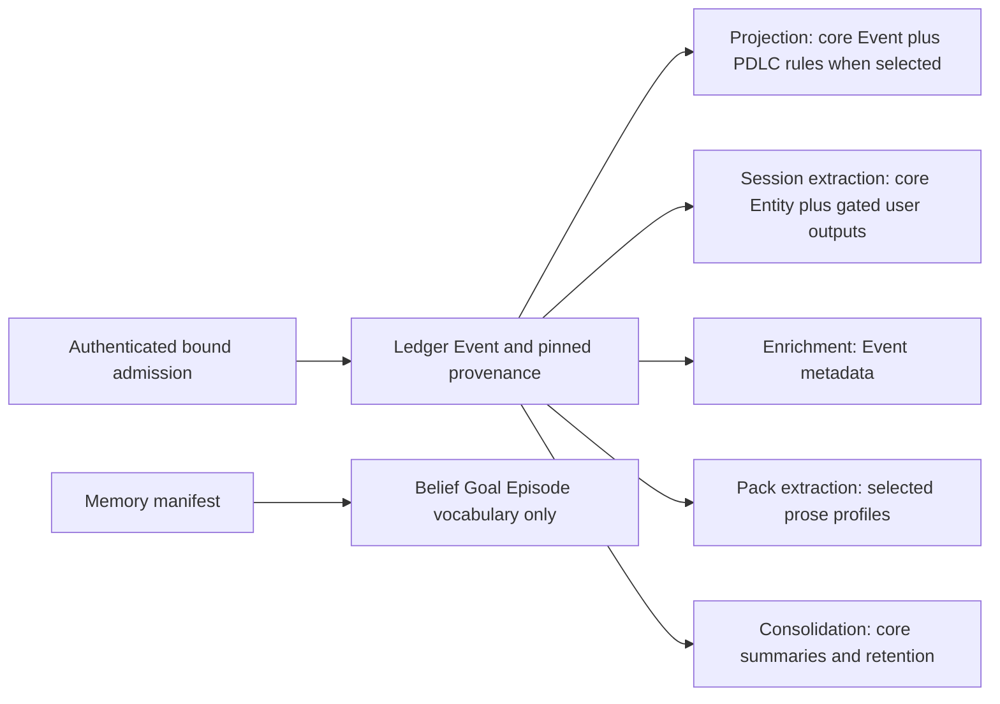
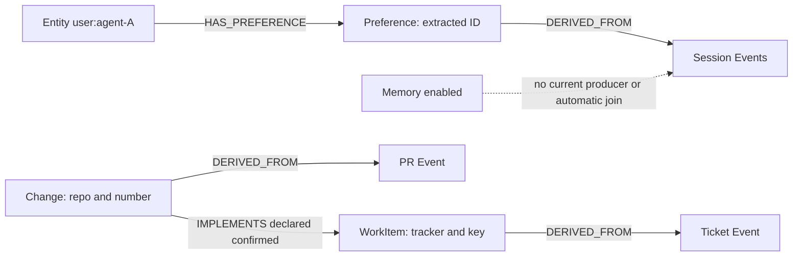

# Controlled-pilot composition assessment — Astra medium

Reviewed commit: **51a680adeca608618e0e7905991037349631994e**, verified HEAD in `/Users/arunmenon/projects/Engram-foundation-gate`, 2026-10-08. Read-only source/document inspection; no tests, cloud access, credentials, retained-data changes, issue changes or repository edits. The reviewer originally returned this report outside the repository; the coordinating agent preserved it here unchanged apart from this location note. Paths below are relative to that checkout; line numbers refer to this commit.

## Assessment

The brief is well scoped and should be retained. Add explicit preliminary conclusions before designing the pilot: **pack selection and specialized user gating exist; memory currently adds vocabulary, not a working memory producer; public tenant dispatch remains deliberately unavailable.** These are different constraints and need different decisions. Do not repeat the older October 7 optionality review's assertion that loader selection always includes memory/user: it is stale at this commit.

Labels used below: **C — code-established**, **E — execution evidence available in inspected documents**, **U — unverified**. C means inspected implementation, not an executed acceptance result. E does not mean this reviewer reran or independently checked raw archived outputs.

**E:** `docs/review/spanner-compatibility/2026-10-08-astra-g06-evidence-review.md:3` records a bounded private-bound core+PDLC run: 38 inputs, 24 accepted, 12 exact retrieval oracles, five drained workers, three pack-extraction outcomes with zero new items. It explicitly excludes public-tenant isolation and extraction quality. G1–G6 must remain bounded journey evidence, not composition signoff. G05/G06 remain retained. G07 stays first; this planning assessment authorizes no implementation or pilot run.

## What resolves, and what actually runs

**C:** `ontology/loader.py:197` accepts explicit `builtin_packs=[]`, always includes core, then resolves declared dependencies. Memory/user require core; PDLC requires core>=1.1 (`ontology/packs/{memory,user,pdlc}.pack.yaml:8,12,42`). `domain/pack_bundle.py:83` snapshots/recomposes the registry, unconditionally installs five core handlers, checks handler availability/type ownership, and derives bindings from actual projection/extraction declarations. User owns `user.extract.v1`. Memory declares **no processing, projection or extraction**. A provider declaration is not provider readiness.

`ontology/runtime.py:22` caches immutable bundles by selected names/directories/built-ins, not tenant or manifest content. This is acceptable as a deployment configuration cache only while files are fixed. TenantBinding intentionally bypasses it and pins manifests (`tenancy.py:139`). Registry views are reconstructed, rather than shared mutable registry dictionaries (`domain/pack_bundle.py:71`). Neither fact proves all runtime state is tenant safe.

Five selectable worker loops exist (`worker/__main__.py:35`), with a timer inside consolidation, not a sixth independently launched consumer. Table shorthand: C=core, U=user, M=memory, P=PDLC. All cells describe constructed behavior, not measured success. None of these combinations is public-tenant approved.

| Configuration | Projection: each accepted event | Session extraction: session end / periodic turns | Enrichment: each event | Consolidation: stream trigger + timer | Pack extraction: matching event prose | Retrieval |
|---|---|---|---|---|---|---|
| C control | Core Event and event relationships | LLM Entity resolution + REFERENCES; user store disabled | Core Event keywords/importance; optional embedding | Core Summary/SUMMARIZES, importance, forgetting/archive/log maintenance | No profiles: no extraction writes, though loop/client still constructed | Event engine; no domain artifact seeds or user endpoint capability |
| C+U | Same core projection; user event names are not deterministic user projection rules | Above plus persona/UserProfile, Preference, Skill, interests, user evidence and contradiction handling | Same | Same; not a memory feature | No profiles | Event intents add personalize; gated user reads available; artifact engine still has no domain seeds |
| C+U+M | Same as C+U | Same as C+U; no Belief/Goal/Episode producer | Same | Same core summaries, not Episode nodes | No memory profile | Same implemented paths; M vocabulary alone supplies no stored memory journey |
| C+P | Core plus declared PDLC upserts/lifecycle/edges and DERIVED_FROM | Core Entity extraction remains active; no user output | Same | Same, including retention of core evidence | PDLC prose sources only; proposed Decision/Constraint/Lesson and allowed links | Event engine plus domain artifact discovery/traversal/evidence |
| C+P+M | Same as C+P | Same as C+P; no memory producer | Same | Same | Same PDLC profiles | Same implemented retrieval; no automatic memory/domain joins |

Worker wiring evidence: `worker/__main__.py:95,130,174,198,239`; user gate at `:213,233`; extraction defensive gate `worker/extraction.py:78`; trigger `:108,131`; core/entity/user writes `:235,270,370`; enrichment `worker/enrichment.py:57`; consolidation `worker/consolidation.py:75,146,214,302,348`. Session extraction and pack extraction require an LLM for useful results. Entity matching/event embeddings depend on optional embedding services; consolidation can use LLM summaries. Selection does not remove these core provider dependencies. No-profile pack extraction still constructs an LLM client (`worker/__main__.py:130–170`); startup/provider-failure probes must distinguish construction from actual invocation.

PDLC extraction sources are `pdlc.design.section_changed`, `pdlc.spec.approved`, `core:observation.input`; never-propose includes Change/WorkItem/TestRun/Deployment/Incident/Release (`ontology/packs/pdlc.pack.yaml:1444`). It is incorrect to promise that a ticket/PR event independently invokes that extractor, or that extraction can author authoritative PR lifecycle changes.

## Grounded examples and expected graph

**C, U execution:** submit ordinary Event envelopes through the normalized events route: UUID event_id, event_type, UTC occurred_at, session_id, agent_id, trace_id, nonempty payload_ref, plus top-level payload (`domain/models.py:290`; `api/routes/events.py:194`). For user context, use `observation.input` carrying `payload.content="I prefer pytest"`, followed in the same session by `system.session_end`; then a new session with the same agent_id and `"I no longer prefer pytest"`. The LLM formatter actually reads payload.content (`adapters/llm/client.py:230,263`). Core alone preserves/extracts Event/Entity context but deliberately has no user preference output. Core+user attempts specialized preference extraction; it is **not** a deterministic `user.preference.stated` command. Those declared event names have no projection rules in user.pack.yaml.

User identity is `user:{agent_id}` of the triggering event (`worker/extraction.py:244`), not authenticated principal identity or an asserted person mentioned in prose. All session events are collected and their IDs supplied as supporting events (`:176,156`); a second person in the same session is not automatically a separate user. Freeze either one synthetic agent per intended profile or explicitly test/restrict this contract. Do not describe this as authenticated human profile ownership. Correction detection only groups category/key and compares differing polarity; it uses timestamp heuristics (`domain/contradiction.py:20,41`; `worker/extraction.py:548`). “Current preference” is therefore conditional on actual extracted key/polarity/IDs and user read filtering, not guaranteed by natural-language correction alone.

**C:** PDLC's smallest deterministic pair is `pdlc.ticket.created` payload `{tracker:"jira",key:"PAY-1",title:"Retry refunds",work_type:"task",status:"To Do"}`, followed by `pdlc.change.created` payload `{repo:"acme/pay",number:7,title:"Retry refunds",work_items:[{tracker:"jira",external_key:"PAY-1"}]}`. Supply valid standard envelopes and an authorized source. Required fields/contracts are at `ontology/packs/pdlc.pack.yaml:204,813`; rules at `:1292,1399`. The graph gets WorkItem keyed `(tracker,external_key)`, Change keyed `(repo,number)`, Change→WorkItem IMPLEMENTS with confidence=1, method=declared, link_status=confirmed, and artifact→Event DERIVED_FROM. Use `make_node_id` (`domain/pack_projection.py:214`) for encoded typed IDs rather than constructing URI-sensitive IDs by hand. Missing complete targets may be stubs; a declared link is not proof the target was observed.

The two halves are alternative grounded example shapes, not an invented identity mapping. **C:** adding memory to either example currently leaves the implemented producer graph unchanged. It does not create a Goal from the ticket, a Belief from the preference, or an Episode from consolidation. **U:** future memory semantics, producers and cross-pack identity/evidence joins need a bounded specification before memory-added value can be a passing pilot criterion.

## Both retrieval contracts and isolation

**C:** Event retrieval selects core/memory/user intents (`domain/pack_intents.py:52`), runs graph, entity-vector and BM25 seed channels, fuses ranks, hydrates events, expands neighbors, then scores/PPR (`retrieval/engine.py:196,203,240,252,270,276`). User-profile seeding falls back to general when unavailable/empty (`:540`). Vector search is specifically Entity search, with typed Event hydration through referencing events (`:571`); enrichment's Event vectors do not establish arbitrary artifact-vector retrieval. The bounded event neighbor path validates selected vocabulary but recognizes only Event/Entity/Summary identity fields, and subsequently forms IDs only from Event/Entity (`:779–815`). It is not a generic Goal/Preference/PDLC artifact traversal. Explicit inactive intent behavior should be checked through RegistryIntents validation, rather than claiming every query mentioning preferences is rejected: natural-language fallback can still return ordinary events.

**C:** Artifact retrieval obtains seeds from non-OPEN_PACKS only (`retrieval/artifacts.py:227`; OPEN_PACKS is core/memory/user), validates typed references, does key/number/word discovery, expands allowed graph edges with ranking/sibling controls, and attaches DERIVED_FROM evidence (`:385,454`, module contract `:14–70`). It has no embedding/vector seed channel in the inspected implementation. Thus “both retrieval APIs, vector/text seed discovery” in the brief needs a per-engine map: vector is an event-engine channel, not a supported universal channel. User reads (`api/routes/users.py:33`) are an additional supported contract relevant to the preference journey; include them explicitly.

**C:** Memory/Spanner read primitives are wrapped by ComposedReadView before limit/rank (`adapters/registry.py:244`; `adapters/composed_reads.py:28,55,80`). Writes retain the original graph. This is read filtering, not a universal write capability guard. Neo4j does not receive this wrapper; this pilot is Spanner, so broader backend parity is deferrable. GraphVectorIndex still binds the base graph but searches only core Entity (`adapters/registry.py:236`; `adapters/search.py:60`). Verify hydration and tenant fencing around it rather than claiming the wrapper universally encloses every channel.

**C:** TenantBinding pins real Spanner durable ports, database resource, bundle digest, epoch, settings and engine revision; API and worker constructors validate the supplied settings/bundle against it (`tenancy.py:90,139,160`; `api/app.py:59`; `worker/__main__.py:81`; `adapters/registry.py:134,174`). Store reads have database/epoch checks, and bound source admission is server-principal derived (`tenancy.py:171`). Private dispatch creates per-tenant child apps and authenticates before dispatch (`api/tenants.py:67,141`); consumer counters are instance-local. Nevertheless **public `create_tenant_app` raises unconditionally** (`api/tenants.py:31`). CLI worker startup does not discover a tenant catalog (`worker/__main__.py:327`). Shared supported public entrypoints and ordinary multi-tenant worker supervision remain a pilot blocker, not solved by choosing two databases. Specify the topology and lifecycle before changing that guard; never simply remove the refusal because some fences exist.

## Prioritized findings and decisive probes

1. **Blocker — promised memory-added behavior has no producer (C).** `memory.pack.yaml:1–64` is vocabulary only; `pack_bundle.py:90` expressly installs no implicit memory producer. Smallest correction: mark these matrix cells “loadable, memory value unsupported/unverified,” keep all requested variants, and make a product checkpoint choose the minimum memory behavior before implementation. Probe later: identical admitted sessions in fresh C+U versus C+U+M and C+P versus C+P+M; expect no memory nodes today. Do not treat that expected absence as satisfying memory value.

2. **Blocker — public tenant entrypoint is intentionally disabled (C).** Evidence above. Smallest plan addition: a separate #43 acceptance slice for production dispatch/bootstrap, pinned worker bindings, credential/source mapping and lifecycle fences. Decisive later probe: run both tenants concurrently with colliding event/session/artifact IDs and contradictory payloads; test API, both retrieval engines, user reads, cursors and restarted workers. Public factory should currently fail closed; private conformance success must remain labeled private.

3. **Likely user-journey blocker — profile key disagreement (C; runtime impact U).** User schema declares user_id key (`user.pack.yaml:23`); GraphOperations stores `profile:{user_id}` using profile_id (`adapters/graph_ops.py:75,1159`), while composed reads validate stored key against registry user_id (`adapters/composed_reads.py:55–63`). This can suppress a real profile from composed personalization traversal while the specialized user endpoint reads it directly. Smallest probe: one persona extraction, compare canonical node key, user profile endpoint, and personalize seeds. Align the declared/implemented key for new datasets if confirmed; no historical migration is authorized.

4. **User correction/retry blocker until measured — producer identity and retry semantics (C/U).** Missing preference_id creates a random ID, repeated writes increment observation_count (`graph_ops.py:1217`); the worker later resolves contradictions using the original model dictionaries (`worker/extraction.py:563–575`). A generated storage ID is not returned into that dictionary. At-least-once consumer retry is present (`worker/consumer.py:154,207,282`), but no extraction-result receipt/deduplication was established. Freeze output contract and probe a failure after preference write before acknowledgement, plus two same-key/opposite-polarity sessions. Assert exact preference IDs, count, superseded_by and evidence. Smallest potential fix is stable extraction result identities/receipt at this boundary, not a new generic memory framework. Do not accept a repeated count increment as idempotent.

5. **Core evidence/retrieval blocker if reproducible — independent worker ordering (C/U).** Projection and enrichment have independent subscriptions; enrichment updates existing Event only and silently does nothing if absent (`worker/enrichment.py:84`; `graph_ops.py:480–498`). Pack application stages nodes/states/lookups/edges separately (`worker/pack_projection.py:148`), and pack extraction reads known items before writing (`worker/pack_extraction.py:147`). No global ordering barrier across those loops was established. Pause projection, let enrichment consume, resume, then inspect keywords/vectors and receipts; interrupt pack apply between stages and retry. Define success as converged exact graph/evidence, not merely zero lag. Smallest correction is a missing-prerequisite retry/defer or a proven convergent update path where failures occur. Memory currently contributes no concurrent writer; actual concurrency is core workers plus PDLC projection/extraction. Do not invent a memory/PDLC lifecycle conflict to test.

6. **Evidence completeness and retrieval expectations need explicit limits (C/U).** User extraction supplies the session's full event set, whereas PDLC rule provenance points to the triggering Event; neither is automatically a precise quoted assertion. Consolidation can delete/archive core Events (`worker/consolidation.py:302–376`) while domain answers depend on DERIVED_FROM. Run one bounded retention case for selected PDLC evidence and one user correction evidence query; freeze expected retained/archive availability. Defer broad retention redesign unless this fails the chosen policy. Artifact-vector search and generic memory graph traversal should be declared unsupported, not silently counted as failed implemented channels.

## Concrete brief additions

- Add a “current implementation facts” paragraph with the three main conclusions, the five-loop inventory, immutable bundle resolution and mandatory core responsibilities. Keep user gating and core summaries separate.
- Extend the matrix with exact settings (`builtin_packs=[]/[user]/[user,memory]/[memory]`, domain `packs=[]/[pdlc]`) and a resolved manifest/handler digest column to be captured later. Name order is immaterial; exact canonical content matters.
- Split acceptance into supported mechanism, useful produced output, and public entrypoint availability. A zero-output pack-extraction invocation proves execution only; M selection without a producer proves vocabulary selection only.
- Include the grounded user input/agent identity contract, non-authoritative LLM correction semantics, profile-key check and user endpoint comparison. Do not promise distinct people from prose alone.
- Replace generic vector wording with engine/channel-specific expectations. Add precise artifact seed/evidence questions and event-context questions, and explicitly state absent optional behavior/fallback responses.
- Add the six bounded probes above before expansive connected journeys. Use fresh separately owned targets only after checkpoint approval; preserve G05/G06. Preserve failed/oracle-corrected results.
- Keep #35 for bundle/capability contract, #42 for optional-user/memory behavior, #43 for tenant runtime, #39 for reusable exact probes, #40 for PDLC journey, #41 for real Spanner evidence, and #34 as umbrella. No live issue state was inspected or changed here; reconcile it when drafting actual tickets.

Keep/fix/block decision: **keep** the brief's sequence, full requested matrix and fresh-data constraints; **fix** the explicit behavioral baselines and per-path acceptance criteria; **block readiness claims** on memory value, user correction/profile behavior and supported public tenant runtime until the selected decisive evidence exists. Generic memory conversion, historical migration, all-backend parity, ANN and a broad foundational rewrite remain outside this assessment.
