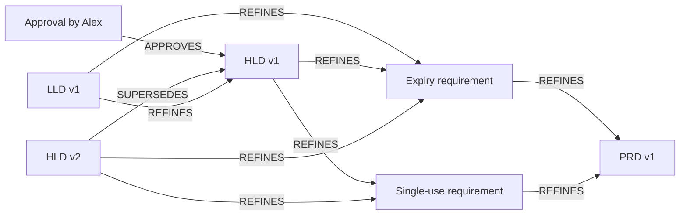

# G02 verification and stakeholder demonstration

## Latest revalidation on cleaned-up foundation

`20261008-cloud-cleaned-g02-01` passed all 22 original checks from executed source commit `13e9d12be28feee1d05d0325f67ff35466a70921`. This is current core 1.1.0 and PDLC 2.1.0 and the cleaned-up shared helpers, preserving the earlier goal's oracles. No source changes or manual repair during execution. Historical run details below remain retained evidence.

| Functional check | Observed result |
|---|---|
| PRD → requirements → HLD → LLD | Explicit revision-specific artifacts and declared links projected and retrieved with evidence |
| Approval and revision | Approval remains bound to HLD v1; HLD v2 supersedes v1 without inheriting approval |
| Duplicate/conflict/invalid input | 12 unique accepted events, one idempotent retry and four no-write rejections (three 422, one 409) across 17 input steps |
| Missing references | Identity-only placeholder later filled by the real artifact without losing its links |
| Retrieval and isolation | Five final retrieval checks passed; unrelated newsletter artifacts excluded |
| Actual pack extraction | Six applied LLM extraction outcomes recorded; proposals/outcomes retained separately from declared links |

All five actual worker loops reached zero lag with empty pending/dead-letter sets. The full path used authenticated Engram HTTP → actual Spanner ledger → workers → graph → retrieval. Inputs are normalized producer events, not a new native PRD/HLD adapter or automatic field interpretation. Review/test/source assertions retain their declared trust scope.

Owned cleanup removed 12 events, 29 nodes, 45 edges, 5 groups and 80 cursors. All seven application tables are empty; core owner restored epoch 38. [Astra's scoped evidence review](2026-10-08-cleaned-g02-astra-evidence-review.md) found no blockers and confirmed all 189 archived source hashes. No new product defect or new feature bucket.

Evidence: [observations](runs/20261008-cloud-cleaned-g02-01/observations.json), [fixtures](runs/20261008-cloud-cleaned-g02-01/fixtures.json), [preflight](runs/20261008-cloud-cleaned-g02-01/preflight.json), [manifest](runs/20261008-cloud-cleaned-g02-01/manifest.json), [exact source hashes](runs/20261008-cloud-cleaned-g02-01/executed-source-sha256.json), [archive](runs/20261008-cloud-cleaned-g02-01/executed-source.tar.gz), [log](runs/20261008-cloud-cleaned-g02-01/runner.log). Broader issue acceptance, public tenant dispatch, whole-pack evaluation and original 65 baseline sign-off remain separate; Monitoring IAM 403 remains recorded. No migration work; G04 has not started.


## Scope decision — disposable experiments (2026-10-08)

Applies to every current goal: historical-data migration, migration adapters, conversion of old pack identities, and cross-version historical upgrade analysis/tests are OUT OF SCOPE. Do not spend implementation, review or analysis effort on them or use their absence as a completion blocker. Runs start with an explicitly owned disposable dataset. Priorities are ontology-pack composition and the actual Engram ingestion → ledger → workers/projection → Spanner graph → retrieval/evidence path.

Revision history, approvals, retries, ordering and recovery/replay of events created within the same experiment and pinned pack configuration remain functional tests. They are not historical migration. A fresh connected demo dataset must be created through Engram ingestion; retaining it for an approved demonstration does not add migration scope. Existing migration tickets/history are preserved as deferred future work; do not silently count their scenarios as passing or close them. A migration-only baseline case is explicitly deferred, not a current-goal sign-off requirement. Migration work requires a separate explicit future authorization.

Status: VERIFIED on real Spanner, independently reviewed, pushed and reconciled with GitHub. Recorded walkthrough delivered in this document; stakeholder sign-off is not assumed. G03 remains unstarted.

## What this proves

Engram can accept an explicitly normalized password-reset planning journey, build versioned planning artifacts through its workers, and retrieve the connected evidence from Spanner. HLD v1 has an approval; HLD v2 supersedes it without inheriting that approval. This is a bounded planning journey, not whole-PDLC or Spanner-platform sign-off.

Specification: [scenario contract](2026-10-08-goal-02-planning-journey.md). Review: [Astra findings and dispositions](2026-10-08-astra-g02-review.md). Standard: [verification standard](goal-verification-standard.md).

## Actual route and what changed

Synthetic normalized producer → authenticated TCP `POST /v1/events` → actual Engram admission → Spanner Events ledger → five running ordinary workers → Spanner graph → `POST /v1/query/artifacts`. There is no native document-service adapter in this experiment. The producer explicitly supplies the declared fields; no arbitrary-document interpretation is claimed. SQL reads observe results; SQL writes are restricted to fenced activation and owned cleanup. No manual graph repair or direct artifact insertion counts as acceptance.

Reused: common envelope, mandatory core, pack composition, generic admission and duplicate-conflict checks, bound tenant/source authority, actual Spanner ports, generic projection interpreter and ordinary workers. New: PDLC 2.0 revision keys, deterministic Spec/Requirement/DesignElement mappings, explicit LLD→HLD refinement, approval artifact and APPROVES relation, version supersession and retrieval weights. Two new events extend the catalog from 23 to 25; the [contract delta](2026-10-08-goal-02-contract-delta.json) records this breaking change. The memory/user packs are disabled.

Cloud-discovered #46 fixed a shared retrieval bug: an observed LLD→Requirement edge was omitted even when both endpoints were already selected. The repair preserves those edges without adding sibling nodes or changing scores. A local red reproduction failed first; 168 affected tests, Ruff and retrieval mypy then passed. This is an Engram engine fix observed on Spanner, not a defect in the Spanner service.

## Environment and evidence

Run: `20261008-cloud-g02-all-03`. Target: `projects/portiq-mvp/instances/engram-experiment/databases/engram-compat-target` only. Core 1.1.0 plus PDLC 2.0.0; single bound `compat-control` tenant; actual Bearer catalog verification; actual configured LLM and cached embedder. The experiment explicitly permits an unevaluated bundle: no full-pack evaluation claim.

[Raw observations](runs/20261008-cloud-g02-all-03/observations.json), [input fixtures](runs/20261008-cloud-g02-all-03/fixtures.json), [manifest and source fingerprints](runs/20261008-cloud-g02-all-03/manifest.json), [execution log](runs/20261008-cloud-g02-all-03/execution.log), [exact executed source archive](runs/20261008-cloud-g02-all-03/executed-source.tar.gz), [archive hashes](runs/20261008-cloud-g02-all-03/executed-source-sha256.json). The exact-source archive includes reused uncommitted foundation files; the ordinary branch checkout alone is not claimed to reproduce that entire foundation.

## Recorded stakeholder walkthrough

Start with a password-reset PRD. Its two requirements say that a token expires in fifteen minutes and is single-use. HLD v1 describes the token service and explicitly addresses both requirements. LLD v1 describes token storage and explicitly refines the HLD plus expiry requirement. Alex’s approval names HLD v1. A subsequent HLD v2 adds rate limiting, preserves v1 through SUPERSEDES, and has no new APPROVES link.



Every actual content artifact also has DERIVED_FROM evidence to its accepted Event. The missing-reference placeholder deliberately has no content evidence until its own event arrives. Arrow directions above are the actual ontology directions.

The following table is the per-request recorded demonstration. Open the raw observations’ matching `scenarios` entry for the complete payload, authority record, storage snapshot, worker lags and returned API response. All successful creation steps use the full route above; rejection stops at admission, with storage equality proving no writes. Each step also performs actual artifact retrieval, including rejects/duplicate checks against the existing PRD.

| Step | Input and actual outcome | Ledger / workers / graph / retrieval |
|---|---|---|
| PL01: PASS | `pdlc.spec.changed`; event `a6e608e0-4b5c-590b-8bda-f158a9e77cae`; HTTP 201 / created | Accepted epoch 27, source `demo.query`; all five lags `[0, 0, 0, 0, 0]`; `Spec:g02/20261008-cloud-g02-all-03-reset|1` and declared links/evidence verified; retrieval HTTP 200. |
| PL02-expiry: PASS | `pdlc.requirement.changed`; event `cf61dc99-c478-5cd1-8475-20ef64346bcb`; HTTP 201 / created | Accepted epoch 27, source `demo.query`; all five lags `[0, 0, 0, 0, 0]`; `Requirement:g02/20261008-cloud-g02-all-03-reset|1|expiry` and declared links/evidence verified; retrieval HTTP 200. |
| PL02-single: PASS | `pdlc.requirement.changed`; event `2f947a07-c581-5783-a143-1e32a41102f8`; HTTP 201 / created | Accepted epoch 27, source `demo.query`; all five lags `[0, 0, 0, 0, 0]`; `Requirement:g02/20261008-cloud-g02-all-03-reset|1|single` and declared links/evidence verified; retrieval HTTP 200. |
| PL03: PASS | `pdlc.design.section_changed`; event `3d778d8b-19b8-51e2-ac2d-bebed49b549a`; HTTP 201 / created | Accepted epoch 27, source `demo.query`; all five lags `[0, 0, 0, 0, 0]`; `DesignElement:g02/20261008-cloud-g02-all-03-hld|tokens|1` and declared links/evidence verified; retrieval HTTP 200. Connected chain and required returned edges verified. |
| PL04: PASS | `pdlc.design.section_changed`; event `896fbfb0-87c2-5e65-94aa-ef725e0d24d2`; HTTP 201 / created | Accepted epoch 27, source `demo.query`; all five lags `[0, 0, 0, 0, 0]`; `DesignElement:g02/20261008-cloud-g02-all-03-lld|storage|1` and declared links/evidence verified; retrieval HTTP 200. Connected chain and required returned edges verified. |
| PL05: PASS | `pdlc.design.approval_recorded`; event `cca4a88b-d761-5d23-b803-2a82b41f9cb2`; HTTP 201 / created | Accepted epoch 27, source `demo.query`; all five lags `[0, 0, 0, 0, 0]`; `DesignApproval:g02/20261008-cloud-g02-all-03-approval` and declared links/evidence verified; retrieval HTTP 200. |
| PL05-not-approved: PASS | `pdlc.design.approval_recorded`; event `ab97bc4b-47b8-5b8b-9609-5c2f889e54a4`; HTTP 422 | Persistent snapshot unchanged; existing PRD retrieval succeeds. No new ledger or graph writes. |
| PL06: PASS | `pdlc.design.section_changed`; event `e2975881-bc7b-5aeb-ab27-4498f852d763`; HTTP 201 / created | Accepted epoch 27, source `demo.query`; all five lags `[0, 0, 0, 0, 0]`; `DesignElement:g02/20261008-cloud-g02-all-03-hld|tokens|2` and declared links/evidence verified; retrieval HTTP 200. |
| PL07-duplicate: PASS | `pdlc.design.section_changed`; event `e2975881-bc7b-5aeb-ab27-4498f852d763`; HTTP 201 / duplicate | Persistent snapshot unchanged; existing PRD retrieval succeeds. No new ledger or graph writes. |
| PL07-conflict: PASS | `pdlc.design.section_changed`; event `e2975881-bc7b-5aeb-ab27-4498f852d763`; HTTP 409 | Persistent snapshot unchanged; existing PRD retrieval succeeds. No new ledger or graph writes. |
| PL08-version: PASS | `pdlc.design.section_changed`; event `ec0854d6-187d-5f21-9cf8-79d3e56bf972`; HTTP 422 | Persistent snapshot unchanged; existing PRD retrieval succeeds. No new ledger or graph writes. |
| PL08-kind: PASS | `pdlc.design.section_changed`; event `9d359ab5-a718-552c-b897-61ad5ae15159`; HTTP 422 | Persistent snapshot unchanged; existing PRD retrieval succeeds. No new ledger or graph writes. |
| PL09-before: PASS | `pdlc.design.section_changed`; event `4db54dcd-0e70-5818-951a-6f97d486e812`; HTTP 201 / created | Accepted epoch 27, source `demo.query`; all five lags `[0, 0, 0, 0, 0]`; `DesignElement:g02/20261008-cloud-g02-all-03-lld|late-storage|1` and declared links/evidence verified; retrieval HTTP 200. Missing parent is identity-only, without body or content provenance. |
| PL09-after: PASS | `pdlc.design.section_changed`; event `e1999b18-33b6-5ec6-8407-da3b602dbf72`; HTTP 201 / created | Accepted epoch 27, source `demo.query`; all five lags `[0, 0, 0, 0, 0]`; `DesignElement:g02/20261008-cloud-g02-all-03-hld|late|1` and declared links/evidence verified; retrieval HTTP 200. |
| PL10-spec: PASS | `pdlc.spec.changed`; event `31fd01e3-a92e-5684-94a7-4169344f0cb6`; HTTP 201 / created | Accepted epoch 27, source `demo.query`; all five lags `[0, 0, 0, 0, 0]`; `Spec:g02/20261008-cloud-g02-all-03-newsletter|1` and declared links/evidence verified; retrieval HTTP 200. |
| PL10-requirement: PASS | `pdlc.requirement.changed`; event `35c9fce9-7efa-56d3-99bd-660ece138557`; HTTP 201 / created | Accepted epoch 27, source `demo.query`; all five lags `[0, 0, 0, 0, 0]`; `Requirement:g02/20261008-cloud-g02-all-03-newsletter|1|expiry` and declared links/evidence verified; retrieval HTTP 200. |
| PL10-design: PASS | `pdlc.design.section_changed`; event `480f5b7f-02fa-5ab9-bc9c-62baa284bbeb`; HTTP 201 / created | Accepted epoch 27, source `demo.query`; all five lags `[0, 0, 0, 0, 0]`; `DesignElement:g02/20261008-cloud-g02-all-03-newsletter-hld|subscriptions|1` and declared links/evidence verified; retrieval HTTP 200. |

## Final read-path checks

The 17 HTTP input steps above plus five final retrieval checks give 22 subchecks grouped into PL01–PL12. Required edges are checked, not just presence of node names. All 12 unique accepted events retain exact normalized payload and tenant/database/bundle/source authority. Four rejected requests and the matching duplicate leave persistent state unchanged.

| Check | Question and expected behavior | Actual |
|---|---|---|
| PL11-hld-v1 | `status DesignElement:g02/20261008-cloud-g02-all-03-hld|tokens|1`; required nodes `['DesignElement:g02/20261008-cloud-g02-all-03-hld|tokens|1', 'DesignElement:g02/20261008-cloud-g02-all-03-hld|tokens|2', 'DesignApproval:g02/20261008-cloud-g02-all-03-approval', 'Requirement:g02/20261008-cloud-g02-all-03-reset|1|expiry', 'Spec:g02/20261008-cloud-g02-all-03-reset|1', 'DesignElement:g02/20261008-cloud-g02-all-03-lld|storage|1']`; forbidden unrelated-feature nodes `['Spec:g02/20261008-cloud-g02-all-03-newsletter|1', 'Requirement:g02/20261008-cloud-g02-all-03-newsletter|1|expiry', 'DesignElement:g02/20261008-cloud-g02-all-03-newsletter-hld|subscriptions|1']` | PASS; HTTP 200; expected edges and Spanner event provenance verified; no truncation |
| PL11-requirement | `trace Requirement:g02/20261008-cloud-g02-all-03-reset|1|expiry`; required nodes `['Requirement:g02/20261008-cloud-g02-all-03-reset|1|expiry', 'Spec:g02/20261008-cloud-g02-all-03-reset|1', 'DesignElement:g02/20261008-cloud-g02-all-03-hld|tokens|2']`; forbidden unrelated-feature nodes `['Spec:g02/20261008-cloud-g02-all-03-newsletter|1', 'Requirement:g02/20261008-cloud-g02-all-03-newsletter|1|expiry', 'DesignElement:g02/20261008-cloud-g02-all-03-newsletter-hld|subscriptions|1']` | PASS; HTTP 200; expected edges and Spanner event provenance verified; no truncation |
| PL11-history | `status DesignElement:g02/20261008-cloud-g02-all-03-hld|tokens|2`; required nodes `['DesignElement:g02/20261008-cloud-g02-all-03-hld|tokens|1', 'DesignElement:g02/20261008-cloud-g02-all-03-hld|tokens|2', 'DesignApproval:g02/20261008-cloud-g02-all-03-approval']`; forbidden unrelated-feature nodes `[]` | PASS; HTTP 200; expected edges and Spanner event provenance verified; no truncation |
| PL11-lld | `status DesignElement:g02/20261008-cloud-g02-all-03-lld|storage|1`; required nodes `['DesignElement:g02/20261008-cloud-g02-all-03-lld|storage|1']`; forbidden unrelated-feature nodes `[]` | PASS; HTTP 200; expected edges and Spanner event provenance verified; no truncation |
| PL12 | `fifteen minutes`; required nodes `['Requirement:g02/20261008-cloud-g02-all-03-reset|1|expiry']`; forbidden unrelated-feature nodes `['Spec:g02/20261008-cloud-g02-all-03-newsletter|1', 'Requirement:g02/20261008-cloud-g02-all-03-newsletter|1|expiry', 'DesignElement:g02/20261008-cloud-g02-all-03-newsletter-hld|subscriptions|1']` | PASS; HTTP 200; expected edges and Spanner event provenance verified; no truncation |

PL03/PL04 retrieve both requirements from their shared design and verify the complete declared chain. An expiry-seeded trace does not promise the sibling single-use requirement: shared design membership is insufficient to expand an answer into sibling requirements. The unrelated newsletter feature uses the same local `expiry` ID and stays out of required password-reset answers. PL12 supplies text only, with no seed IDs; this proves the specific “fifteen minutes” discovery case, not general natural-language completeness.

## Workers and live inference

Projection, session extraction, enrichment, consolidation and pack extraction run as ordinary consumer loops. Every input step waits for zero lag across all five, no pending deliveries or dead letters, and no stopped consumer. Triggered design extraction additionally requires a real `pack_extraction_applied` outcome: zero lag alone cannot prove that inference ran successfully. Generated proposals are kept separate from the declared planning oracle.

Observed extraction outcomes: `[{"edges_written": 3, "event": "pack_extraction_applied", "event_id": "3d778d8b-19b8-51e2-ac2d-bebed49b549a", "links": 2, "nodes": 1, "pack": "pdlc", "rejected": []}, {"edges_written": 3, "event": "pack_extraction_applied", "event_id": "896fbfb0-87c2-5e65-94aa-ef725e0d24d2", "links": 2, "nodes": 1, "pack": "pdlc", "rejected": []}, {"edges_written": 1, "event": "pack_extraction_applied", "event_id": "e2975881-bc7b-5aeb-ab27-4498f852d763", "links": 0, "nodes": 1, "pack": "pdlc", "rejected": []}, {"edges_written": 0, "event": "pack_extraction_applied", "event_id": "4db54dcd-0e70-5818-951a-6f97d486e812", "links": 0, "nodes": 0, "pack": "pdlc", "rejected": []}, {"edges_written": 0, "event": "pack_extraction_applied", "event_id": "e1999b18-33b6-5ec6-8407-da3b602dbf72", "links": 0, "nodes": 0, "pack": "pdlc", "rejected": []}, {"edges_written": 0, "event": "pack_extraction_applied", "event_id": "480f5b7f-02fa-5ab9-bc9c-62baa284bbeb", "links": 0, "nodes": 0, "pack": "pdlc", "rejected": []}]`

Invalid proposed relationship types are rejected by ordinary pack checks and recorded, rather than being mistaken for required deterministic relationships. No inference provider was mocked and no required worker was disabled to obtain a pass.

## Failed attempts remain visible

- local planning-01: 129 checks passed; two new test setup failures omitted required ledger position. Corrected.
- local planning-02: 166 passed; one new test omitted constructor settings and lint failed. Corrected.
- local planning-03/04: 167 passed with lint clean after successive review corrections.
- cloud pl01-01: PRD actually accepted/projected; harness compared distinct digest concepts and failed. Corrected to the accepted binding digest; cleanup restored core at epoch20.
- cloud pl01-02: complete PRD checkpoint passed; cleanup restored epoch22.
- cloud all-01: 17 input steps passed; final HLD history retrieval omitted the LLD→Requirement edge. Filed #46. Failed response was not persisted in that runner revision; stored graph and assertion error are retained. Subsequent runner persists responses before assertions. Cleanup restored epoch24.
- local path-red-01: missing-edge regression failed as intended; path-green-01 passed all 168 affected tests, lint and retrieval mypy after the fix.
- cloud all-02: 17 input steps and HLD history retrieval passed; expiry trace expected a sibling requirement in conflict with the existing anti-drift policy. Independent review confirmed an oracle error. Only that sibling expectation was removed; both-requirement graph and HLD query assertions remain. The failed run and response are retained; cleanup restored epoch26.
- cloud all-03: all 22 checks passed; this is the final acceptance run. See each named directory under [runs](runs/).

## Cleanup and repeatable demo

Exact-key owned cleanup counts: `{"ConsumerCursors": 80, "ConsumerDeadLetters": 0, "ConsumerDeliveries": 0, "ConsumerGroups": 5, "Events": 12, "GraphEdges": 43, "GraphNodes": 28}`. Every generated artifact deleted had a DERIVED_FROM link to this run’s registered Events; all edge endpoints had to be owned. All seven application tables are observed empty after cleanup. Restored owner: `[["compat-control", "projects/portiq-mvp/instances/engram-experiment/databases/engram-compat-target", "compat-control-binding", 28, "sha256:f57ffb649f7ab0197d21f45b9397203887f8cb103e32efd784f4e52ce4c3f7b1", "active"]]`.

This disposable G02 dataset has been removed according to its predeclared policy. The source fixtures and observations preserve the recorded demonstration. A later approved connected-demo goal may retain its dataset; that is not silently applied to G02.

To repeat, use the exact executed source archive in an isolated checkout/environment with its dependencies, a valid private credential file and actual LLM credentials. Do not copy credential values into Git. The predecessor epoch must still match; if it has changed, stop and inspect ownership rather than weakening the guard.

```bash
PYTHONPATH=src:scripts /private/tmp/engram-ontology-review-venv/bin/python -u scripts/engram_goal02_planning_demo.py \
  --run-id <new-unique-run-id> \
  --credentials /private/tmp/engram-spanner-token-env \
  --expected-epoch 28 \
  --expected-digest sha256:f57ffb649f7ab0197d21f45b9397203887f8cb103e32efd784f4e52ce4c3f7b1
```

For a recorded walkthrough, follow PL01 → PL02 → PL03/04 → PL05/06, then show PL07/08 rejection/no-write evidence, PL09 placeholder/fill, PL10 unrelated-feature separation, and PL11/12 returned graph and provenance. These are recorded actual runs, not a live stakeholder demonstration. Stakeholder approval is a separate step.

## Limits and remaining work

- Single bound tenant app with real authentication, not the public multi-tenant dispatcher; cross-tenant isolation is not newly signed off.
- Synthetic explicitly normalized producer events, not native document adapters or arbitrary raw payload interpretation.
- Approval asserts a named revision and supplied reviewer; it does not prove independently authenticated human approval or immutable content. Different event IDs can still rewrite the same revision. Design lifecycle remains draft; approval does not automatically promote it.
- PDLC 2.0 breaks prior Requirement/DesignElement identities. Only an empty disposable target was activated. Historical migration is excluded from current goals and is not a blocker.
- Actual cloud data operations succeed; monitoring metrics emit an IAM 403, so metrics publication is not verified.
- All original 65 Spanner baseline scenario statuses remain unchanged; these G02 extensions do not promote baseline cases. Full PDLC event coverage, CRM/unfamiliar packs and later journeys remain outside G02.

## GitHub reconciliation and feature-bucket assessment

Actual synchronization links and status changes are recorded below. #46 is the only newly discovered product defect; it fits the existing retrieval bucket under #34, so no new feature umbrella is warranted. Planning mapping work fits #40. Broad issues retain remaining acceptance and stay open; a bounded G02 pass does not close them. #46 is closed after final cloud evidence and independent review; all broader issues remain open.

| Issue | Before → after | Verified scope / remaining work | Actual update |
|---|---|---|---|
| #34 | OPEN → OPEN | Planning milestone recorded; original32 plus discovered45/46 tracked. Other feature acceptance remains. | [GitHub update](https://github.com/arunmenon/Engram/issues/34#issuecomment-6051645912) |
| #4 | OPEN → OPEN | Planning payload rejection/no-write evidence; remaining whole-pack and ingress cases. | [GitHub update](https://github.com/arunmenon/Engram/issues/4#issuecomment-6051646172) |
| #35 | OPEN → OPEN | Core+PDLC authority/configuration evidence; broader capabilities and version mismatch remain. | [GitHub update](https://github.com/arunmenon/Engram/issues/35#issuecomment-6051646439) |
| #36 | OPEN → OPEN | Version keys, approval, supersession and placeholders; general ordering/update rules remain. | [GitHub update](https://github.com/arunmenon/Engram/issues/36#issuecomment-6051646700) |
| #37 | OPEN → OPEN | Same-ID duplicate/conflict verified; other producers and normalization remain. | [GitHub update](https://github.com/arunmenon/Engram/issues/37#issuecomment-6051646919) |
| #39 | OPEN → OPEN | Exact planning paths/evidence and retrieval; whole-pack/unfamiliar-pack conformance remains. | [GitHub update](https://github.com/arunmenon/Engram/issues/39#issuecomment-6051647193) |
| #40 | OPEN → OPEN | Planning journey implemented and verified; code/test and operational journeys remain. | [GitHub update](https://github.com/arunmenon/Engram/issues/40#issuecomment-6051647461) |
| #41 | OPEN → OPEN | G02 cloud extension evidence added; original 65 baseline statuses unchanged. | [GitHub update](https://github.com/arunmenon/Engram/issues/41#issuecomment-6051647737) |
| #46 | OPEN → CLOSED | Bounded missing-selected-edge bug fixed, reviewed and verified on cloud. | [GitHub update](https://github.com/arunmenon/Engram/issues/46#issuecomment-6051648083) |

#34 and #40 body summaries were also refreshed to distinguish current G02 evidence from historical gaps. #46 acceptance checkboxes are complete and the defect is closed. Review: no blockers in bounded technical acceptance; all source hashes matched. No new feature bucket was created because both the mapping work and retrieval fix fit existing ownership. Publication commit b81398599ef63c259498d60c61544b36ed116619 includes implementation, exact-source archives, failed attempts and passing rerun. The subsequent documentation commit carries these actual reconciliation links.
