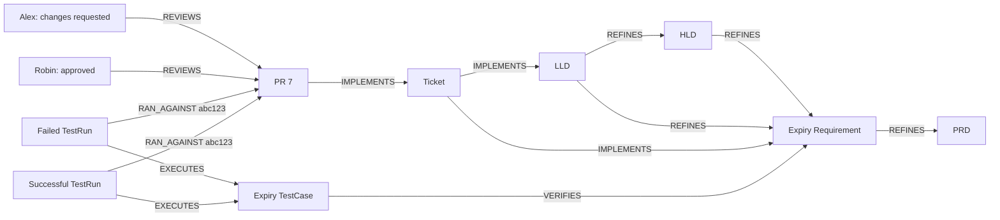

# G03 verification and stakeholder demonstration

Status: VERIFIED on real Spanner, independently reviewed, pushed and GitHub-reconciled. Recorded walkthrough is provided here; stakeholder sign-off is not assumed. G04 has not started. Historical migration is excluded from all current goals.

## What the stakeholder can now ask

“What code implements the fifteen-minute password-reset expiry requirement, who reviewed it, and what test results do we have?” Engram must return explicit planning, ticket, PR, review and verification links plus their supporting events. A failed test is not turned into a passing test, and a later approval does not erase a changes-requested review.

Specification: [predeclared G03 scenarios](2026-10-08-goal-03-implementation-journey.md). Review: [Astra G03](2026-10-08-astra-g03-review.md). Standard: [goal verification](goal-verification-standard.md).

## What changed and what we reused

PDLC 2.1 adds optional bounded typed references: ticket `requirements` and `designs` produce IMPLEMENTS links; PR `work_items` produces its ticket link; test `requirements` produces TestCase→Requirement VERIFIES. Existing artifact identities remain unchanged. Review now records the supplied reviewer. RAN_AGAINST records the declared commit SHA. Trace weights include REVIEWS, EXECUTES and RAN_AGAINST so retrieval can show actual review/test records. The catalog remains25 events. All changes use existing generic declarations; no generic retrieval engine change was required in G03.

We reused G02’s admission, source authority, pack interpreter, worker loops, retrieval and Spanner adapters. Core is mandatory and active; memory/user are disabled in this configuration. The planning setup is recreated through Engram rather than inserted directly into tables.

## Actual route and environment

Synthetic explicitly normalized producer payload → real TCP authenticated POST /v1/events → ordinary Engram admission → real Spanner ledger → five ordinary running workers → real Spanner graph → POST /v1/query/artifacts. SQL is used for observation and fenced owned setup/cleanup only. No direct artifact insertion, manual graph repair or mocked Spanner counts as acceptance.

Run `20261008-cloud-g03-all-01` uses only `projects/portiq-mvp/instances/engram-experiment/databases/engram-compat-target`, one bound `compat-control` tenant, actual catalog Bearer verification, core1.1 and PDLC2.1. Real configured design LLM extraction and cached embedding provider remain enabled. The private bound app does not prove public multi-tenant dispatch. Producer fields are explicitly normalized examples, not captured native-source webhooks or arbitrary-document interpretation.

[Observations](runs/20261008-cloud-g03-all-01/observations.json), [source requests and exact expectations](runs/20261008-cloud-g03-all-01/fixtures.json), [manifest and runtime fingerprints](runs/20261008-cloud-g03-all-01/manifest.json), [execution log](runs/20261008-cloud-g03-all-01/execution.log), [exact executed-source archive](runs/20261008-cloud-g03-all-01/executed-source.tar.gz), [archive hashes](runs/20261008-cloud-g03-all-01/executed-source-sha256.json). The archive preserves the reused local foundation snapshot; ordinary branch checkout alone is not claimed to reproduce every uncommitted foundation file.

## Recorded demonstration: follow the requirement into code

First show the password-reset PRD and expiry requirement. HLD describes token validation; LLD describes storage of the digest and expiry timestamp. A Jira ticket explicitly names that Requirement and LLD. PR7 in the payments repository explicitly names the ticket. Alex requests changes; Robin later approves. The same expiry test has separate failed and successful run IDs at the declared commit abc123. Both outcomes stay visible.



VERIFIES is an explicit coverage claim; pass/fail belongs to the individual TestRun. The graph does not imply that Engram itself executed the tests. Reviewers/outcomes are authenticated producer assertions, not independently authenticated human approval or immutable commit/content attestations. The Change lifecycle `reviewed` does not mean approved.

## Every input and its actual result

For each row, the raw observation’s matching `scenarios` entry contains the entire payload, auth-derived authority record, persistent snapshot, five worker lags and actual retrieval response. The accepted authority must match tenant, database, bundle digest, binding epoch and source. Each observed content artifact has DERIVED_FROM evidence to its source Event. Failed/conflicting requests stop at admission; their persistent snapshots are unchanged.

| Step | Input and actual API outcome | Verified effects |
|---|---|---|
| IM01: PASS | `pdlc.spec.changed`; event `ae0c2d4e-f8f2-5cf3-b305-a7e5a65af6a5`; HTTP 201/created | Epoch 29, source `demo.query`, five worker lags `[0, 0, 0, 0, 0]`. Exact artifact `Spec:g03/20261008-cloud-g03-all-01-reset|1`, properties `{'title': 'Password reset PRD'}`, extra artifacts `{}`, declared links and event evidence verified. Actual retrieval HTTP200. |
| IM02: PASS | `pdlc.requirement.changed`; event `8a4fd9ad-8e59-545b-a1b9-2dd3e0388ec3`; HTTP 201/created | Epoch 29, source `demo.query`, five worker lags `[0, 0, 0, 0, 0]`. Exact artifact `Requirement:g03/20261008-cloud-g03-all-01-reset|1|expiry`, properties `{'statement': 'Reset token expires in fifteen minutes'}`, extra artifacts `{}`, declared links and event evidence verified. Actual retrieval HTTP200. |
| IM03: PASS | `pdlc.design.section_changed`; event `3fa1bf76-25d1-5e20-8937-6e55c09ae58e`; HTTP 201/created | Epoch 29, source `demo.query`, five worker lags `[0, 0, 0, 0, 0]`. Exact artifact `DesignElement:g03/20261008-cloud-g03-all-01-hld|tokens|1`, properties `{'kind': 'hld'}`, extra artifacts `{}`, declared links and event evidence verified. Actual retrieval HTTP200. |
| IM04: PASS | `pdlc.design.section_changed`; event `ea256b35-da44-508c-a79e-2685bd32d369`; HTTP 201/created | Epoch 29, source `demo.query`, five worker lags `[0, 0, 0, 0, 0]`. Exact artifact `DesignElement:g03/20261008-cloud-g03-all-01-lld|storage|1`, properties `{'kind': 'lld'}`, extra artifacts `{}`, declared links and event evidence verified. Actual retrieval HTTP200. |
| IM05: PASS | `pdlc.ticket.created`; event `fb22f2ae-dd0e-589c-9a56-42ebf264bd26`; HTTP 201/created | Epoch 29, source `demo.query`, five worker lags `[0, 0, 0, 0, 0]`. Exact artifact `WorkItem:jira|g03/20261008-cloud-g03-all-01-17`, properties `{'title': 'Implement reset expiry'}`, extra artifacts `{}`, declared links and event evidence verified. Actual retrieval HTTP200. |
| IM06: PASS | `pdlc.change.created`; event `3793bd3e-22c2-51c8-b8e7-d538f0067ead`; HTTP 201/created | Epoch 29, source `demo.query`, five worker lags `[0, 0, 0, 0, 0]`. Exact artifact `Change:g03/20261008-cloud-g03-all-01/payments|7`, properties `{'head_sha': 'abc123', 'title': 'Reject expired password-reset tokens'}`, extra artifacts `{}`, declared links and event evidence verified. Actual retrieval HTTP200. |
| IM07-requested: PASS | `pdlc.change.reviewed`; event `831ee250-9b3f-5451-a731-d7d1ea28da60`; HTTP 201/created | Epoch 29, source `demo.query`, five worker lags `[0, 0, 0, 0, 0]`. Exact artifact `Review:g03/20261008-cloud-g03-all-01/payments|7|alex-1`, properties `{'verdict': 'changes_requested', 'reviewer': 'Alex'}`, extra artifacts `{}`, declared links and event evidence verified. Actual retrieval HTTP200. |
| IM07-approved: PASS | `pdlc.change.reviewed`; event `d03e22a0-d594-569c-b07b-5a0ab05a44ce`; HTTP 201/created | Epoch 29, source `demo.query`, five worker lags `[0, 0, 0, 0, 0]`. Exact artifact `Review:g03/20261008-cloud-g03-all-01/payments|7|robin-2`, properties `{'verdict': 'approved', 'reviewer': 'Robin'}`, extra artifacts `{}`, declared links and event evidence verified. Actual retrieval HTTP200. |
| IM08-failure: PASS | `pdlc.testcaserun.finished`; event `acf76b00-64ab-5525-af00-9103f48106ed`; HTTP 201/created | Epoch 29, source `demo.query`, five worker lags `[0, 0, 0, 0, 0]`. Exact artifact `TestRun:g03/20261008-cloud-g03-all-01-failure`, properties `{'outcome': 'failure', 'commit_sha': 'abc123'}`, extra artifacts `{'TestCase:g03/20261008-cloud-g03-all-01/payments|expiry': {'name': 'Reject expired reset token', 'path': 'tests/test_expiry.py'}}`, declared links and event evidence verified. Actual retrieval HTTP200. |
| IM08-success: PASS | `pdlc.testcaserun.finished`; event `be710cfa-1f76-51c5-aad5-fc4185f04101`; HTTP 201/created | Epoch 29, source `demo.query`, five worker lags `[0, 0, 0, 0, 0]`. Exact artifact `TestRun:g03/20261008-cloud-g03-all-01-success`, properties `{'outcome': 'success', 'commit_sha': 'abc123'}`, extra artifacts `{'TestCase:g03/20261008-cloud-g03-all-01/payments|expiry': {'name': 'Reject expired reset token', 'path': 'tests/test_expiry.py'}}`, declared links and event evidence verified. Actual retrieval HTTP200. |
| IM09-spec: PASS | `pdlc.spec.changed`; event `33d11eda-6f58-5d66-a29c-40d45eda5900`; HTTP 201/created | Epoch 29, source `demo.query`, five worker lags `[0, 0, 0, 0, 0]`. Exact artifact `Spec:g03/20261008-cloud-g03-all-01-newsletter|1`, properties `{'title': 'Newsletter PRD'}`, extra artifacts `{}`, declared links and event evidence verified. Actual retrieval HTTP200. |
| IM09-requirement: PASS | `pdlc.requirement.changed`; event `90e5d92b-19d6-5a47-893b-52f287f0428e`; HTTP 201/created | Epoch 29, source `demo.query`, five worker lags `[0, 0, 0, 0, 0]`. Exact artifact `Requirement:g03/20261008-cloud-g03-all-01-newsletter|1|expiry`, properties `{'statement': 'Newsletter link lasts seven days'}`, extra artifacts `{}`, declared links and event evidence verified. Actual retrieval HTTP200. |
| IM09-ticket: PASS | `pdlc.ticket.created`; event `6dbc4326-081c-54d7-a8bf-3a52f4c35eca`; HTTP 201/created | Epoch 29, source `demo.query`, five worker lags `[0, 0, 0, 0, 0]`. Exact artifact `WorkItem:linear|g03/20261008-cloud-g03-all-01-17`, properties `{'title': 'Newsletter expiry'}`, extra artifacts `{}`, declared links and event evidence verified. Actual retrieval HTTP200. |
| IM09-change: PASS | `pdlc.change.created`; event `422c8b86-b2c2-5190-b83b-18b183efc390`; HTTP 201/created | Epoch 29, source `demo.query`, five worker lags `[0, 0, 0, 0, 0]`. Exact artifact `Change:g03/20261008-cloud-g03-all-01/newsletter|7`, properties `{'title': 'Newsletter expiry'}`, extra artifacts `{}`, declared links and event evidence verified. Actual retrieval HTTP200. |
| IM09-test: PASS | `pdlc.testcaserun.finished`; event `6c8c5f26-385a-5f22-ac76-0eae2486ed23`; HTTP 201/created | Epoch 29, source `demo.query`, five worker lags `[0, 0, 0, 0, 0]`. Exact artifact `TestRun:g03/20261008-cloud-g03-all-01-other`, properties `{'outcome': 'success', 'commit_sha': 'def456'}`, extra artifacts `{'TestCase:g03/20261008-cloud-g03-all-01/newsletter|expiry': {}}`, declared links and event evidence verified. Actual retrieval HTTP200. |
| IM10-change: PASS | `pdlc.change.created`; event `bf9f919a-8213-5e68-8ad7-36841142ddd5`; HTTP 201/created | Epoch 29, source `demo.query`, five worker lags `[0, 0, 0, 0, 0]`. Exact artifact `Change:g03/20261008-cloud-g03-all-01/payments|8`, properties `{'title': 'Unlinked maintenance'}`, extra artifacts `{}`, declared links and event evidence verified. Actual retrieval HTTP200. |
| IM10-test: PASS | `pdlc.testcaserun.finished`; event `d43d6d67-c5d5-5506-a6df-5202f18f41f4`; HTTP 201/created | Epoch 29, source `demo.query`, five worker lags `[0, 0, 0, 0, 0]`. Exact artifact `TestRun:g03/20261008-cloud-g03-all-01-unmapped`, properties `{'outcome': 'failure'}`, extra artifacts `{'TestCase:g03/20261008-cloud-g03-all-01/payments|unmapped': {}}`, declared links and event evidence verified. Actual retrieval HTTP200. |
| IM11-duplicate: PASS | `pdlc.testcaserun.finished`; event `be710cfa-1f76-51c5-aad5-fc4185f04101`; HTTP 201/duplicate | No new ledger/graph writes; entire persistent snapshot unchanged. Existing PRD retrieval succeeds. |
| IM11-conflict: PASS | `pdlc.testcaserun.finished`; event `be710cfa-1f76-51c5-aad5-fc4185f04101`; HTTP 409 | No new ledger/graph writes; entire persistent snapshot unchanged. Existing PRD retrieval succeeds. |
| IM12-revision: PASS | `pdlc.ticket.created`; event `1a3f8410-69e3-5820-9c84-6419ff6ffcb4`; HTTP 422 | No new ledger/graph writes; entire persistent snapshot unchanged. Existing PRD retrieval succeeds. |
| IM12-ticket: PASS | `pdlc.change.created`; event `04668ffb-cf49-59bf-87ee-e2b083845171`; HTTP 422 | No new ledger/graph writes; entire persistent snapshot unchanged. Existing PRD retrieval succeeds. |
| IM12-review: PASS | `pdlc.change.reviewed`; event `e5c54837-7e41-5f0e-a4e5-96bea989cb40`; HTTP 422 | No new ledger/graph writes; entire persistent snapshot unchanged. Existing PRD retrieval succeeds. |
| IM12-test: PASS | `pdlc.testcaserun.finished`; event `c89df925-b796-5c27-a48d-abc4eb1d5925`; HTTP 422 | No new ledger/graph writes; entire persistent snapshot unchanged. Existing PRD retrieval succeeds. |

23 input checks comprise17unique accepted events, one unchanged duplicate, one same-ID conflict409, and four contract rejections422. Missing nested revision keys, malformed ticket references, unsupported review verdict and unsupported test outcome are rejected before ledger append. Unlinked PR and unlinked test still create their own artifacts but no invented IMPLEMENTS/VERIFIES relationships. The exact domain-edge assertion covers all21 declared relationships.

## Final retrieval demonstration

The same journey is retrieved from four different starting points: expiry Requirement, LLD, PR and TestCase. Each must return the complete declared11-artifact chain, its expected links, both reviewers/verdicts and both test outcomes, with actual Spanner Event provenance. RAN_AGAINST carries the correct commit SHA in graph and response. No truncation is accepted.

| Check | Starting point | Actual |
|---|---|---|
| IM13-expiry | `Requirement:g03/20261008-cloud-g03-all-01-reset|1|expiry` | PASS; required `['Spec:g03/20261008-cloud-g03-all-01-reset|1', 'Requirement:g03/20261008-cloud-g03-all-01-reset|1|expiry', 'DesignElement:g03/20261008-cloud-g03-all-01-hld|tokens|1', 'DesignElement:g03/20261008-cloud-g03-all-01-lld|storage|1', 'WorkItem:jira|g03/20261008-cloud-g03-all-01-17', 'Change:g03/20261008-cloud-g03-all-01/payments|7', 'Review:g03/20261008-cloud-g03-all-01/payments|7|alex-1', 'Review:g03/20261008-cloud-g03-all-01/payments|7|robin-2', 'TestCase:g03/20261008-cloud-g03-all-01/payments|expiry', 'TestRun:g03/20261008-cloud-g03-all-01-failure', 'TestRun:g03/20261008-cloud-g03-all-01-success']`; forbidden `['Spec:g03/20261008-cloud-g03-all-01-newsletter|1', 'Requirement:g03/20261008-cloud-g03-all-01-newsletter|1|expiry', 'WorkItem:linear|g03/20261008-cloud-g03-all-01-17', 'Change:g03/20261008-cloud-g03-all-01/newsletter|7', 'TestCase:g03/20261008-cloud-g03-all-01/newsletter|expiry', 'TestRun:g03/20261008-cloud-g03-all-01-other', 'Change:g03/20261008-cloud-g03-all-01/payments|8', 'TestCase:g03/20261008-cloud-g03-all-01/payments|unmapped', 'TestRun:g03/20261008-cloud-g03-all-01-unmapped']`; exact expected edges and event provenance verified |
| IM13-lld | `DesignElement:g03/20261008-cloud-g03-all-01-lld|storage|1` | PASS; required `['Spec:g03/20261008-cloud-g03-all-01-reset|1', 'Requirement:g03/20261008-cloud-g03-all-01-reset|1|expiry', 'DesignElement:g03/20261008-cloud-g03-all-01-hld|tokens|1', 'DesignElement:g03/20261008-cloud-g03-all-01-lld|storage|1', 'WorkItem:jira|g03/20261008-cloud-g03-all-01-17', 'Change:g03/20261008-cloud-g03-all-01/payments|7', 'Review:g03/20261008-cloud-g03-all-01/payments|7|alex-1', 'Review:g03/20261008-cloud-g03-all-01/payments|7|robin-2', 'TestCase:g03/20261008-cloud-g03-all-01/payments|expiry', 'TestRun:g03/20261008-cloud-g03-all-01-failure', 'TestRun:g03/20261008-cloud-g03-all-01-success']`; forbidden `['Spec:g03/20261008-cloud-g03-all-01-newsletter|1', 'Requirement:g03/20261008-cloud-g03-all-01-newsletter|1|expiry', 'WorkItem:linear|g03/20261008-cloud-g03-all-01-17', 'Change:g03/20261008-cloud-g03-all-01/newsletter|7', 'TestCase:g03/20261008-cloud-g03-all-01/newsletter|expiry', 'TestRun:g03/20261008-cloud-g03-all-01-other', 'Change:g03/20261008-cloud-g03-all-01/payments|8', 'TestCase:g03/20261008-cloud-g03-all-01/payments|unmapped', 'TestRun:g03/20261008-cloud-g03-all-01-unmapped']`; exact expected edges and event provenance verified |
| IM13-change | `Change:g03/20261008-cloud-g03-all-01/payments|7` | PASS; required `['Spec:g03/20261008-cloud-g03-all-01-reset|1', 'Requirement:g03/20261008-cloud-g03-all-01-reset|1|expiry', 'DesignElement:g03/20261008-cloud-g03-all-01-hld|tokens|1', 'DesignElement:g03/20261008-cloud-g03-all-01-lld|storage|1', 'WorkItem:jira|g03/20261008-cloud-g03-all-01-17', 'Change:g03/20261008-cloud-g03-all-01/payments|7', 'Review:g03/20261008-cloud-g03-all-01/payments|7|alex-1', 'Review:g03/20261008-cloud-g03-all-01/payments|7|robin-2', 'TestCase:g03/20261008-cloud-g03-all-01/payments|expiry', 'TestRun:g03/20261008-cloud-g03-all-01-failure', 'TestRun:g03/20261008-cloud-g03-all-01-success']`; forbidden `['Spec:g03/20261008-cloud-g03-all-01-newsletter|1', 'Requirement:g03/20261008-cloud-g03-all-01-newsletter|1|expiry', 'WorkItem:linear|g03/20261008-cloud-g03-all-01-17', 'Change:g03/20261008-cloud-g03-all-01/newsletter|7', 'TestCase:g03/20261008-cloud-g03-all-01/newsletter|expiry', 'TestRun:g03/20261008-cloud-g03-all-01-other', 'Change:g03/20261008-cloud-g03-all-01/payments|8', 'TestCase:g03/20261008-cloud-g03-all-01/payments|unmapped', 'TestRun:g03/20261008-cloud-g03-all-01-unmapped']`; exact expected edges and event provenance verified |
| IM13-test | `TestCase:g03/20261008-cloud-g03-all-01/payments|expiry` | PASS; required `['Spec:g03/20261008-cloud-g03-all-01-reset|1', 'Requirement:g03/20261008-cloud-g03-all-01-reset|1|expiry', 'DesignElement:g03/20261008-cloud-g03-all-01-hld|tokens|1', 'DesignElement:g03/20261008-cloud-g03-all-01-lld|storage|1', 'WorkItem:jira|g03/20261008-cloud-g03-all-01-17', 'Change:g03/20261008-cloud-g03-all-01/payments|7', 'Review:g03/20261008-cloud-g03-all-01/payments|7|alex-1', 'Review:g03/20261008-cloud-g03-all-01/payments|7|robin-2', 'TestCase:g03/20261008-cloud-g03-all-01/payments|expiry', 'TestRun:g03/20261008-cloud-g03-all-01-failure', 'TestRun:g03/20261008-cloud-g03-all-01-success']`; forbidden `['Spec:g03/20261008-cloud-g03-all-01-newsletter|1', 'Requirement:g03/20261008-cloud-g03-all-01-newsletter|1|expiry', 'WorkItem:linear|g03/20261008-cloud-g03-all-01-17', 'Change:g03/20261008-cloud-g03-all-01/newsletter|7', 'TestCase:g03/20261008-cloud-g03-all-01/newsletter|expiry', 'TestRun:g03/20261008-cloud-g03-all-01-other', 'Change:g03/20261008-cloud-g03-all-01/payments|8', 'TestCase:g03/20261008-cloud-g03-all-01/payments|unmapped', 'TestRun:g03/20261008-cloud-g03-all-01-unmapped']`; exact expected edges and event provenance verified |
| IM13-text | `fifteen minutes` | PASS; required `['Requirement:g03/20261008-cloud-g03-all-01-reset|1|expiry']`; forbidden `['Spec:g03/20261008-cloud-g03-all-01-newsletter|1', 'Requirement:g03/20261008-cloud-g03-all-01-newsletter|1|expiry', 'WorkItem:linear|g03/20261008-cloud-g03-all-01-17', 'Change:g03/20261008-cloud-g03-all-01/newsletter|7', 'TestCase:g03/20261008-cloud-g03-all-01/newsletter|expiry', 'TestRun:g03/20261008-cloud-g03-all-01-other', 'Change:g03/20261008-cloud-g03-all-01/payments|8', 'TestCase:g03/20261008-cloud-g03-all-01/payments|unmapped', 'TestRun:g03/20261008-cloud-g03-all-01-unmapped']`; exact expected edges and event provenance verified |

The separate newsletter feature deliberately shares PR number7 and test ID expiry in another repository, local Requirement ID expiry in another Spec, and the same ticket key under another tracker. Those are the actual identity scopes. TestRun is globally run_id-keyed, so every run ID is globally distinct. Focused answers exclude that feature and the unlinked examples. Text-only “fifteen minutes” supplies no seed IDs and must discover the expiry requirement; this proves that concrete text discovery case, not broad natural-language completeness.

## Processing, inference and retained attempts

Five ordinary consumers run: graph projection, extraction, enrichment, consolidation and pack extraction. Every step requires all lags zero, no pending deliveries/dead letters and no stopped consumer. Actual pack extraction must log successful applied outcomes for both design events; lag alone cannot establish inference success. Extra inferred proposals remain separate from the explicit mapping oracle.

Actual extraction outcomes: `[{"edges_written": 0, "event": "pack_extraction_applied", "event_id": "3fa1bf76-25d1-5e20-8937-6e55c09ae58e", "links": 0, "nodes": 0, "pack": "pdlc", "rejected": []}, {"edges_written": 1, "event": "pack_extraction_applied", "event_id": "ea256b35-da44-508c-a79e-2685bd32d369", "links": 0, "nodes": 1, "pack": "pdlc", "rejected": []}]`.

Local implementation-01 retained:168 existing tests passed; two newly written tests had strict Event conversion setup errors and failed. Corrected without cloud effects. Implementation-02:170 affected tests passed. Preflight review requested the missing IM06 title assertion; added it, then implementation-03 passed170tests and scoped Ruff again. These local memory diagnostics supplement, never replace, cloud acceptance.

Final cloud run `20261008-cloud-g03-all-01` passed all28checks:23input steps plus5finalqueries. No required case used manual repair. Independent final evidence review is recorded in the linked review document before delivery.

## Cleanup and repeating the demonstration

Exact owned cleanup counts: `{"ConsumerCursors": 80, "ConsumerDeadLetters": 0, "ConsumerDeliveries": 0, "ConsumerGroups": 5, "Events": 17, "GraphEdges": 59, "GraphNodes": 39}`. Restored owner: `[["compat-control", "projects/portiq-mvp/instances/engram-experiment/databases/engram-compat-target", "compat-control-binding", 30, "sha256:f57ffb649f7ab0197d21f45b9397203887f8cb103e32efd784f4e52ce4c3f7b1", "active"]]`. All seven application tables are observed empty after cleanup, with no shutdown errors. Generated-node cleanup requires DERIVED_FROM to this run’s registered Events, and all deleted edges must have owned endpoints. Credentials never enter evidence.

This was a disposable run. For the recorded demo, show IM01–04 planning, IM05–06 code linkage, IM07 both reviewers, IM08 both outcomes, IM09–10 isolation/unlinked behavior, IM11–12 no-write negatives, then IM13’s different retrieval perspectives. Open matching saved requests and actual responses. This is a recorded walkthrough of real execution, not a live stakeholder session; stakeholder sign-off remains separate.

Repeat from the exact executed-source snapshot with dependencies and actual LLM credentials. Use a private fresh credential file, unique run ID and pinned current predecessor; if ownership changed, stop and inspect rather than weaken fencing. Do not target the source database engram or any other database.

```bash
PYTHONPATH=src:scripts /private/tmp/engram-ontology-review-venv/bin/python -u scripts/engram_goal03_implementation_demo.py \
  --run-id <new-unique-run-id> \
  --credentials /private/tmp/engram-spanner-token-env \
  --expected-epoch 30 \
  --expected-digest sha256:f57ffb649f7ab0197d21f45b9397203887f8cb103e32efd784f4e52ce4c3f7b1
```

## Scope, issues and end gate

Historical migration is excluded, not a blocker or a pending acceptance task. Public tenant dispatch, native source adapters, all other PDLC journeys and the original65 compatibility baseline are not newly signed off by G03. The experiment permits an unevaluated bundle; whole-pack evaluation is not implied. Metrics IAM publication is separately limited by the observed monitoring403; actual data operations are evidenced above.

Actual GitHub reconciliation links and final review are recorded below. The mappings fit the existing #34/#40 implementation journey bucket; no new feature bucket is needed. Broad issues remain open wherever remaining acceptance exists. No new product defect is assumed from test harness setup failures. G04 and later require explicit stakeholder authorization.

The test-only fixture import was made portable using the existing scripts-package pattern. Both new semantic tests additionally passed with normal PYTHONPATH=src in local-g03-import-01; no executed cloud code or expectations changed. Final independent review verified source hashes, all28checks, exact21declared edges, both review/test outcomes and cleanup.

## Actual issue reconciliation

| Issue | Before → after | Verified / remaining scope | Actual update |
|---|---|---|---|
| #34 | OPEN → OPEN | Bounded G03 milestone recorded; other feature/platform/lifecycle goals remain. | [GitHub update](https://github.com/arunmenon/Engram/issues/34#issuecomment-6051981977) |
| #4 | OPEN → OPEN | New nested reference and verdict/outcome rejection evidence; remaining catalog/ingress scope stays open. | [GitHub update](https://github.com/arunmenon/Engram/issues/4#issuecomment-6051982348) |
| #36 | OPEN → OPEN | Explicit planning/code/test mappings and SHA; broader update/ordering/fan-out scope remains. | [GitHub update](https://github.com/arunmenon/Engram/issues/36#issuecomment-6051982651) |
| #37 | OPEN → OPEN | Test-event duplicate/conflict verified; native-source normalization and other producers remain; migration excluded. | [GitHub update](https://github.com/arunmenon/Engram/issues/37#issuecomment-6051982909) |
| #39 | OPEN → OPEN | Exact21links and four full retrieval routes plus text discovery; whole-pack/unfamiliar-pack coverage remains. | [GitHub update](https://github.com/arunmenon/Engram/issues/39#issuecomment-6051983182) |
| #40 | OPEN → OPEN | Planning-to-code/review/test implemented and verified; later operational/lifecycle journeys remain. | [GitHub update](https://github.com/arunmenon/Engram/issues/40#issuecomment-6051983528) |
| #41 | OPEN → OPEN | 28G03cloud extension checks verified; original65baseline statuses unchanged. | [GitHub update](https://github.com/arunmenon/Engram/issues/41#issuecomment-6051983894) |

#34 and #40 body summaries were refreshed to current G03 evidence and the G04 approval boundary. No issue was closed on partial acceptance. No new product defect was found and no new feature bucket is needed: this is existing #34/#40 journey work. Technical acceptance, independent review, actual issue synchronization, committed evidence and the recorded stakeholder walkthrough are delivered. Stakeholder sign-off remains separate. Implementation/evidence commit: fed05ec50f952ec342efcf92d558938f03c99eba; the subsequent documentation commit publishes these actual links. Stop here: G04 is not started.
