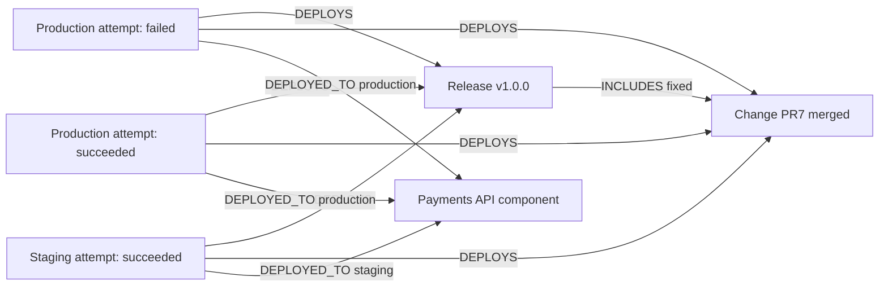

# G04 verification and stakeholder demonstration

Status: VERIFIED and independently reviewed; all 31 predeclared real-Spanner checks passed. Recorded stakeholder walkthrough delivered here; GitHub issues are reconciled below. Stakeholder sign-off is separate. Stakeholder sign-off is not assumed. G05 has not started.

## What this demonstrates

A password-reset change is merged and explicitly included in a release. Its first production deployment fails; a later attempt succeeds. Both remain separate and visible, as does staging. Engram answers what shipped, where it ran and which attempt failed using the stored links and source events. Merge or release alone never creates a successful deployment.

## What was reused and changed

The reconciled foundation supplies authentication/tenant binding, admission, receipts, five ordinary worker loops, Spanner ports, graph projection interpreter and artifact retrieval. No foundation track or G01–G03 cloud reruns. No generic retrieval/runtime change. The existing G03 demo harness accepts explicit G04 fixtures instead of copying a second runner; stronger checks are G04-gated and G03 retains its default fixture path.

PDLC 3.0 adds a failed deployment event, optional explicit release_version→Release mapping, Deployment query seeds, valid release-section enforcement and repo/service in deployment identity. That identity change is breaking and runs on a fresh disposable dataset; historical migration is excluded. The original identity collision is tracked in #47 under #34; G04 lifecycle work fits #40.

## Reproduction and source provenance

- Run: `20261008-cloud-g04-all-01`. Executed commit: `431a29d5bb7d0e2dfa971f0264a2e2b94a02bc87`; per-file archive has 190 matching hashes. Contents were frozen before the first cloud operation.
- Target: `projects/portiq-mvp/instances/engram-experiment/databases/engram-compat-target`; never the source database `engram`.
- Core 1.1 + PDLC 3.0; memory/user disabled. Private bound tenant compat-control, real Bearer catalog authentication and response guard. All five ports use real Spanner, emulator unset, creation disabled.
- Inputs are synthetic normalized producer events. No new native release/deployment adapter or arbitrary raw-field interpretation is claimed. Source assertions record external outcomes; Engram does not actually deploy software.
- Explicit serve_unevaluated experiment gate; no whole-pack/public-dispatch/65-scenario baseline sign-off. Real cached embeddings run; no G04 event requires LLM pack extraction, so LLM client initialization is not reported as extraction execution.

```bash
PYTHONPATH=scripts .venv/bin/python scripts/engram_goal04_release_demo.py \
  --run-id NEW_UNIQUE_RUN_ID \
  --credentials /private/tmp/engram-spanner-token-env \
  --expected-epoch CURRENT_VERIFIED_EMPTY_CORE_EPOCH
```

Repeat from the archived source with locked dependencies and refreshed private credentials. Inspect owner/digest and all seven tables first; never override a changed owner or nonempty database. The completed run restored epoch 42. No tokens appear in committed evidence.

## Graph meaning



Each observed artifact has DERIVED_FROM links to its actual event(s). Graph storage retains the complete declared source set; retrieval attaches the newest event only. Explicit references may create identity-only placeholders without provenance, later filled by their own source events. No guessed change/release links.

## Processing and per-scenario trace

Every row below follows normalized input → authenticated bound admission → HTTP response → ledger → five running workers → domain graph → HTTP artifact retrieval. Adapter translation is not applicable to these normalized fixtures. Ledger checks assert exact original payload/event type and tenant/database/bundle/epoch/source authority. Successful rows require all worker lags zero, no pending deliveries/DLQ, exact domain identities/properties/links and source sets. Core projection builds Event/evidence; pack projection builds the declared domain graph; enrichment produces real event embeddings/annotations. Other workers participate but do not invent disabled memory/user outputs.

Full row-level source bodies, acceptance documents, storage snapshots, edge properties, worker lags and HTTP answers are retained in observations.json and fixtures.json. The table gives each real event identity and the concrete effect.

| Check | Input and HTTP result | Graph/read result |
|---|---|---|
| RD01-open: PASS | `pdlc.change.created`; event `2c32607d-e091-5e51-9c7d-f669abe28e84`; HTTP201/created | `Change:g04/20261008-cloud-g04-all-01/payments|7` {'title': 'Enforce fifteen-minute reset expiry', 'status': 'open'}; no new domain links; five zero lags; HTTP retrieval checked |
| RD02-merge: PASS | `pdlc.change.merged`; event `ce56bcb8-fa35-54ff-89eb-c4a8647a85e9`; HTTP201/created | `Change:g04/20261008-cloud-g04-all-01/payments|7` {'title': 'Enforce fifteen-minute reset expiry', 'status': 'merged', 'merge_sha': 'reset-sha'}; no new domain links; five zero lags; HTTP retrieval checked |
| RD03-release: PASS | `pdlc.release.published`; event `133252a7-4fa9-53c3-b951-718e18391d4b`; HTTP201/created | `Release:g04/20261008-cloud-g04-all-01/payments|v1.0.0` {'breaking': False}; INCLUDES Release:g04/20261008-cloud-g04-all-01/payments|v1.0.0 → Change:g04/20261008-cloud-g04-all-01/payments|7; five zero lags; HTTP retrieval checked |
| RD04-failed: PASS | `pdlc.service.deployment_failed`; event `a7510869-ca9f-556d-a7f3-42c919f2cc5e`; HTTP201/created | `Deployment:g04/20261008-cloud-g04-all-01/payments|g04/20261008-cloud-g04-all-01/payments/api|production|reset-sha|2026-10-08T05:46:45+00:00` {'status': 'failed', 'repo': 'g04/20261008-cloud-g04-all-01/payments', 'service': 'g04/20261008-cloud-g04-all-01/payments/api', 'environment': 'production', 'artifact_id': 'reset-sha'}; DEPLOYED_TO Deployment:g04/20261008-cloud-g04-all-01/payments|g04/20261008-cloud-g04-all-01/payments/api|production|reset-sha|2026-10-08T05:46:45+00:00 → Component:g04/20261008-cloud-g04-all-01/payments/api; DEPLOYS Deployment:g04/20261008-cloud-g04-all-01/payments|g04/20261008-cloud-g04-all-01/payments/api|production|reset-sha|2026-10-08T05:46:45+00:00 → Release:g04/20261008-cloud-g04-all-01/payments|v1.0.0; DEPLOYS Deployment:g04/20261008-cloud-g04-all-01/payments|g04/20261008-cloud-g04-all-01/payments/api|production|reset-sha|2026-10-08T05:46:45+00:00 → Change:g04/20261008-cloud-g04-all-01/payments|7; five zero lags; HTTP retrieval checked |
| RD05-succeeded: PASS | `pdlc.service.deployed`; event `89aca3c1-80ad-55bb-b33f-b9426f8c090e`; HTTP201/created | `Deployment:g04/20261008-cloud-g04-all-01/payments|g04/20261008-cloud-g04-all-01/payments/api|production|reset-sha|2026-10-08T05:46:46+00:00` {'status': 'succeeded', 'repo': 'g04/20261008-cloud-g04-all-01/payments', 'service': 'g04/20261008-cloud-g04-all-01/payments/api', 'environment': 'production', 'artifact_id': 'reset-sha'}; DEPLOYED_TO Deployment:g04/20261008-cloud-g04-all-01/payments|g04/20261008-cloud-g04-all-01/payments/api|production|reset-sha|2026-10-08T05:46:46+00:00 → Component:g04/20261008-cloud-g04-all-01/payments/api; DEPLOYS Deployment:g04/20261008-cloud-g04-all-01/payments|g04/20261008-cloud-g04-all-01/payments/api|production|reset-sha|2026-10-08T05:46:46+00:00 → Release:g04/20261008-cloud-g04-all-01/payments|v1.0.0; DEPLOYS Deployment:g04/20261008-cloud-g04-all-01/payments|g04/20261008-cloud-g04-all-01/payments/api|production|reset-sha|2026-10-08T05:46:46+00:00 → Change:g04/20261008-cloud-g04-all-01/payments|7; five zero lags; HTTP retrieval checked |
| RD06-staging: PASS | `pdlc.service.deployed`; event `3d16c76e-c76f-59c4-913f-6e9eb48e4d0f`; HTTP201/created | `Deployment:g04/20261008-cloud-g04-all-01/payments|g04/20261008-cloud-g04-all-01/payments/api|staging|reset-sha|2026-10-08T05:46:47+00:00` {'status': 'succeeded', 'repo': 'g04/20261008-cloud-g04-all-01/payments', 'service': 'g04/20261008-cloud-g04-all-01/payments/api', 'environment': 'staging', 'artifact_id': 'reset-sha'}; DEPLOYED_TO Deployment:g04/20261008-cloud-g04-all-01/payments|g04/20261008-cloud-g04-all-01/payments/api|staging|reset-sha|2026-10-08T05:46:47+00:00 → Component:g04/20261008-cloud-g04-all-01/payments/api; DEPLOYS Deployment:g04/20261008-cloud-g04-all-01/payments|g04/20261008-cloud-g04-all-01/payments/api|staging|reset-sha|2026-10-08T05:46:47+00:00 → Release:g04/20261008-cloud-g04-all-01/payments|v1.0.0; DEPLOYS Deployment:g04/20261008-cloud-g04-all-01/payments|g04/20261008-cloud-g04-all-01/payments/api|staging|reset-sha|2026-10-08T05:46:47+00:00 → Change:g04/20261008-cloud-g04-all-01/payments|7; five zero lags; HTTP retrieval checked |
| RD07-duplicate: PASS | `pdlc.service.deployed`; event `89aca3c1-80ad-55bb-b33f-b9426f8c090e`; HTTP201/duplicate | Idempotent retry; full seven-table fingerprints unchanged; five zero lags; HTTP retrieval checked |
| RD07-conflict: PASS | `pdlc.service.deployed`; event `89aca3c1-80ad-55bb-b33f-b9426f8c090e`; HTTP409/rejected | Rejected before append; full seven-table fingerprints unchanged; conflicting event did not replace stored event; five zero lags; HTTP retrieval checked |
| RD08-release-first: PASS | `pdlc.release.published`; event `38ff9b2a-8651-5a6e-a0b9-ee24d4868001`; HTTP201/created | `Release:g04/20261008-cloud-g04-all-01/payments|v2.0.0` {}; INCLUDES Release:g04/20261008-cloud-g04-all-01/payments|v2.0.0 → Change:g04/20261008-cloud-g04-all-01/payments|9; five zero lags; HTTP retrieval checked |
| RD08-change-arrives: PASS | `pdlc.change.created`; event `5cdb4e80-4f42-53ad-b859-9f970bb838cb`; HTTP201/created | `Change:g04/20261008-cloud-g04-all-01/payments|9` {'title': 'Future change', 'status': 'open'}; no new domain links; five zero lags; HTTP retrieval checked |
| RD08-deploy-first: PASS | `pdlc.service.deployed`; event `b2e8311b-77b3-5b20-b7fa-3da655228dda`; HTTP201/created | `Deployment:g04/20261008-cloud-g04-all-01/payments|g04/20261008-cloud-g04-all-01/payments/api|production|future-sha|2026-10-08T05:46:52+00:00` {'status': 'succeeded', 'repo': 'g04/20261008-cloud-g04-all-01/payments', 'service': 'g04/20261008-cloud-g04-all-01/payments/api', 'environment': 'production', 'artifact_id': 'future-sha'}; DEPLOYED_TO Deployment:g04/20261008-cloud-g04-all-01/payments|g04/20261008-cloud-g04-all-01/payments/api|production|future-sha|2026-10-08T05:46:52+00:00 → Component:g04/20261008-cloud-g04-all-01/payments/api; DEPLOYS Deployment:g04/20261008-cloud-g04-all-01/payments|g04/20261008-cloud-g04-all-01/payments/api|production|future-sha|2026-10-08T05:46:52+00:00 → Release:g04/20261008-cloud-g04-all-01/payments|v3.0.0; five zero lags; HTTP retrieval checked |
| RD08-release-arrives: PASS | `pdlc.release.published`; event `99859ffd-b84f-5c6a-bf08-8315c7e41072`; HTTP201/created | `Release:g04/20261008-cloud-g04-all-01/payments|v3.0.0` {'breaking': True}; no new domain links; five zero lags; HTTP retrieval checked |
| RD09-empty-release: PASS | `pdlc.release.published`; event `9bec26d5-778f-5e61-980f-01bc15d3d157`; HTTP201/created | `Release:g04/20261008-cloud-g04-all-01/payments|empty` {}; no new domain links; five zero lags; HTTP retrieval checked |
| RD09-unlinked-deploy: PASS | `pdlc.service.deployed`; event `6346f99f-bbe2-56bc-932b-0fd38c73c82a`; HTTP201/created | `Deployment:g04/20261008-cloud-g04-all-01/payments|g04/20261008-cloud-g04-all-01/payments/unlinked|production|unknown-sha|2026-10-08T05:46:55+00:00` {'status': 'succeeded', 'repo': 'g04/20261008-cloud-g04-all-01/payments', 'service': 'g04/20261008-cloud-g04-all-01/payments/unlinked', 'environment': 'production', 'artifact_id': 'unknown-sha'}; DEPLOYED_TO Deployment:g04/20261008-cloud-g04-all-01/payments|g04/20261008-cloud-g04-all-01/payments/unlinked|production|unknown-sha|2026-10-08T05:46:55+00:00 → Component:g04/20261008-cloud-g04-all-01/payments/unlinked; five zero lags; HTTP retrieval checked |
| RD10-other-change: PASS | `pdlc.change.created`; event `2fc44fb0-74ed-51ed-adce-d05fc7ba8b70`; HTTP201/created | `Change:g04/20261008-cloud-g04-all-01/newsletter|7` {'status': 'open'}; no new domain links; five zero lags; HTTP retrieval checked |
| RD10-other-release: PASS | `pdlc.release.published`; event `e22dd911-ccff-5c94-9cf3-b98a47c94b09`; HTTP201/created | `Release:g04/20261008-cloud-g04-all-01/newsletter|v1.0.0` {}; INCLUDES Release:g04/20261008-cloud-g04-all-01/newsletter|v1.0.0 → Change:g04/20261008-cloud-g04-all-01/newsletter|7; five zero lags; HTTP retrieval checked |
| RD10-other-repo-same-time: PASS | `pdlc.service.deployed`; event `3ecd7677-414a-55a9-bc45-cacf3c1ae92b`; HTTP201/created | `Deployment:g04/20261008-cloud-g04-all-01/newsletter|g04/20261008-cloud-g04-all-01/newsletter/api|production|reset-sha|2026-10-08T05:46:45+00:00` {'status': 'succeeded', 'repo': 'g04/20261008-cloud-g04-all-01/newsletter', 'service': 'g04/20261008-cloud-g04-all-01/newsletter/api', 'environment': 'production', 'artifact_id': 'reset-sha'}; DEPLOYED_TO Deployment:g04/20261008-cloud-g04-all-01/newsletter|g04/20261008-cloud-g04-all-01/newsletter/api|production|reset-sha|2026-10-08T05:46:45+00:00 → Component:g04/20261008-cloud-g04-all-01/newsletter/api; DEPLOYS Deployment:g04/20261008-cloud-g04-all-01/newsletter|g04/20261008-cloud-g04-all-01/newsletter/api|production|reset-sha|2026-10-08T05:46:45+00:00 → Release:g04/20261008-cloud-g04-all-01/newsletter|v1.0.0; DEPLOYS Deployment:g04/20261008-cloud-g04-all-01/newsletter|g04/20261008-cloud-g04-all-01/newsletter/api|production|reset-sha|2026-10-08T05:46:45+00:00 → Change:g04/20261008-cloud-g04-all-01/newsletter|7; five zero lags; HTTP retrieval checked |
| RD10-other-repo-same-service: PASS | `pdlc.service.deployed`; event `e631275a-fd2a-538c-adb4-47c517ebf639`; HTTP201/created | `Deployment:g04/20261008-cloud-g04-all-01/newsletter|g04/20261008-cloud-g04-all-01/payments/api|production|reset-sha|2026-10-08T05:46:45+00:00` {'status': 'succeeded', 'repo': 'g04/20261008-cloud-g04-all-01/newsletter', 'service': 'g04/20261008-cloud-g04-all-01/payments/api', 'environment': 'production', 'artifact_id': 'reset-sha'}; DEPLOYED_TO Deployment:g04/20261008-cloud-g04-all-01/newsletter|g04/20261008-cloud-g04-all-01/payments/api|production|reset-sha|2026-10-08T05:46:45+00:00 → Component:g04/20261008-cloud-g04-all-01/payments/api; five zero lags; HTTP retrieval checked |
| RD10-other-service-same-time: PASS | `pdlc.service.deployed`; event `a9ca97c4-3965-5f01-8035-57db03c73485`; HTTP201/created | `Deployment:g04/20261008-cloud-g04-all-01/payments|g04/20261008-cloud-g04-all-01/payments/worker|production|reset-sha|2026-10-08T05:46:45+00:00` {'status': 'succeeded', 'repo': 'g04/20261008-cloud-g04-all-01/payments', 'service': 'g04/20261008-cloud-g04-all-01/payments/worker', 'environment': 'production', 'artifact_id': 'reset-sha'}; DEPLOYED_TO Deployment:g04/20261008-cloud-g04-all-01/payments|g04/20261008-cloud-g04-all-01/payments/worker|production|reset-sha|2026-10-08T05:46:45+00:00 → Component:g04/20261008-cloud-g04-all-01/payments/worker; DEPLOYS Deployment:g04/20261008-cloud-g04-all-01/payments|g04/20261008-cloud-g04-all-01/payments/worker|production|reset-sha|2026-10-08T05:46:45+00:00 → Change:g04/20261008-cloud-g04-all-01/payments|7; five zero lags; HTTP retrieval checked |
| RD11-null-release: PASS | `pdlc.service.deployed`; event `24c7fcbf-77e0-53c5-8a94-540b078848e7`; HTTP422/rejected | Rejected before append; full seven-table fingerprints unchanged; candidate absent through HTTP retrieval; five zero lags; HTTP retrieval checked |
| RD11-empty-release: PASS | `pdlc.service.deployed`; event `5ba3ff1b-0409-5fab-ae9a-1670b7b83be2`; HTTP422/rejected | Rejected before append; full seven-table fingerprints unchanged; candidate absent through HTTP retrieval; five zero lags; HTTP retrieval checked |
| RD11-typed-release: PASS | `pdlc.service.deployed`; event `ac3c69d4-3d67-533e-9b60-25ebf3b2b42c`; HTTP422/rejected | Rejected before append; full seven-table fingerprints unchanged; candidate absent through HTTP retrieval; five zero lags; HTTP retrieval checked |
| RD11-missing-environment: PASS | `pdlc.service.deployed`; event `5da22a63-9da6-5b7c-803f-d83c60d04b52`; HTTP422/rejected | Rejected before append; full seven-table fingerprints unchanged; candidate absent through HTTP retrieval; five zero lags; HTTP retrieval checked |
| RD11-missing-section: PASS | `pdlc.release.published`; event `d73a681e-568a-5fb1-a046-1c7afe4cc776`; HTTP422/rejected | Rejected before append; full seven-table fingerprints unchanged; candidate absent through HTTP retrieval; five zero lags; HTTP retrieval checked |
| RD11-bad-section: PASS | `pdlc.release.published`; event `1d07130b-b78b-5512-b43c-ebb7268737ee`; HTTP422/rejected | Rejected before append; full seven-table fingerprints unchanged; candidate absent through HTTP retrieval; five zero lags; HTTP retrieval checked |
| RD11-bad-number: PASS | `pdlc.release.published`; event `9e00a34f-794e-5396-b177-bba986db5a5c`; HTTP422/rejected | Rejected before append; full seven-table fingerprints unchanged; candidate absent through HTTP retrieval; five zero lags; HTTP retrieval checked |
| RD11-bogus-event: PASS | `pdlc.service.nonexistent`; event `7268e968-a8e6-5868-99b7-f7ec1bd28691`; HTTP422/rejected | Rejected before append; full seven-table fingerprints unchanged; candidate absent through HTTP retrieval; five zero lags; HTTP retrieval checked |

## Final retrieval paths

Exact node sets, edge sets/directions, section/environment properties and newest source-event provenance were checked. Any truncation fails acceptance. No inferred siblings are added just to make the demo look fuller.

| Query | Exact required artifacts | Outcome |
|---|---|---|
| RD12-release; seed `Release:g04/20261008-cloud-g04-all-01/payments|v1.0.0` | 8 artifacts: `Release:g04/20261008-cloud-g04-all-01/payments|v1.0.0`; `Change:g04/20261008-cloud-g04-all-01/payments|7`; `Deployment:g04/20261008-cloud-g04-all-01/payments|g04/20261008-cloud-g04-all-01/payments/api|production|reset-sha|2026-10-08T05:46:45+00:00`; `Deployment:g04/20261008-cloud-g04-all-01/payments|g04/20261008-cloud-g04-all-01/payments/api|production|reset-sha|2026-10-08T05:46:46+00:00`; `Deployment:g04/20261008-cloud-g04-all-01/payments|g04/20261008-cloud-g04-all-01/payments/api|staging|reset-sha|2026-10-08T05:46:47+00:00`; `Component:g04/20261008-cloud-g04-all-01/payments/api`; `Deployment:g04/20261008-cloud-g04-all-01/payments|g04/20261008-cloud-g04-all-01/payments/worker|production|reset-sha|2026-10-08T05:46:45+00:00`; `Component:g04/20261008-cloud-g04-all-01/payments/worker` | PASS; exact topology/properties/evidence; forbidden IDs absent |
| RD12-change; seed `Change:g04/20261008-cloud-g04-all-01/payments|7` | 8 artifacts: `Change:g04/20261008-cloud-g04-all-01/payments|7`; `Release:g04/20261008-cloud-g04-all-01/payments|v1.0.0`; `Deployment:g04/20261008-cloud-g04-all-01/payments|g04/20261008-cloud-g04-all-01/payments/api|production|reset-sha|2026-10-08T05:46:45+00:00`; `Deployment:g04/20261008-cloud-g04-all-01/payments|g04/20261008-cloud-g04-all-01/payments/api|production|reset-sha|2026-10-08T05:46:46+00:00`; `Deployment:g04/20261008-cloud-g04-all-01/payments|g04/20261008-cloud-g04-all-01/payments/api|staging|reset-sha|2026-10-08T05:46:47+00:00`; `Component:g04/20261008-cloud-g04-all-01/payments/api`; `Deployment:g04/20261008-cloud-g04-all-01/payments|g04/20261008-cloud-g04-all-01/payments/worker|production|reset-sha|2026-10-08T05:46:45+00:00`; `Component:g04/20261008-cloud-g04-all-01/payments/worker` | PASS; exact topology/properties/evidence; forbidden IDs absent |
| RD12-failed-attempt; seed `Deployment:g04/20261008-cloud-g04-all-01/payments|g04/20261008-cloud-g04-all-01/payments/api|production|reset-sha|2026-10-08T05:46:45+00:00` | 4 artifacts: `Deployment:g04/20261008-cloud-g04-all-01/payments|g04/20261008-cloud-g04-all-01/payments/api|production|reset-sha|2026-10-08T05:46:45+00:00`; `Release:g04/20261008-cloud-g04-all-01/payments|v1.0.0`; `Change:g04/20261008-cloud-g04-all-01/payments|7`; `Component:g04/20261008-cloud-g04-all-01/payments/api` | PASS; exact topology/properties/evidence; forbidden IDs absent |
| RD12-component; seed `Component:g04/20261008-cloud-g04-all-01/payments/api` | 9 artifacts: `Change:g04/20261008-cloud-g04-all-01/payments|7`; `Release:g04/20261008-cloud-g04-all-01/payments|v1.0.0`; `Deployment:g04/20261008-cloud-g04-all-01/payments|g04/20261008-cloud-g04-all-01/payments/api|production|reset-sha|2026-10-08T05:46:45+00:00`; `Deployment:g04/20261008-cloud-g04-all-01/payments|g04/20261008-cloud-g04-all-01/payments/api|production|reset-sha|2026-10-08T05:46:46+00:00`; `Deployment:g04/20261008-cloud-g04-all-01/payments|g04/20261008-cloud-g04-all-01/payments/api|staging|reset-sha|2026-10-08T05:46:47+00:00`; `Component:g04/20261008-cloud-g04-all-01/payments/api`; `Deployment:g04/20261008-cloud-g04-all-01/payments|g04/20261008-cloud-g04-all-01/payments/api|production|future-sha|2026-10-08T05:46:52+00:00`; `Release:g04/20261008-cloud-g04-all-01/payments|v3.0.0`; `Deployment:g04/20261008-cloud-g04-all-01/newsletter|g04/20261008-cloud-g04-all-01/payments/api|production|reset-sha|2026-10-08T05:46:45+00:00` | PASS; exact topology/properties/evidence; forbidden IDs absent |

A single failed-attempt query returns that attempt, its Change, Release and Component, not the later success/staging siblings. Release/Change seeds return both production outcomes, staging and the linked worker-service attempt. Component queries follow explicit catalog identity: another repo that deliberately names the same service is genuinely connected; repo-specific Change/Release queries exclude its unrelated artifacts. This is same-tenant graph semantics, not proof of cross-tenant isolation.

## Cleanup, failures and limitations

Owned cleanup counts: `{'Events': 17, 'GraphNodes': 38, 'GraphEdges': 62, 'ConsumerGroups': 5, 'ConsumerCursors': 80, 'ConsumerDeliveries': 0, 'ConsumerDeadLetters': 0}`. All seven application tables are empty; active core ownership restored to epoch 42. Shutdown errors: none. Owner40→41 for the experiment → 42 restored; no manual graph repair or direct artifact setup.
Local preflight failures (outdated test identity oracles, invalid old section fixture, strict local Event conversion, payload aliasing and an incorrect local test filename) are retained in the local G04 logs; final affected suite:190 passed. These are not cloud passes. All cloud attempts remain retained; this first complete cloud run passed. Monitoring export403 is outside data-path assertions and remains unresolved.

Deployment attempts still use timestamp-based identity: otherwise identical keys require distinct attempt timestamps; native attempt IDs are not added. Outcome authority is the event type; unrecognized extra payload fields are preserved. Incidents/rollback/upgrade, public tenant dispatch, optional-pack combinations and original 65-scenario baseline remain outside this slice. No historical migration.

## Recorded stakeholder walkthrough

1. Show RD01–03: PR7 opens, merges and enters release v1.0.0; there is still no Deployment.
2. Show RD04–06: production failure, later production success and staging success are three records with the correct environment and event evidence. The failure is never erased.
3. Show RD07: identical retry adds nothing; altered same-ID content returns409 and changes nothing.
4. Show RD08–09: named parents can arrive later and fill placeholders; omitted release/change references create no explicit-reference links; existing exact merge_sha matching may still establish a Change link (as in RD10).
5. Show RD10: exact equal-time/artifact collisions in different repo/service scopes remain separate. Explain the deliberate shared Component identity case.
6. Show RD11: eight invalid requests return422, leave every application table unchanged and candidate reads return absent.
7. Show RD12: compare release/change/attempt/component answers, their exact topology and evidence. Explain why the one-attempt answer intentionally excludes siblings.
8. Show verified cleanup and the GitHub reconciliation table below. Recorded execution is delivered by this walkthrough/evidence; a fresh live demo requires a new owned run and fresh credentials. Stakeholder approval is separate.

## Evidence and review links

[Fixtures](runs/20261008-cloud-g04-all-01/fixtures.json), [observations](runs/20261008-cloud-g04-all-01/observations.json), [manifest](runs/20261008-cloud-g04-all-01/manifest.json), [source hashes](runs/20261008-cloud-g04-all-01/executed-source-sha256.json), [executed source](runs/20261008-cloud-g04-all-01/executed-source.tar.gz), [preflight](runs/20261008-cloud-g04-all-01/preflight.json), [runner log](runs/20261008-cloud-g04-all-01/runner.log), [implementation review](2026-10-08-astra-g04-review.md).

[Final independent Astra evidence review](2026-10-08-astra-g04-evidence-review.md) found no blockers. Actual [GitHub reconciliation receipts](2026-10-08-g04-issue-reconciliation.json) are recorded below. Broader issues are not presumed closed. G05 remains unstarted.

## Actual GitHub reconciliation and feature-bucket assessment

| Issue | Before → after | Acceptance advanced and remaining scope | Actual update |
|---|---|---|---|
| #34 | OPEN → OPEN | Bounded G04 milestone recorded; other feature goals remain open. New child #47 records the confirmed deployment identity defect. | [GitHub update](https://github.com/arunmenon/Engram/issues/34#issuecomment-6053441691) |
| #4 | OPEN → OPEN | Eight G04 invalid inputs reject before append, with candidate absence and full-table no-write proof. Other event/ingress contract coverage remains open. | [GitHub update](https://github.com/arunmenon/Engram/issues/4#issuecomment-6053442676) |
| #35 | OPEN → OPEN | New PDLC3.0 event/rules resolve in the existing core+PDLC bundle and reject an unsupported domain event. Other capability combinations, public routing and unfamiliar-pack scope remain open. | [GitHub update](https://github.com/arunmenon/Engram/issues/35#issuecomment-6053443252) |
| #36 | OPEN → OPEN | Repo/service-scoped deployment identity, explicit release links and independent failed/successful attempts verified. Broader update/fan-out/late-ordering semantics remain open. | [GitHub update](https://github.com/arunmenon/Engram/issues/36#issuecomment-6053443769) |
| #37 | OPEN → OPEN | Deployment event duplicate/conflict handling verified with ten unchanged full-table snapshots including rejects. Native adapters/other sources remain separate. | [GitHub update](https://github.com/arunmenon/Engram/issues/37#issuecomment-6053444281) |
| #39 | OPEN → OPEN | Four exact G04 retrieval oracles verify node/edge/property/source sets; no truncation. Whole-pack and unfamiliar-pack conformance remain open. | [GitHub update](https://github.com/arunmenon/Engram/issues/39#issuecomment-6053444754) |
| #40 | OPEN → OPEN | Change→Release→failed/successful deployment journey verified; incident/rollback/upgrade and remaining lifecycle journeys remain open. | [GitHub update](https://github.com/arunmenon/Engram/issues/40#issuecomment-6053445232) |
| #41 | OPEN → OPEN | 31 G04 real-Spanner extension checks passed; original 65-scenario baseline statuses are unchanged, no broad compatibility sign-off. | [GitHub update](https://github.com/arunmenon/Engram/issues/41#issuecomment-6053446015) |
| #47 | OPEN → CLOSED | Exact same-time environment/artifact collisions across repositories and services now remain separate on real Spanner; failed outcome/evidence retained. All bounded defect acceptance proved. | [GitHub update](https://github.com/arunmenon/Engram/issues/47#issuecomment-6053446495) |

#34 and #40 body summaries now point to the G04 milestone; prior run context is retained as history. #47 is closed only after its scoped defect acceptance, independent review and actual cloud rerun. All eight broader issues remain OPEN. No new feature bucket is needed: release/deployment belongs to existing PDLC journey work under #34/#40. The new collision defect is a child of #34. No migration or separate foundation reruns. Stop here: G05 has not started.
