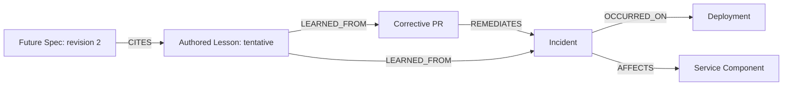

# G06 verification and stakeholder walkthrough

Status: all 50 real-Spanner checks passed in `20261008-cloud-g06-all-03`.
Independent evidence review found no blockers. GitHub reconciliation is pending.
G07 is not authorized.

## What this goal demonstrates

An expired password-reset token is accepted after deployment. A producer reports
the incident, explicitly identifies a corrective PR, records resolution separately,
and authors a lesson. A later specification explicitly cites that lesson. Engram
must retrieve the connected story with evidence without inventing cause,
resolution, approval, or links to similar records.



Every observed artifact also has DERIVED_FROM evidence to its actual source Event.
Relationship declarations retain their source event and/or pinned ledger position.
Reference-only stubs have no artifact observation provenance until an artifact
event arrives. Occurrence is not causal attribution; merging the PR does not
resolve the incident; confirmed support does not validate a tentative lesson.

## Exact boundary and execution

The frozen source is `e73f100`, PDLC 4.2.0 plus mandatory core, with memory/user
disabled. The target is `portiq-mvp / engram-experiment / engram-g06-target`.
The predecessor owner is epoch 5 with the empty-core bundle digest recorded in
the manifest. The runtime uses one private bound `compat-control` tenant, real
Bearer authentication, TCP HTTP and all five ordinary worker loops. It does not
exercise the public multi-tenant dispatcher.

These are synthetic normalized producer events. Native incident/webhook adapter
translation is not claimed: the normalization stage is explicitly already done
by the typed fixture producer. There are no direct artifact inserts, mocked
Spanner calls, manual graph repairs or migration tests. Administrative writes
only install schema/ownership in the separate empty target; graph data comes
through Engram.

The original run command was:

```bash
PYTHONPATH=src:scripts .venv/bin/python scripts/engram_goal06_incident_demo.py \
  --run-id 20261008-cloud-g06-all-03 \
  --credentials /private/tmp/engram-spanner-token-env \
  --expected-epoch 5 \
  --expected-digest sha256:5fdd8a1db58b4a44c56454ec9c57381f8699da64c6042c6a5703733eab6a2962
```

This is a record of the executed command, not permission to rerun over retained
data. A repeat needs a new run ID and an explicitly authorized empty target with
its actual ownership fence. Never reuse or clear G05's retained database.

## What happens inside Engram, for every input

1. The fixture producer supplies a common envelope and typed domain payload.
   Authentication supplies the trusted source and tenant binding; the caller's
   agent name is not authenticated human approval.
2. POST `/v1/events` validates the selected pack's contract and returns a durable
   receipt, an unchanged duplicate receipt, a 409 conflict, or a 422 rejection.
   A stored receipt does not alone establish projection completion.
3. The runner observes the real Spanner ledger, checking the exact payload and
   acceptance tenant, database, bundle, epoch and verified source metadata.
4. Projection, extraction, enrichment, pack extraction and consolidation run
   through ordinary subscriptions. Each checkpoint requires every lag to reach
   zero, all accepted Event nodes to exist, and no pending or dead-letter records.
   All three accepted Spec approvals require successful real LLM pack-extraction
   outcomes; no inferred item is required or treated as an authored lesson.
5. Raw graph snapshots are checked against the predeclared cumulative identities,
   lifecycle, relationships and exact DERIVED_FROM evidence. Numeric edge
   properties are compared through Engram's normal Spanner decoder. Raw evidence
   and full-table fingerprints remain unchanged by that decoding.
6. POST `/v1/query/artifacts` verifies artifact fields and Spanner provenance after
   each input, then the twelve final questions check exact nodes and the exact
   relationships supported by the selected incident intent. Stored DEPLOYED_TO
   remains checked but is deliberately not traversed by that intent.

For every duplicate, conflict and malformed input, all seven application-table
fingerprints must remain identical. Computable rejected Lesson/Spec IDs also
receive absence queries. Seeds are search hints, so other text matches may be
returned; the rejected candidate must be absent and the result untruncated.
Those complete responses are retained, rather than reported as empty answers.

## Recorded demonstration to walk through

1. Show the five deployment inputs: intended deployment, repository collision,
   independent service collision, another scope and a future deployment. The
   main incident occurs between the intended and future deployments; it must
   connect to the former only. An earlier incident and one lacking reference
   fields remain visible without a fabricated OCCURRED_ON edge.
2. Show `IC05-remediation`, then `IC06-merge-still-open`. PR 8 is explicitly linked
   to the incident, but merging it leaves the incident detected. PR 9 stays
   unlinked. `IC07-explicit-resolution` supplies the separate resolution evidence;
   the late detection afterward does not reopen it.
3. Show `IC08-reference-first`: the relationship exists before its artifact
   events, with reference-only endpoints and null provenance. The normal Change
   and Incident events then fill those same identities with their own evidence.
4. Show the authored lesson “Check token expiry server-side.” Its status stays
   tentative. The same statement for the other incident is a separate authored
   assertion. Producer-rejected support remains stored and is excluded from
   retrieval.
5. Show the future Spec's explicit citation and the similarly worded unciting
   Spec. Only the explicit declaration creates CITES. An unknown typed citation
   names a reference stub, not an observed or validated lesson.
6. Walk from Incident to the corrective PR and future Spec, then from that Spec
   back to the incident/deployment. Show the natural-language question and the
   unrelated controls. Inspect the actual returned IDs, relationships, properties
   and supporting source events in the recorded response.
7. Finish with unchanged-data fingerprints for all 14 no-write cases and G05's
   independent before/after retention proof. This is a recorded demonstration;
   stakeholder sign-off and an executed live demonstration are not inferred.

## Preserved failures and review

See [integrated review and dispositions](2026-10-08-g06-integrated-review.md).
The preparation permission failure and both failed full-cloud attempts remain
recorded. Full attempt 01 stopped on raw float encoding; attempt 02 incorrectly
required an entire search answer to be empty for a missing candidate. Their
corrections affect the runner, not the engine or PDLC rules. No final journey
question was rewritten. Both failed attempts safely restored empty G06 ownership
and verified G05 unchanged.

One newly added local regression initially omitted required retriever constructor
arguments. Its test-only setup correction passed all seven local journey/guard
tests after the third run's source was frozen. The archive preserves the exact
executed source, including that earlier test version; no runtime, fixture or
query expectation changed during the cloud execution.

## Limits and feature-bucket assessment

This goal does not establish whole-pack evaluation, arbitrary-pack composition,
public tenant dispatch/isolation, strict ID-only lookup, interruption recovery,
general ordering, ANN quality/performance, or the original 65-scenario baseline.
`serve_unevaluated` is explicit; unsupported capability warnings remain visible.
Historical migration is excluded. The Cloud Monitoring export permission failure
is separate from the data path and is not reported as passing.

The work fits existing PDLC journey #40 under #34 and Spanner verification #41.
No separate feature bucket is needed for the runner corrections. A strict
ID-only retrieval mode would be a separate product capability, not a prerequisite
or silently implemented addition here. G07 and later remain unstarted.


## Final cloud result

All 50 checks passed. The 38 HTTP inputs comprise 24 unique accepted events, three unchanged duplicates, three unchanged 409 conflicts and eight unchanged 422 rejections. All 14 no-write fingerprints matched. The 12 final queries matched their exact expected identity and intent-supported edge sets without truncation. All five worker lags were zero at each input checkpoint; no pending or dead-letter entries remained.

All three Spec events logged real `pack_extraction_applied` outcomes, each proposing zero nodes/links. This proves execution with valid empty extraction output, not inferred lesson generation. The authored feedback chain came from explicit pack rules.

The retained G06 dataset has 24 Events, 49 GraphNodes, 76 GraphEdges, five consumer groups and 80 cursors, with zero deliveries/dead letters, at active owner epoch 6. Workers and HTTP are stopped; shutdown errors are empty. G05 owner/fingerprints matched its retained receipt before and after. Neither retained dataset may be cleared without approval.

## Input-by-input expected versus actual

Aliases below resolve to full typed IDs in the artifact table. Every row links conceptually to the same scenario key in [frozen fixtures](runs/20261008-cloud-g06-all-03/fixtures.json) and [actual observations](runs/20261008-cloud-g06-all-03/observations.json). Those records contain the full envelope/payload, receipt and global position, trusted ledger metadata, raw graph, five worker lags and HTTP retrieval response.

| Case | Event | HTTP expected / actual | Expected graph change or no-write result | Actual |
|---|---|---|---|---|
| IC01-main-deploy | service.deployed | 201 / 201 | deployment: {"status": "succeeded", "repo": "g06/20261008-cloud-g06-all-03/auth", "service": "g06/20261008-cloud-g06-all-03/auth/reset"}; DEPLOYED_TO deployment → component | passed |
| IC01-repo-collision | service.deployed | 201 / 201 | repo_collision: {"status": "succeeded", "repo": "g06/20261008-cloud-g06-all-03/other", "service": "g06/20261008-cloud-g06-all-03/auth/reset"}; DEPLOYED_TO repo_collision → component | passed |
| IC01-other-scope | service.deployed | 201 / 201 | other_deployment: {"status": "succeeded", "repo": "g06/20261008-cloud-g06-all-03/other", "service": "g06/20261008-cloud-g06-all-03/other/reset"}; DEPLOYED_TO other_deployment → other_component | passed |
| IC01-service-collision | service.deployed | 201 / 201 | service_collision: {"status": "succeeded", "repo": "g06/20261008-cloud-g06-all-03/auth", "service": "g06/20261008-cloud-g06-all-03/auth/reset/worker"}; DEPLOYED_TO service_collision → service_collision_component | passed |
| IC01-future-deploy | service.deployed | 201 / 201 | future_deployment: {"status": "succeeded", "repo": "g06/20261008-cloud-g06-all-03/auth", "service": "g06/20261008-cloud-g06-all-03/auth/reset"}; DEPLOYED_TO future_deployment → component | passed |
| IC02-detected | incident.detected | 201 / 201 | incident: {"status": "detected"}; AFFECTS incident → component; OCCURRED_ON incident → deployment | passed |
| IC02-detected-retry | incident.detected | 201 / 201 | No writes; full fingerprints identical | passed |
| IC02-detected-conflict | incident.detected | 409 / 409 | No writes; full fingerprints identical | passed |
| IC02-reported-other-scope | incident.reported | 201 / 201 | other_incident: {"status": "detected"}; AFFECTS other_incident → other_component; OCCURRED_ON other_incident → other_deployment | passed |
| IC03-before-deployment | incident.detected | 201 / 201 | early_incident: {"status": "detected"}; AFFECTS early_incident → component | passed |
| IC03-no-reference | incident.detected | 201 / 201 | no_reference: {"status": "detected"}; AFFECTS no_reference → component | passed |
| IC04-pr-8 | change.created | 201 / 201 | fix: {"status": "open"} | passed |
| IC04-pr-9 | change.created | 201 / 201 | unlinked_fix: {"status": "open"} | passed |
| IC05-remediation | incident.remediation_recorded | 201 / 201 | Relationship declaration; no artifact observation; REMEDIATES fix → incident | passed |
| IC05-remediation-retry | incident.remediation_recorded | 201 / 201 | No writes; full fingerprints identical | passed |
| IC05-remediation-conflict | incident.remediation_recorded | 409 / 409 | No writes; full fingerprints identical | passed |
| IC06-merge-still-open | change.merged | 201 / 201 | fix: {"status": "merged", "merge_sha": "reset-fix-sha"}; {"incident": {"status": "detected"}} | passed |
| IC07-explicit-resolution | incident.resolved | 201 / 201 | incident: {"status": "resolved", "summary": "Verified server-side expiry enforcement"} | passed |
| IC07-late-detection | incident.detected | 201 / 201 | incident: {"status": "resolved", "summary": "Verified server-side expiry enforcement"}; AFFECTS incident → component; OCCURRED_ON incident → deployment | passed |
| IC08-reference-first | incident.remediation_recorded | 201 / 201 | placeholder_change: {"status": "open"}; REMEDIATES placeholder_change → placeholder_incident | passed |
| IC08-change-arrives | change.created | 201 / 201 | placeholder_change: {"status": "open"} | passed |
| IC08-incident-arrives | incident.detected | 201 / 201 | placeholder_incident: {"status": "detected"}; AFFECTS placeholder_incident → Component:g06/20261008-cloud-g06-all-03/auth/future | passed |
| IC09-authored-lesson | incident.lesson_recorded | 201 / 201 | lesson: {"status": "tentative", "statement": "Check token expiry server-side", "content_hash": "9bb4c5b7aea328ff8f4a5621dbb415c05abdad9d914b293b7ed2900c93ed8205:authored"}; LEARNED_FROM lesson → incident; LEARNED_FROM lesson → fix | passed |
| IC09-authored-lesson-retry | incident.lesson_recorded | 201 / 201 | No writes; full fingerprints identical | passed |
| IC09-authored-lesson-conflict | incident.lesson_recorded | 409 / 409 | No writes; full fingerprints identical | passed |
| IC09-identical-text-other-incident | incident.lesson_recorded | 201 / 201 | other_lesson: {"status": "tentative", "statement": "Check token expiry server-side", "content_hash": "4450ff0bda73efce186b4cd8e07f023d854147e69249d484ace04057776ab3ad:authored"}; LEARNED_FROM other_lesson → other_incident | passed |
| IC09-rejected-support | incident.lesson_recorded | 201 / 201 | rejected_lesson: {"status": "tentative", "statement": "Check token expiry server-side", "content_hash": "374af11c9e00f7537af4ebf1a79fd9342cddb4f7382ea52d6899a7a0d1a6b22d:authored"}; LEARNED_FROM rejected_lesson → incident | passed |
| IC10-explicit-citation | spec.approved | 201 / 201 | future_spec: {"status": "approved"}; CITES future_spec → lesson | passed |
| IC10-similar-unciting-spec | spec.approved | 201 / 201 | unciting_spec: {"status": "approved"} | passed |
| IC10-unknown-lesson-citation | spec.approved | 201 / 201 | unknown_spec: {"status": "approved"}; CITES unknown_spec → unknown_lesson | passed |
| IC11-detected-missing-repo | incident.detected | 422 / 422 | No writes; full fingerprints identical | passed |
| IC11-reported-typed-service | incident.reported | 422 / 422 | No writes; full fingerprints identical | passed |
| IC11-resolved-typed-id | incident.resolved | 422 / 422 | No writes; full fingerprints identical | passed |
| IC11-remediation-incomplete-pr | incident.remediation_recorded | 422 / 422 | No writes; full fingerprints identical | passed |
| IC11-remediation-typed-incident | incident.remediation_recorded | 422 / 422 | No writes; full fingerprints identical | passed |
| IC11-lesson-typed-statement | incident.lesson_recorded | 422 / 422 | No writes; full fingerprints identical; rejected candidate absent; discovery response retained | passed |
| IC11-lesson-incomplete-support | incident.lesson_recorded | 422 / 422 | No writes; full fingerprints identical; rejected candidate absent; discovery response retained | passed |
| IC11-citation-nonhex | spec.approved | 422 / 422 | No writes; full fingerprints identical; rejected candidate absent; discovery response retained | passed |

## Final retrieval questions

| Case | Original question | Exact expected / actual artifacts | Expected / actual edges | Result |
|---|---|---|---|---|
| IQ1-incident-feedback | incident Incident:g06/20261008-cloud-g06-all-03/auth\|g06/20261008-cloud-g06-all-03/auth/reset\|INC-RESET-51 | incident, deployment, component, fix, lesson, future_spec | 6 / 6 | passed; no truncation |
| IQ2-deployment-incident | incident Deployment:g06/20261008-cloud-g06-all-03/auth\|g06/20261008-cloud-g06-all-03/auth/reset\|production\|reset-bad-sha\|2026-10-08T14:27:19+00:00 | incident, deployment, component, fix, lesson, future_spec | 6 / 6 | passed; no truncation |
| IQ3-corrective-pr-incident | incident Change:g06/20261008-cloud-g06-all-03/auth\|8 | incident, deployment, component, fix, lesson, future_spec | 6 / 6 | passed; no truncation |
| IQ4-future-spec-back-to-incident | incident Spec:g06/20261008-cloud-g06-all-03-TOKEN-EXPIRY-2027\|2 | incident, deployment, component, fix, lesson, future_spec | 6 / 6 | passed; no truncation |
| IQ5-natural-language-reuse | What incident lesson does g06/20261008-cloud-g06-all-03-TOKEN-EXPIRY-2027 cite? | incident, deployment, component, fix, lesson, future_spec | 6 / 6 | passed; no truncation |
| IQ6-other-scope-identical-lesson | incident Incident:g06/20261008-cloud-g06-all-03/other\|g06/20261008-cloud-g06-all-03/other/reset\|INC-RESET-51 | other_incident, other_deployment, other_component, other_lesson | 3 / 3 | passed; no truncation |
| IQ7-no-deployment-reference | incident Incident:g06/20261008-cloud-g06-all-03/auth\|g06/20261008-cloud-g06-all-03/auth/reset\|INC-UNKNOWN | no_reference, component | 1 / 1 | passed; no truncation |
| IQ8-before-any-deployment | incident Incident:g06/20261008-cloud-g06-all-03/auth\|g06/20261008-cloud-g06-all-03/auth/reset\|INC-BEFORE | early_incident, component | 1 / 1 | passed; no truncation |
| IQ9-rejected-support-excluded | incident Lesson:374af11c9e00f7537af4ebf1a79fd9342cddb4f7382ea52d6899a7a0d1a6b22d:authored | rejected_lesson | 0 / 0 | passed; no truncation |
| IQ10-unknown-citation-honest | incident Spec:g06/20261008-cloud-g06-all-03-unknown-reference\|1 | unknown_spec, unknown_lesson | 1 / 1 | passed; no truncation |
| IQ11-unciting-spec | incident Spec:g06/20261008-cloud-g06-all-03-unrelated-spec\|1 | unciting_spec | 0 / 0 | passed; no truncation |
| IQ12-unlinked-pr | incident Change:g06/20261008-cloud-g06-all-03/auth\|9 | unlinked_fix | 0 / 0 | passed; no truncation |

The exact node and edge arrays are frozen in fixtures, not inferred from responses. The first five queries return the same connected six-artifact story from Incident, Deployment, corrective PR, future Spec and the original natural-language question. Other-scope, no-reference, early incident, rejected-support, unknown citation, unciting Spec and unlinked PR questions retain their separately declared boundaries.

## Full artifact coordinates

| Alias | Exact typed ID |
|---|---|
| component | Component:g06/20261008-cloud-g06-all-03/auth/reset |
| deployment | Deployment:g06/20261008-cloud-g06-all-03/auth\|g06/20261008-cloud-g06-all-03/auth/reset\|production\|reset-bad-sha\|2026-10-08T14:27:19+00:00 |
| repo_collision | Deployment:g06/20261008-cloud-g06-all-03/other\|g06/20261008-cloud-g06-all-03/auth/reset\|production\|reset-bad-sha\|2026-10-08T14:27:29+00:00 |
| other_component | Component:g06/20261008-cloud-g06-all-03/other/reset |
| other_deployment | Deployment:g06/20261008-cloud-g06-all-03/other\|g06/20261008-cloud-g06-all-03/other/reset\|production\|reset-bad-sha\|2026-10-08T14:27:39+00:00 |
| service_collision_component | Component:g06/20261008-cloud-g06-all-03/auth/reset/worker |
| service_collision | Deployment:g06/20261008-cloud-g06-all-03/auth\|g06/20261008-cloud-g06-all-03/auth/reset/worker\|production\|reset-bad-sha\|2026-10-08T14:27:44+00:00 |
| future_deployment | Deployment:g06/20261008-cloud-g06-all-03/auth\|g06/20261008-cloud-g06-all-03/auth/reset\|production\|reset-bad-sha\|2026-10-08T14:28:39+00:00 |
| incident | Incident:g06/20261008-cloud-g06-all-03/auth\|g06/20261008-cloud-g06-all-03/auth/reset\|INC-RESET-51 |
| other_incident | Incident:g06/20261008-cloud-g06-all-03/other\|g06/20261008-cloud-g06-all-03/other/reset\|INC-RESET-51 |
| early_incident | Incident:g06/20261008-cloud-g06-all-03/auth\|g06/20261008-cloud-g06-all-03/auth/reset\|INC-BEFORE |
| no_reference | Incident:g06/20261008-cloud-g06-all-03/auth\|g06/20261008-cloud-g06-all-03/auth/reset\|INC-UNKNOWN |
| fix | Change:g06/20261008-cloud-g06-all-03/auth\|8 |
| unlinked_fix | Change:g06/20261008-cloud-g06-all-03/auth\|9 |
| placeholder_change | Change:g06/20261008-cloud-g06-all-03/auth\|88 |
| placeholder_incident | Incident:g06/20261008-cloud-g06-all-03/auth\|g06/20261008-cloud-g06-all-03/auth/future\|INC-FUTURE |
| lesson | Lesson:9bb4c5b7aea328ff8f4a5621dbb415c05abdad9d914b293b7ed2900c93ed8205:authored |
| other_lesson | Lesson:4450ff0bda73efce186b4cd8e07f023d854147e69249d484ace04057776ab3ad:authored |
| rejected_lesson | Lesson:374af11c9e00f7537af4ebf1a79fd9342cddb4f7382ea52d6899a7a0d1a6b22d:authored |
| future_spec | Spec:g06/20261008-cloud-g06-all-03-TOKEN-EXPIRY-2027\|2 |
| unciting_spec | Spec:g06/20261008-cloud-g06-all-03-unrelated-spec\|1 |
| unknown_lesson | Lesson:0000000000000000000000000000000000000000000000000000000000000000:authored |
| unknown_spec | Spec:g06/20261008-cloud-g06-all-03-unknown-reference\|1 |

| filled_reference_service | Component:g06/20261008-cloud-g06-all-03/auth/future |

## Evidence and issue synchronization

- [Executed manifest](runs/20261008-cloud-g06-all-03/manifest.json), [197 source hashes](runs/20261008-cloud-g06-all-03/executed-source-sha256.json), and [source archive](runs/20261008-cloud-g06-all-03/executed-source.tar.gz).
- [Retained G06 ownership and fingerprints](runs/20261008-cloud-g06-all-03/retained-dataset.json) and [G05 before/after protection](runs/20261008-cloud-g06-all-03/g05-protection.json).
- [Failed first attempt](runs/20261008-cloud-g06-all-01/observations.json) and [failed second attempt](runs/20261008-cloud-g06-all-02/observations.json), including cleanup/restoration proofs.

[Independent Astra evidence review](2026-10-08-astra-g06-evidence-review.md) found no blockers. GitHub reconciliation is pending; cloud success alone does not close the tickets or imply stakeholder sign-off.
